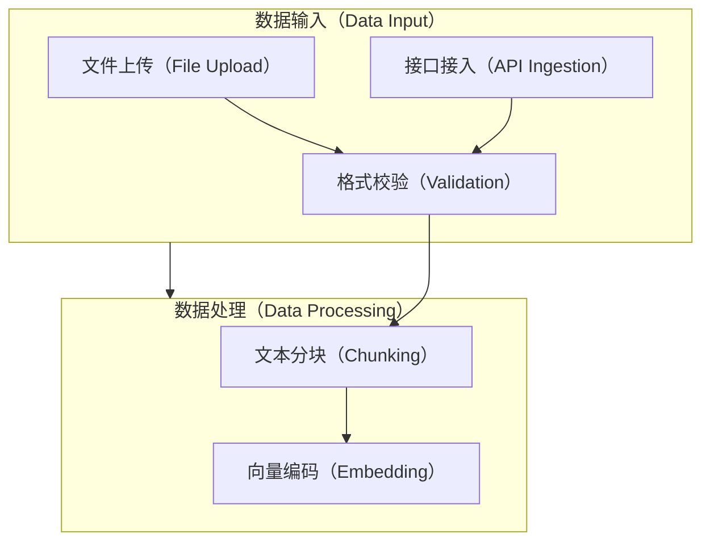
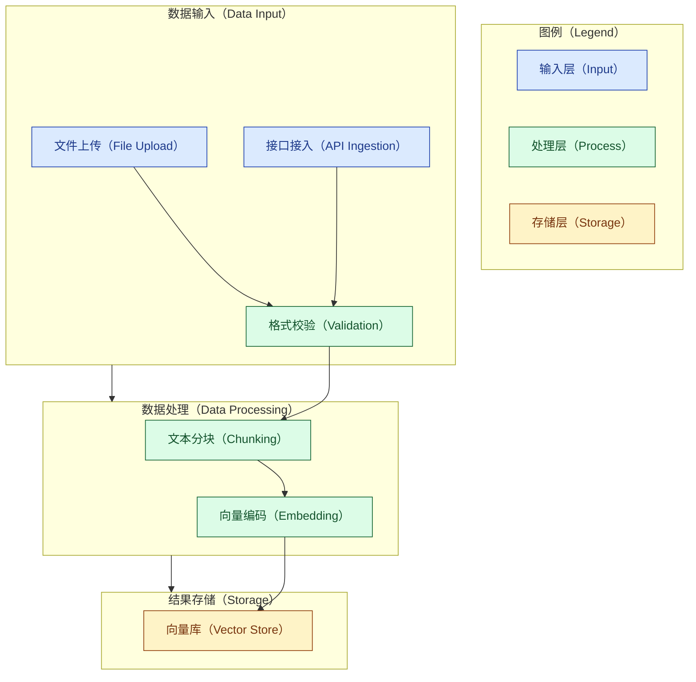
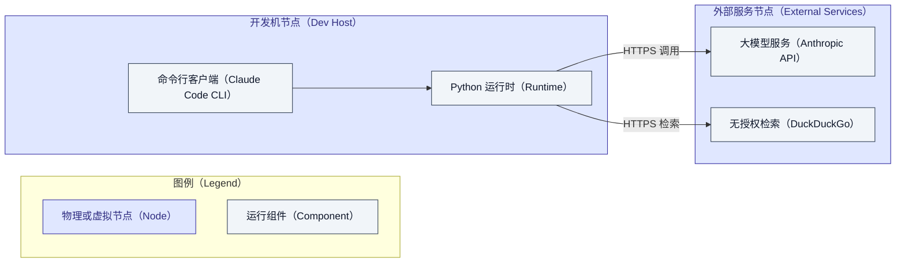
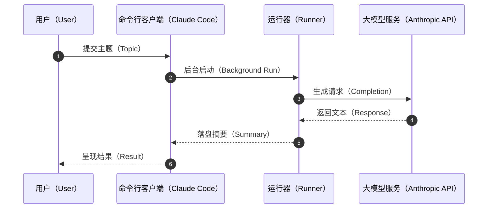
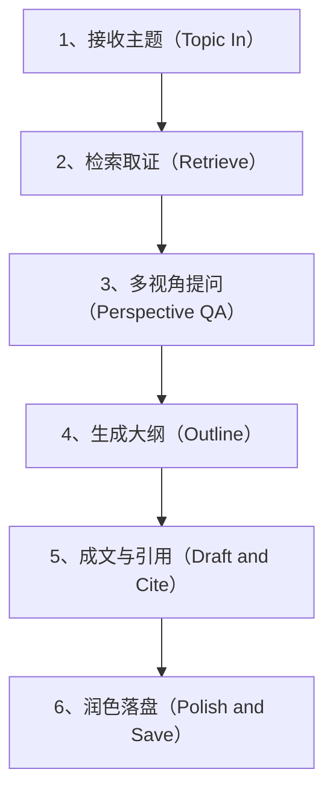

# Mermaid 图表详细格式规范（附录）

本附录是《[报告与设计文档写作规范](report-style-guide.md)》的图表部分附录，给出本仓库
所有 Mermaid 图表必须遵循的书写规则与**可直接复用的合规示例**。

## 核心规则

- **文本语言**：主要使用中文；英文术语作为补充时，格式为"中文术语（English Term）"，
  其中括号一律使用**全角**符号"（"与"）"。
- **严禁英文圆括号**：Mermaid 文本中不得出现英文圆括号 `(` `)`。所有括号场景（含中英
  对照）统一用全角"（""）"，外层容器用方括号 `[]`。
- **换行符**：一律使用 `<br>`，不使用 `\n` 或直接回车。
- **注释**：一律以 `%%` 开头，并单独占据一行。
- **图例（Legend）**：若有，一律置顶；技术场景使用专业配色（通过 `classDef` 定义）。
- **业务流序号**：流程/数据流图中的步骤应带层级分明的序号，如"1、""2、"。

## 命名规则

- **模块命名规则**：`大写缩写[中文名称（英文术语）]`，例如 `DI[数据输入（Data Input）]`。
- **节点命名规则**：`标识[中文名称（英文术语）]`，括号统一全角、外层用 `[]`，例如
  `A2[格式校验（Validation）]`。

下面是命名规则的最小示例，可作为模板：



## 架构图（Architecture Diagram）示例

架构图描述系统内部模块的层次与依赖关系。图例置顶、专业配色、`%%` 注释独占一行：



## 部署图（Deployment Diagram）示例

部署图描述组件、节点及其运行时关系。用外层子图表示节点（Node），内层节点表示运行
组件（Component），边上标注协议：



## 组件时序图（Sequence Diagram）示例（可选）

时序图描述核心业务场景下模块间的交互与调用顺序，`autonumber` 自动生成步骤序号：



## 数据流/控制流图（Data Flow Diagram）示例（可选）

数据流图展示核心业务的数据流转与控制逻辑，步骤带层级分明的序号：



## 常见违规对照

以下为**反例**（仅作说明，不可照抄）：

```text
错误：A[文件上传(File Upload)]      %% 使用了英文圆括号
正确：A[文件上传（File Upload）]     %% 全角括号

错误：A[第一步\n第二步]             %% 使用了 \n 换行
正确：A[第一步<br>第二步]           %% 使用 <br>

错误：A --> B  // 注释                %% 使用了非 %% 注释
正确：%% 注释独占一行
      A --> B
```

## 落地校验

本仓库以自动化测试守护上述规则：`integrations/claude_code/tests/test_mermaid_style.py`
会扫描 `docs/` 下所有 Markdown 的 ```mermaid 代码块，若出现英文圆括号或 `\n` 字面量即
判失败，从而使本规范在提交环节切实生效。
