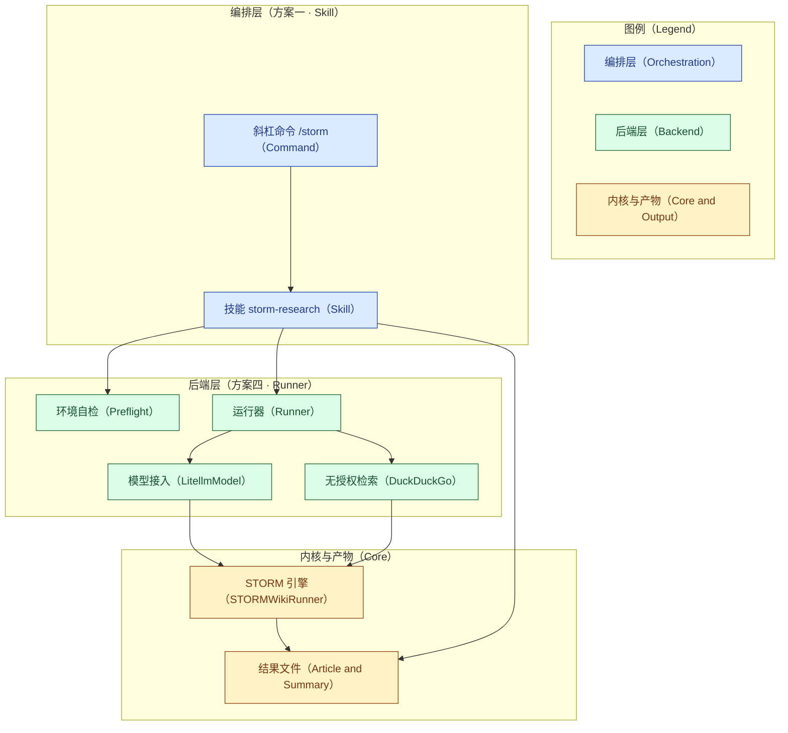
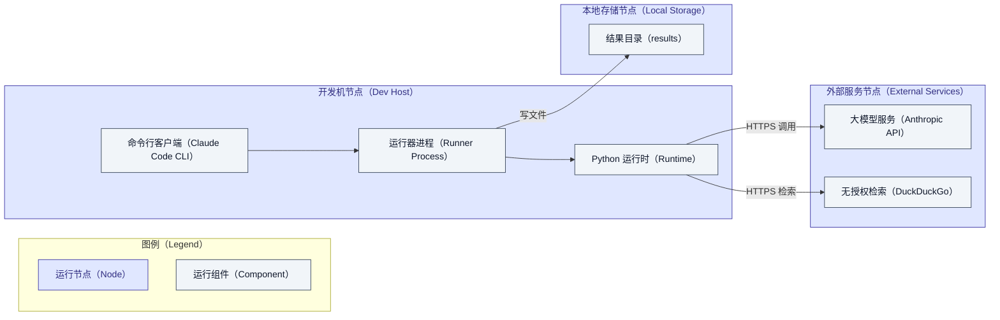

# STORM × Claude Code CLI — 设计与用法

本文描述 STORM 与 Claude Code CLI 集成扩展的**设计、数据流、配置、用法与测试**。
实现落在 `integrations/claude_code/` 与 `.claude/`，STORM 核心 `knowledge_storm/`
保持零改动。

## 1. 目标与非目标

**目标**
- 让 Claude Code 能"一句话"发起一次 STORM 调研，并拿回可读的成稿（方案一）。
- 让 STORM 用**当前** Claude 模型作后端，走官方推荐的 `LitellmModel` 路径（方案四）。
- 无搜索 Key 也能跑通（默认 DuckDuckGo），便于开箱验证。
- 产物机器可读，便于 Claude Code 解析、汇总、二次加工。

**非目标**
- 不让 STORM "蹭" Claude Code 的订阅额度（认证模型不互通，详见
  [capability-boundaries.md](capability-boundaries.md)）。
- 不把 `claude -p` 反过来当 STORM 的模型后端（可行但不划算，同上文）。
- 不改 STORM 的算法/模块。

## 2. 架构与部署

集成遵循"编排与后端分离"的思路：**编排层**由 Claude Code 依据技能指令负责调度，
**后端层**在 STORM 内核之上薄封装、用 Claude 模型供能，内核本身保持零改动。下面的
架构图刻画模块的层次与依赖关系。



- **编排层（方案一）**：`storm-research` 技能与 `/storm` 命令。Claude Code 依据技能
  指令，依次完成环境自检、后台启动、轮询 `claude_code_summary.json`、读回文章并汇总
  呈现。
- **后端层（方案四）**：`run_storm_claude.py` 组装 `STORMWikiLMConfigs`，把五个语言
  模型槽位分别指到 Claude 的强/快模型，检索默认走无授权的 DuckDuckGo，最终交给
  `STORMWikiRunner`（`knowledge_storm/storm_wiki/engine.py`）执行原有四阶段流水线。

下面的部署图刻画运行时的节点、组件与其间的调用关系。开发机上是命令行客户端与 Python
运行器进程，外部只依赖大模型服务与无授权检索，产物落到本地结果目录。



需要强调的是，部署上对外只有两条 HTTPS 出站：一条到大模型服务，一条到无授权检索；
后者不需要任何 API 密钥，这与本仓库"无授权外部检索"策略一致（见
[no-auth-external-retrieval.md](no-auth-external-retrieval.md)）。

## 3. 组件

| 文件 | 职责 |
|---|---|
| `integrations/claude_code/run_storm_claude.py` | 非交互 STORM 运行器；`LitellmModel`→Claude；默认 DuckDuckGo；输出 `claude_code_summary.json` |
| `integrations/claude_code/preflight.py` | 运行前自检（python≥3.10 / `knowledge_storm` 可导入 / `ANTHROPIC_API_KEY` / 检索器 Key），输出 JSON |
| `integrations/claude_code/secrets.toml.example` | 密钥模板（复制到根目录 `secrets.toml`） |
| `integrations/claude_code/tests/` | 单元测试（stdlib，mock 掉 STORM 依赖，可离线运行） |
| `.claude/skills/storm-research/SKILL.md` | 教 Claude Code 如何驱动上面的运行器 |
| `.claude/commands/storm.md` | `/storm <topic>` 斜杠命令，转交给技能 |

### 设计要点：惰性导入

`run_storm_claude.py` 与 `preflight.py` 的重依赖（`knowledge_storm`、`litellm` 等）
都在**函数内部**导入。这样模块本身仅依赖标准库，可以在**未安装 STORM 依赖**的环境
里被导入和单元测试——CI/开发机无需先装 torch 就能验证参数解析、模型分配、摘要生成
等纯逻辑。

## 4. 模型配置（方案四）

STORM 是"多模型系统"，本运行器沿用其成本/质量分层：

| STORM 槽位 | 默认档位 | 默认 `max_tokens` | 用途 |
|---|---|---|---|
| `conv_simulator_lm` | fast | 500 | 拆查询、合成对话答案（调用最频繁） |
| `question_asker_lm` | fast | 500 | 提问 |
| `outline_gen_lm` | strong | 400 | 组织大纲 |
| `article_gen_lm` | strong | 700 | 带引用写正文 |
| `article_polish_lm` | strong | 4000 | 润色 |

默认模型 id（可被 `--strong-model/--fast-model` 或 `STORM_CLAUDE_STRONG_MODEL/
STORM_CLAUDE_FAST_MODEL` 覆盖）：

- strong：`anthropic/claude-sonnet-4-5`
- fast：`anthropic/claude-haiku-4-5`

> **模型 id 说明**：LiteLLM 以 `anthropic/<model>` 直连 Anthropic API。若你的账号
> 或 litellm 版本不认识上述较新 id（报 404/not found），改用稳妥的别名
> `anthropic/claude-3-5-sonnet-latest` 与 `anthropic/claude-3-5-haiku-latest`。
> 采样参数默认 `temperature=1.0, top_p=0.9`（与官方 Claude 示例一致）。

## 5. 检索器

`--retriever` 可选：`duckduckgo`(默认，无需 Key) / `searxng`(可自建) / `bing` /
`you` / `serper` / `brave` / `tavily`。除 DuckDuckGo/SearXNG 外都需在环境或
`secrets.toml` 里提供对应 Key（见 `RETRIEVER_ENV`）。DuckDuckGo 质量最弱，做
正式产出建议切到 `tavily`/`bing`/`serper`。

> 注意：DuckDuckGo 检索器依赖 `duckduckgo_search`（`pip install duckduckgo_search`），
> 它不在 `requirements.txt` 中，属可选依赖，首次使用需自行安装。

## 6. 用法

### 6.1 由 Claude Code 驱动（推荐）
在仓库根目录启动 Claude Code 后：
- 自然语言："用 STORM 写一篇关于 <主题> 的带引用调研"，触发 `storm-research` 技能；
- 或斜杠命令：`/storm <主题>`。

技能会：自检 → 后台运行（分钟级）→ 轮询 `claude_code_summary.json` → 读文章 →
给出摘要并可发布为 Artifact。

### 6.2 手动运行
```bash
# 全流程（默认四阶段全开）
python3 integrations/claude_code/run_storm_claude.py \
  --topic "Retrieval-augmented generation" \
  --retriever duckduckgo \
  --output-dir ./results/claude_code \
  --max-thread-num 3 \
  --print-summary

# 只做检索 + 大纲（分阶段；后续阶段会从输出目录加载已完成结果）
python3 integrations/claude_code/run_storm_claude.py \
  --topic "RAG" --do-research --do-generate-outline
```

## 7. 输出与摘要 schema

产物目录 `<output_dir>/<topic_slug>/` 与 STORM 原生一致，另加
`claude_code_summary.json`：

```json
{
  "ok": true,
  "topic": "Retrieval-augmented generation",
  "output_dir": "./results/claude_code/Retrieval-augmented_generation",
  "article_path": ".../storm_gen_article_polished.txt",
  "files": { "polished_article": "...", "url_to_info": "...", "...": "..." },
  "num_references": 42,
  "stages_run": ["do_research", "do_generate_outline", "do_generate_article", "do_polish_article"],
  "models": { "article_gen_lm": "anthropic/claude-sonnet-4-5", "...": "..." },
  "retriever": "duckduckgo",
  "elapsed_seconds": 214.3,
  "token_usage": { "run_article_generation_module": { "...": {"prompt_tokens": 0, "completion_tokens": 0} } }
}
```

失败时返回 `{"ok": false, "error": "...", "type": "...", "topic": "..."}`，退出码：
`2`=缺 `ANTHROPIC_API_KEY`，`3`=缺检索器 Key，`1`=运行期异常。

## 8. 测试

单元测试仅依赖标准库，把 `knowledge_storm` 用假模块注入 `sys.modules`，因此**无需
安装 STORM 依赖**即可运行：

```bash
python3 -m unittest discover -s integrations/claude_code/tests -p "test_*.py" -v
# 或
pytest integrations/claude_code/tests -q
```

覆盖：参数解析与默认值、阶段解析（缺省全开 / 子集）、模型分层映射、检索器 Key
校验、`main()` 全链路（含摘要文件落盘与模型槽位接线）、以及两条错误退出码路径；
preflight 的各项检查与退出码。

真正的端到端跑通需要：装好依赖的 Python 环境 + `ANTHROPIC_API_KEY`（+ 可选搜索
Key）+ 网络，本仓库测试不覆盖这部分外部依赖。

## 9. 与 STORM 内部的对应关系

- 运行器组装的 `STORMWikiLMConfigs` / `STORMWikiRunnerArguments` /
  `STORMWikiRunner` 均来自 `knowledge_storm/storm_wiki/engine.py`。
- `LitellmModel` 来自 `knowledge_storm/lm.py`（v1.1.0 起的推荐后端；`ClaudeModel`
  已弃用）。
- 检索器来自 `knowledge_storm/rm.py`。
- 密钥加载复用 `knowledge_storm/utils.py:load_api_key`。
