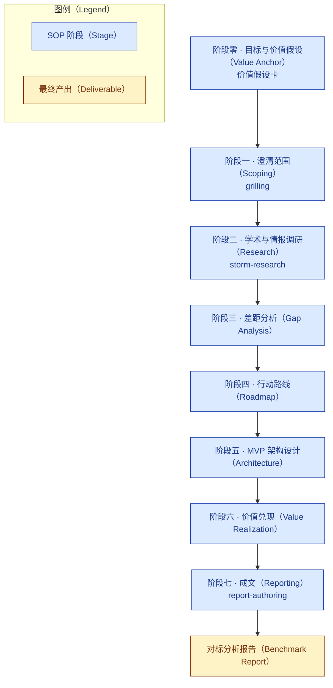
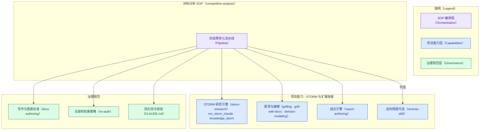

# 竞品对标分析 SOP（Harness SOP）

本目录是"产品/技术/特性全面对标分析"标准作业流程（SOP）的文档主页。SOP 本身由可执行技能
`.claude/skills/competitive-analysis/` 承载，本文档说明其定位、流程、输入产出与使用方式；
每次生成的案例报告统一落在 [`examples/`](examples/)。

## 章节大纲

- SOP 定位与适用
- 流程总览（阶段流水线与技能映射）
- 输入三要素与最终产出
- 如何触发
- 两条硬约束（无授权检索、严禁虚构）
- 报告骨架与案例落盘
- 结论

## SOP 定位与适用

面向一个反复出现的问题范式：**结合学术界在某方向（XXX）的最新研究热点，针对本方产品（YYY）
对标竞品（ZZZ），产出差距分析、行动路线、最优价值 MVP 架构设计，以及 MVP 的价值兑现（产品
FAB、客户语言的价值、控标经典案例）**。SOP 把这条链条固化下来，把本仓库已有的三类能力编排成
一次可复现的作业，产出一份决策级、可对外交付的报告。

本 SOP 以**价值兑现**为主线组织：从阶段零钉住价值假设，到最终成文，每个产物都必须能追溯回目标
与真实证据，凡不可追溯或流于空泛者一律淘汰。价值方法论内核见
[value-realization-model.md](value-realization-model.md)。

## 流程总览

SOP 分七个阶段，串联"澄清 → 调研 → 分析 → 规划 → 设计 → 价值 → 成文"。下图刻画阶段流水线
与关键技能的落点。

各阶段与承载技能的对应关系如下。表格只列骨架，展开说明见可执行技能 `SKILL.md`。

| 阶段 | 目标 | 承载技能/工具 |
|---|---|---|
| 零 目标与价值假设 | 钉住要兑现的价值、受益者、度量口径 | 本 SOP（价值假设卡） |
| 一 澄清范围 | 锁定 XXX 边界、YYY/ZZZ 形态、评价维度、客户与招标背景 | `grilling`（可配 `domain-modeling` 落术语/决策） |
| 二 学术与情报调研 | 汇集 XXX 学术热点、ZZZ 公开情报、YYY 现状，带引用 | `storm-research`（默认无授权 DuckDuckGo）+ 内置 `WebSearch`/`WebFetch` |
| 三 差距分析 | 逐维对比 YYY 与 ZZZ，证据锚定 | `report-authoring`（表格化） |
| 四 行动路线 | 差距转分期行动，按价值×可行性排序 | 本 SOP + 时间线图 |
| 五 MVP 架构设计 | 选最高价值切片，出架构图与部署图 | 本 SOP + Mermaid 合规图 |
| 六 价值兑现 | 产品 FAB、客户语言价值、控标案例 | 本 SOP |
| 七 成文 | 组装为符合写作标准的报告 | `report-authoring` |

## 本 SOP 与 STORM 及扩展技能的关系

这套 SOP **不是一套凭空的方法论**，而是把本仓库既有的能力编排起来完成对标分析。它坐落在三层
之上：底层是 STORM 与各扩展技能提供的**能力**，中层是仓库统一的**治理规范**，SOP 只做**编排**。
下图刻画这种依赖关系。

具体到每项能力落在哪个阶段、来自仓库哪个资产，见下表。这层显性映射保证 SOP 与本项目是"长在
一起"的，而不是可以随意搬走的空壳。

| SOP 能力 | 依赖的本项目资产 |
|---|---|
| 阶段零/一 · 澄清与价值假设 | `grilling`、`grill-with-docs`、`domain-modeling` |
| 阶段二 · 学术与情报调研 | `storm-research`（`integrations/claude_code/run_storm_claude.py` → `knowledge_storm`），默认无授权 DuckDuckGo |
| 阶段三/四/六 · 分析·排期·价值 | 本 SOP 方法 + `report-authoring` 的表格与图表规范 |
| 阶段五 · MVP 架构 | `report-authoring` + `docs/authoring/mermaid-style-guide.md` |
| 阶段七 · 成文 | `report-authoring` + `docs/authoring/report-style-guide.md` |
| 全程检索 | `docs/extensions/no-auth-external-retrieval.md`（无授权） |
| 全程事实把关 | 防幻觉与核验（`docs/authoring/` + 根 `CLAUDE.md`） |
| 可选技术剖析 | `vendor/reverse-skill`（仅授权、仅公开信息或己方/开源目标） |

## 输入三要素与最终产出

- **输入**：`XXX`（技术或产品方向）、`YYY`（本方产品）、`ZZZ`（对标产品）；可选目标客户、
  行业、招投标背景。
- **产出**：一份对标分析报告，落到 `docs/harness-sop/examples/`，章节骨架见
  [report-outline.md](report-outline.md)。

## 如何触发

在仓库根目录的 Claude Code 中，用自然语言（如"竞品分析：在 XXX 方向用 YYY 对标 ZZZ"）或
斜杠命令 `/compare` 触发 `competitive-analysis` 技能，随后按七阶段推进。

## 两条硬约束

- **无授权检索**：全流程只用无需 API 授权的检索（DuckDuckGo、内置 `WebSearch`/`WebFetch`
  等），细则见 [`../extensions/no-auth-external-retrieval.md`](../extensions/no-auth-external-retrieval.md)。
- **严禁虚构**：所有事实、数据、案例必须真实可核验；"控标经典案例"尤为敏感，查不到即写
  "无法确定"，不得杜撰客户、项目、金额或结果。详见
  [`../authoring/report-style-guide.md`](../authoring/report-style-guide.md) 的防幻觉一节。

## 报告骨架与案例落盘

- 报告骨架：[report-outline.md](report-outline.md)（与问题范式一一对应，含合规的 Mermaid/
  表格占位）。
- 逆向学习地图：[reverse-learning-map.md](reverse-learning-map.md)——用 reverse 技能消化开源栈的
  可复用方法（按逆向学习价值排序、每仓库一问、观测/布局/放置/回收四分法）。
- 案例目录：[examples/](examples/)，命名建议 `XXX-YYY-vs-ZZZ-YYYYMM`。

## 结论

这套 SOP 的价值不在于新造能力，而在于把"澄清—调研—分析—设计—价值兑现"固化为一条可复现、
可核验、格式统一的作业流水线：调研阶段的每个判断都带可核验来源，成文阶段的每张图表都符合
统一规范，敏感的商业案例受防幻觉约束。它让一次对标分析从"临场发挥"变成"标准交付"，从而在
产品、技术、招投标等场景中稳定地输出决策级材料。
