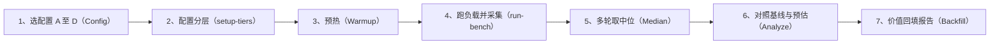

# 对比测试执行方案 · Proxmox 内存分层

本方案把 [report.md](report.md) 第十节的"对比测试设计"细化为**可执行**的基准测试（脚本为骨架，负载
命令按本文替换后即可运行）：具体负载、参数矩阵、采集脚本与数值化判定门，用于把报告里的**估算**在
真实环境中验证为**实测**。脚本骨架在 [`scripts/`](scripts/)。

> 安全与合规：仅在**专用测试主机**运行，勿在生产环境执行；改动系统状态的脚本默认不执行，需显式
> 确认（见脚本内 `MTP_CONFIRM`）。所有命令随内核版本可能不同，以本机实际为准。

## 章节大纲

- 目的与验证对象
- 重要机制澄清（NVMe-swap 与 CXL-NUMA 不是一回事）
- 环境与前置
- 配置矩阵
- 负载
- 指标与采集
- 方法
- 预估与判定门
- 结果回填与价值兑现
- 参考

## 目的与验证对象

验证 report.md 的两条核心价值假设，并划出适用/不适用负载边界：

- **假设一**：慢层安全扩容不显著伤 SLO（关键负载 P99 增幅在可接受范围）。
- **假设二**：降低内存 TCO、提升单机密度（每 GB 成本下降、可用内存/VM 密度上升）。

## 重要机制澄清（NVMe-swap 与 CXL-NUMA 不是一回事）

这一点直接影响测试设计的正确性：

- **CXL/PMem 作慢层**：被内核视为**内存 NUMA 节点**，才是"真·内核内存分层"，由 TPP、DAMON、
  降级/提升、加权交织直接管理 [5][6][7]。
- **NVMe 作慢层**：NVMe 是**块设备**，在 Linux 上作慢层实为 **swap/zswap 承载**（可叠加 zram 前端），
  与内核内存分层是不同机制；这更接近 VMware 集成式 NVMe 分层要解决的问题，但实现路径不同 [1]。

因此矩阵里 NVMe 路径走 swap 栈、CXL 路径走 NUMA 分层栈，二者分别评估，不可混为一谈。

## 环境与前置

- 专用测试主机；记录 CPU、DRAM 容量/速率、NVMe 型号、（如有）CXL 设备与固件。
- 内核：较新的稳定内核（含 TPP/DAMON/加权交织；具体特性以本机 `/sys/kernel/mm/` 与 `/proc/vmstat`
  实际字段为准）。
- 工具：`numactl`、`numastat`、`daxctl`（CXL）、`fio`、`stress-ng`、以及负载工具（`redis` +
  `memtier_benchmark`、RocksDB `db_bench`、或 `YCSB`）。

## 配置矩阵

| 配置 | 慢层与机制 | 启用要点 |
|---|---|---|
| A 基线 | 纯 DRAM（含 PVE 既有 balloon/KSM），无分层 | `demotion_enabled=false`、`numa_balancing=0` |
| B NVMe · DAMOS pageout | NVMe swap + 按 VM DAMOS `pageout`（memcg 过滤到 `qemu.slice/<vmid>.scope`）| 建 swap on NVMe；DAMOS paddr `pageout` + memcg 过滤；`memory.high` |
| B-z 叠 zswap | B + zswap 压缩前端 | 写 `/sys/module/zswap/parameters/enabled=1`（zswap 内建，**非模块**，勿 modprobe）|
| C 1:2 | 改变 DRAM:慢层容量配比 | 同 B，压更低 `mem=`/`memory.high` |
| D2 CXL · DAMON 迁移 | CXL 作 NUMA 层 + DAMON(paddr) `migrate_hot/cold` | `daxctl reconfigure-device --force --mode=system-ram all` + `auto_online_blocks=online_movable`；`demotion_enabled=false`、`numa_balancing=0`（隔离 DAMON）[5][16] |
| E ESXi 头对头 | 同硬件 ESXi 9 分层 1:1 | 外部对照，验证"超越/对等"，非可选 [1] |

具体启用命令见 [`scripts/setup-tiers.sh`](scripts/setup-tiers.sh)。

## 负载

- **冷热分明（利于分层）**：RocksDB `db_bench`（大数据集 + 偏斜读），或 Redis + `memtier_benchmark`
  （大 keyspace + 长尾冷 key），或 `YCSB` Zipfian 分布。
- **均匀热/随机（反例边界）**：`stress-ng --vm` 随机访问，或指针追逐微基准，制造无冷热区分的压力。
- **超分场景**：逐台加 VM，直到任一 VM 破 P99 门或 host PSI-some 超阈值；此时 VM 数即密度。

**必须逼出分层**（否则工作集全驻 DRAM、什么都不发生）：用 host `mem=` 或对 `qemu.slice/<vmid>.scope`
设 `memory.high` 压低快层。示例命令（按机型调参）：
- 冷热分明：`memtier_benchmark --key-maximum=50000000 --key-pattern=G:G --ratio=1:4 --data-size=1024 --test-time=300`；或 `db_bench --benchmarks=readrandom --num=... --cache_size=...`（设偏斜）。
- 均匀热/随机：`stress-ng --vm N --vm-bytes 90% --vm-method all --timeout 300s`。
- **配比落实**：B=1:1、C=1:2 必须真正改变 DRAM:慢层容量（在 `setup-tiers.sh` 落实），否则 B/C 同路。

**新增两维**（经核验修正）：**热迁移（分通路）**——NVMe 通路测换入风暴（precopy 期 `pswpin` 峰值 +
总迁移时长），CXL 通路页常驻、只是读更慢；对照 ESXi vMotion（据 [1][18] 慢 1.5–2×）。**大页**——启用
分层后**双方都牺牲大页**：VMware 每 VM 关大页、按 4 KB [18]；Linux THP 整体迁移、`-ENOMEM` 才拆，
hugetlb（1 GiB）排除。

## 指标与采集

| 指标 | NVMe-swap 通路来源 | CXL-NUMA 通路来源 |
|---|---|---|
| P99/P999 延迟、吞吐 | 负载工具输出 | 同左 |
| 慢层活动 | `/proc/vmstat` 的 `pswpin`/`pswpout`、`pgscan`/`pgsteal` | `pgdemote_*`/`pgpromote_success`/`numa_pages_migrated`，及 **promotion-rate**（MDK 口径）|
| 内存压力 | `/proc/pressure/memory`（PSI）| 同左 |
| **按 VM** | `qemu.slice/<vmid>.scope/memory.stat`、per-PID 计数 | 同左 |
| 迁移/换入 CPU | kswapd 与压缩线程 CPU | kdamond 与迁移线程 CPU |
| 每 GB 介质单价 | 由容量与市价推算（[9][10]）| 同左 |

> 关键（经 v6.14 源码核验）：NVMe 走 swap，`pgdemote/pgpromote` 恒为 0，看 `pswpin/pswpout`（叠 zswap
> 时看 `zswpin/zswpout/zswpwb`）；**DAMON 迁移（D2）不进 `pgpromote/pgdemote`**，看 `pgmigrate_success/fail`
> 与 DAMOS `stats`；只有 TPP（`demotion_enabled`+`numa_balancing`）才计 `pgdemote/pgpromote`。host 全局
> 计数无法归因到单台 VM，按 VM（`qemu.slice/<vmid>.scope/memory.stat` 与 `memory.pressure`）采集为硬性要求。
>
> **按 VM 的可得性分版本**（v6.14 对 master 的 `cgroup-v2.rst` 一手对照，见报告 [26] 与
> reverse-digest 收束三）：v6.14 的 `memory.stat` **有** `zswpin/zswpout/zswpwb` 与
> `pgdemote_kswapd/direct/khugepaged`（zswap 活动与降级可直接按 VM 采）；**无** `pswpin/pswpout`
> （master 才加入，标 npn）——6.14 上按 VM 的 swap 换入/换出用 `memory.swap.current` 增量 +
> `memory.pressure` 近似；`pgpromote` 与 `pgmigrate_*` 仅全局——DAMON 迁移按 VM 归因用"每 VM 一条
> DAMOS scheme + memcg 过滤"的 `stats`，或靠 D2 的单 VM 隔离设计。

采集见 [`scripts/collect-metrics.sh`](scripts/collect-metrics.sh)（只读快照，安全）。

## 方法

固定负载、变分层配置；每配置预热到稳态后采窗口数据，重复 ≥3 轮取中位；对照 A 基线**与**文献
基线（report.md 的估算）。测试主循环：

## 预估与判定门

预估取自 report.md（据公开锚点，属预估非实测）；判定门是价值假设的通过标准：

| 对比 | 预估（据锚点，非实测）| 判定门（数值化）|
|---|---|---|
| B vs A（冷热分明，NVMe）| 介质单价降约 40%–45%（估算 [9][10]）；密度理论上限 +100%、实际更低（[1] 仅支持方向）；P99 待实测（NVMe µs 级，勿用 [7]）| P99 增幅 ≤ +15% 且 密度 ≥ +50% 且 介质单价降 ≥ 20%，三者同过 |
| B vs A（均匀热/随机）| P99 方向性显著上升（幅度无法确定）| 记录为不适用负载边界，不作达标要求 |
| D2 vs B（CXL）| CXL 延迟 140–410 ns（"约 600 ns/尾延迟高"[11] 摘要未载，标未验）；[7] 的 3–5% 是执行时间减速、非 P99 | CXL 路径 P99 与 DAMOS/迁移指标优于 NVMe-swap |
| B/C vs E（对 ESXi 头对头）| 目标对等或更优 | P99 差距 ≤ +15%、密度 ≥ E、每 VM 成本更低（无按核授权）——**"超越/对等"的关键门** |

## 结果回填与价值兑现

把实测中位值回填到 report.md 第七节"价值度量"表：将"估算"替换为"实测"，并对照判定门标注价值
是否兑现；未达标则回到价值假设或 MVP 方案修正（对应价值验证闭环）。这样完成"估算 → 实测"的最后
一公里。

## 参考

引用编号与 report.md 一致：VMware 机制 [1]；Linux 内核分层机制与开关 [5]；加权交织 [6]；DAMON 收益
[7]；成本数据 [9][10]；CXL 延迟 [11]；内核在研工作 [12]。完整链接见 [report.md](report.md) 参考资料。
