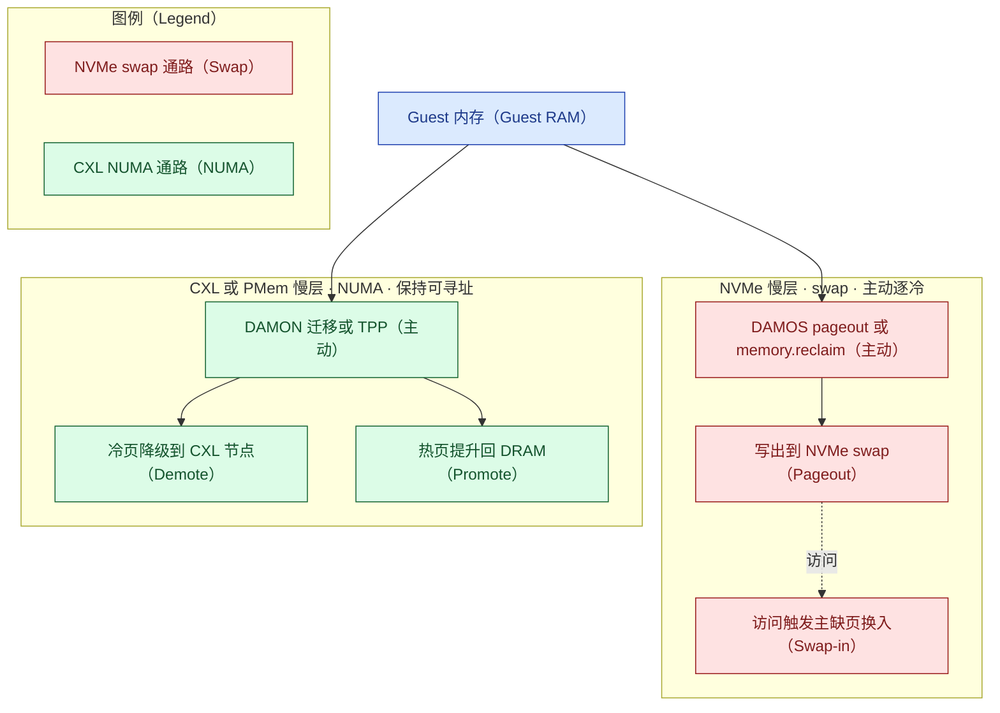
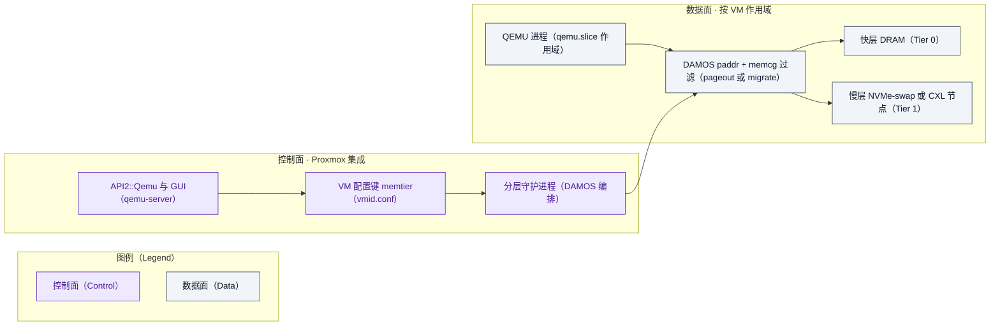

# 内存分层方向 · Proxmox VE 如何超越 VMware vSphere —— 对标分析与业务/技术规划

> 由 `competitive-analysis` SOP 生成，遵循 `docs/authoring/` 标准。检索用**免密钥（keyless）**方式。
> 事实性内容 `[n]` 引注；估算显式标注；无法核验写"无法确定"。学术热点一节基于**用户提供、未独立
> 核验**的材料 [8]。
>
> **本版 v4：经两轮共 7 路 reviewer 对抗式评审（第二轮全部用与主 agent 一致的 Claude Fable 5，含一路
> 对 v6.14 内核源码逐条核验）后重写。v4 纠正了 v3 的一处方向性错误**——见文末"修订说明"。
> **v4.3–v4.4：按升级后 SOP 的"机制底座（逆向消化）"必过门，机制性判断统一挂接到
> [reverse-digest.md](reverse-digest.md)（术语贴回函数 + 论文增量表，证据分级标注）；随后经一路
> Fable-5 机制底座对拍（判 FAIL、9 条必修）返修——含一处作者归属改正与计数器按 VM 口径的
> 分版本重述，均经一手再核验。**

## 章节大纲

- 目标、意图与价值假设
- 背景、代次校准与机制真相
- 学术热点与生产级证据
- 内核视角：历史/现状/演进/预测
- 差距分析：差在产品化，不在引擎
- 如何超越：产品化 + 结构性护城河
- 行动路线与最优价值 MVP
- 业务规划
- MVP 价值兑现
- 对比测试设计（含与 ESXi 头对头）
- 结论与投资建议
- 参考资料 / 修订说明 / 存疑与需确认

## 零、目标、意图与价值假设

| 要素 | 内容 |
|---|---|
| 业务目标与意图 | 回答"Proxmox VE 在内存分层方向**如何超越** VMware vSphere"，给出业务/技术规划，支撑"是否投入/投多少/先打谁"的决策 |
| 受益者 | Broadcom 迁移难民 · 公共部门/信创（有限定）· CSP/托管 · 边缘（见业务规划）|
| 价值主张 | 把内核**已具备的主动分层机制**产品化为集成、可按 VM、带护栏、迁移/HA 感知的能力；以**开源自主可控 + 无按核授权 TCO** 建立 VMware 难以复制的结构性差异 |
| 度量口径 | 分 NVMe-swap 与 CXL-NUMA 两通路给指标（见价值度量）|

## 一、背景、代次校准与机制真相

内存分层把数据在带宽/延迟/容量/成本各异的介质间调度（背景取自用户材料 [8]）。Intel 已于
2022-07 退出 Optane 业务、明确因"产业转向 CXL" [14]，硬件重心转向 CXL。

**代次校准（v4 更新）**：内存分层强绑内核版本。Proxmox VE 9.0（2025-08，内核 6.14）[15] 起具备较完整
分层；**9.1（2025-11，内核 6.17）、9.2（2026-05，内核 7.0）** 更进一步（6.16 加 DAMOS 目标度量与加权
交织自调优、6.17 加 vaddr 上的 DAMON 迁移）[19]。本报告以 **PVE 9.2（内核 7.0）对 vSphere/ESXi 9.x**
为基准（PVE 8.4 起可选装 6.14，故并非"8.x 全无"）。

**机制真相（v4 关键纠正）**：两条慢层通路机制不同，但**都已有主动机制**——区别在**可寻址性**，不在
"主动/被动"：

- **NVMe 慢层 = swap 通路**：NVMe 是块设备，`daxctl` 不适用；但 Linux 早已能**主动**把访问-冷页逐到
  swap——`DAMON_RECLAIM`（内核 5.16）、`DAMOS pageout`（paddr，可按 memcg 过滤到 `qemu.slice/<vmid>.
  scope`）、cgroup v2 `memory.reclaim` [16]。慢层页被换出后，访问需**主缺页 + µs 级 I/O**。
- **CXL/PMem 慢层 = NUMA 通路**：慢层是内存 NUMA 节点，页**保持映射/字节可寻址**，访问**不产生
  主缺页、无 I/O**（提升依赖的 hint fault 是采样性的轻量缺页，代价与 swap 主缺页不同量级）；由
  TPP 降级/提升、DAMON 迁移（paddr）管理 [5][16]。

> **机制底座**：以上两通路的函数级依据见 [reverse-digest.md](reverse-digest.md)——同一次回收扫描里
> 由 `can_demote()` 分岔：降级 = `demote_folio_list`→`migrate_pages()`（页保持映射），换出 = `pageout`
> 解除映射写 swap；冷/热判定三套并行（DAMON `nr_accesses` 与 LRU 老化判冷、hint fault 选热页）。

VMware 的 Memory Tiering over NVMe 也是"按 recency+frequency 在 4 KB 粒度分类、访问时 page-in" [1]——
**与 DAMON(paddr)+DAMOS pageout 到 swap 属同一类机制**。因此 v3"NVMe 上是机制差距"的结论**不成立**；
真正的差距是**产品化/集成**（默认配比与护栏、按 VM 策略面、DRS 式分层感知放置、迁移/HA 协同、
guest 透明）。评价维度据此设为：主动机制（双通路均有）、产品化/集成、按 VM 策略、迁移/HA、大页、
故障域/安全、成本/授权、成熟度。

## 二、学术热点与生产级证据

学术前沿（用户以**线索**提供，已独立检索核验 [8]）：**OSDI '26 确实存在**（USENIX 技术议程）。其中
**RamRyder**（软件定义弹性内存，把 guest 页到内存通道的映射作分配单位；报告容量/带宽利用率各
+28.6%/+43.2%——与用户材料数字一致，警示加权交织是带宽聚合、非冷页下沉）、**MAC**（Metadata
Acceleration，CXL DRAM 元数据加速；OSDI '26 题名可查）、**MDK**（重思数据中心内存回收，目标为 SLO 下
多容纳作业 → 对应 DAMOS 目标 `some_mem_psi_us`、`promotion-rate` 经 `user_input` 反馈 [16]）均**已独立
核验**；**OBASE / NEMO** 的**具体命名未能独立确认**，但其概念（冷热对象混页即 hotness fragmentation、
句柄间接与对象重排 / MC 遥测观测）可溯到公开工作（SoarAlto "Beyond Hotness" OSDI '25 [22]、ObjecTier、
Tidying Up the Address Space）——**按概念采信、按命名存疑**。

**更贴近本 MVP 的是生产级证据**：Meta 的 TMO（Transparent Memory Offloading，ASPLOS'22）在机群规模用
PSI 驱动把冷页主动 offload 到 zswap/NVMe swap [17]；Google 远内存（ASPLOS'19）用 zswap 同理。§七 的
"读 `/proc/pressure/memory` → 写 per-scope cgroup 上限"正是 TMO 的架构——这说明 **NVMe swap 通路的
主动分层是已被生产验证的成熟做法，不是"缺失的引擎"**。

另有直接相关的已核验工作：**Equilibria**（面向 CXL 分层的公平多租户 OS 框架，按容器/租户调控提升与
降级）[20] 为 CSP"按 VM 多租户隔离"提供了学术先例；**Managing Memory Tiers with CXL in Virtualized
Environments（Memstrata，OSDI '24，微软）**[21] 表明 **CXL 分层在虚拟化环境已有系统性研究**——部分
回应"KVM guest 上分层无实测"之虑（但仍非 Proxmox+DAMON 的直接实测，见"存疑"）。

> **机制底座（论文增量）**：上述论文相对内核上游的增量已逐条"贴回函数"——RamRyder 的 channel 在 mm
> 中**无对应层级**（源码核验）、MDK 的 promotion-rate 上游只是副产品（`pgpromote_success`/DAMOS
> stats，源码核验）、MAC 加速的正是 kswapd 扫 `struct folio`+Xarray 的路径（源码核验）、OBASE 重构
> 的是分配器 size-class 造成的冷热混页（**阅读式**——分配器源码研读、未运行）。全表与逐条证据
> 分级见 [reverse-digest.md](reverse-digest.md) 收束二；"贴不上的部分即论文增量"。

## 三、内核视角：历史、现状、演进、预测

内存管理绝大部分来自 Linux 内核，是一等分析源；但须平衡看：VMware 的 vmkernel（非 Linux）虽不继承
内核上游，却率先把 NVMe 主动分层做到 GA 且 **guest 透明** [1]。

- **历史**：降级"reclaim 时下沉"由 Intel 提交（Dave Hansen，5.15）；提升"hint-fault 选热页"由 Intel
  提交（Huang Ying，6.1）；**显式内存层**（`mm/memory-tiers.c`）由 IBM 的 Aneesh Kumar K.V 提交
  （commit `992bf775`，2022-08 作、入 6.1；作者与日期经 GitHub API 一手核验）[27]；"TPP"是 Meta
  论文命名。DAMON 访问监控与 `DAMON_RECLAIM` 见 5.15/5.16 [16]。
- **现状（截至 2026-09 [12]）**：加权交织（6.9）、DAMON 迁移 paddr（6.11）、DAMOS 目标度量与加权交织
  自调优（6.16）、DAMON 迁移 vaddr（6.17）；在研 pghot（`kmigrated` + AMD IBS）与"分层感知内存 cgroup"
  （两套竞争补丁，Hahn 方案被认为更值得推进）[12]。**注意**：DAMON 迁移动作在 6.14 仅 paddr 支持，
  vaddr 要到 6.17（PVE 9.1+）。
- **演进/预测（推断）**：向自调优 + 按 VM（分层感知 memcg）+ CXL 更细治理演进。
- **结构性含义**：主动分层机制**两条通路都已具备且在快速演进**；VMware 与 Proxmox 都还在"整合"阶段。
  "骑内核上游"是**所有 KVM 同类共享**的——这部分上游代码由多厂工程师共写（显式内存层来自
  IBM [27]、hint-fault 提升来自 Intel、PSI/`memory.reclaim` 一线来自 Meta [17]），任一 KVM 发行方都
  同等继承，故对同类不构成差异。

## 四、差距分析：差在产品化，不在引擎

按已核验事实（PVE 9.2/内核 7.0 对 vSphere 9.x）：

| 维度 | Proxmox VE 9.2 | VMware vSphere 9.x | 差距 |
|---|---|---|---|
| 主动分层机制 | 有：NVMe 走 DAMOS pageout/`memory.reclaim`；CXL 走 TPP/DAMON 迁移 [16] | 有：NVMe 主动分层（recency+frequency，4 KB，1:1 默认、每分层区上限 4 TB、默认关、维护模式）[1] | **同类机制，非差距** |
| 产品化/集成 | 需手工拼装（sysctl/DAMOS/cgroup），无统一默认与 GUI [5] | 平台内建、默认护栏、GUI [1] | **核心差距** |
| 按 VM 策略 | 内核基元在研（分层感知 memcg [12]）；今可用 DAMOS paddr + memcg 过滤到 `qemu.slice/<vmid>.scope` | 平台级 | 差在产品面 |
| 迁移/HA | QEMU 迁移需换入慢层页；集群缺分层感知放置 | vMotion 分层页需先取回（**1.5–2×**更慢）、DRS 有分层放置逻辑 [1][18] | VMware 优势在 **DRS 放置**（迁移惩罚双方都有）|
| 大页 | THP 整体迁移、-ENOMEM 才拆；hugetlb（1 GiB）不可分层 | 启用分层即**每 VM 关大页**、按 4 KB [18] | **双方都牺牲大页** |
| 故障域/安全 | 慢层设备故障丢 VM；swap 明文需 dm-crypt | 无 RAID-1 时 NVMe 故障→HA 重启（丢 VM）；加密可选 [1] | 双方慢层故障都丢 VM |
| 成本/授权 | 开源 AGPLv3、无按核授权 | 商业订阅（Broadcom，2024-01 起停永久授权）[13] | **Proxmox 结构性顺风** |
| 成熟度 | 分层随内核演进、产品化早期 | NVMe 分层 8.0U3 TP（4:1）[2]、**9.0 起 GA**（1:1/4TB）[1][3] | 两者都新 |

一句话：**差距在"整合成品"，不在"分层引擎"。**"主动分层机制"一行的函数级依据（观测/降级/换出/
提升四件套在上游齐备）见 [reverse-digest.md](reverse-digest.md)（其"反哺"节把 ADR-0001/0003 由概念级
证据升为函数级）。"大页"一行 Linux 侧的机制位置——`migrate_pages()` 整体迁移大 folio、目标侧分配
失败才 split 重试；hugetlb 不入 LRU、既不换出也不降级——亦见 reverse-digest（标注为阅读式）。

## 五、如何超越：产品化 + 结构性护城河

**超越论点（v4 收敛后）**：

1. **把内核已有的主动机制产品化**——在 Proxmox 上做出集成的、按 VM、带护栏、迁移/HA 感知的分层
   产品（NVMe 走 DAMOS pageout + memcg 过滤 + GUI + 分层感知放置）。差距是产品化，能靠贴内核**快速
   补齐**，无须重造引擎。
2. **结构性护城河（VMware 难以复制的只有这两条）**：**开源/AGPL**（可审计、可 fork、无锁定）与
   **无按核授权 TCO**。其余（CXL、自调优）VMware 可跟随。
3. **CXL 是时机领先，不是结构性超越**：VMware 目前仅本地 NVMe（截至 2026-09 [12][18]），但其 Tier0/
   Tier1 架构可纳入 CXL（trade press 已列 CXL 为候选 [18]）；且 CXL 扩展器 $/GB ≥ DIMM，DRAM 涨价同样
   抬高它——故 CXL **不接** "why-now" 的成本论。CXL 作为期权，随内核（6.16/6.17/7.0）成熟推进。

**why-now（只对 NVMe/现有通路成立）**：Broadcom 2024-01 停永久授权、转订阅、一度停免费 ESXi → 迁移潮
[13]；2025–2026 DRAM 涨价使 swap 分层 ROI 高 [9][10]。对手（抢同一批难民）：Nutanix、OpenShift
Virtualization、Harvester（均 KVM/Linux）、XCP-ng（**Xen，非 KVM**）、及国产 HCI（华为/浪潮/H3C/
ZStack/SmartX/深信服）。

## 六、行动路线与最优价值 MVP

评分：投入按人周（1=<2周,3≈2月,5=>6月）；价值按第零节目标；**证据作门槛（非乘子）**；价值按买家 JTBD
计。近期 MVP 取"可独立交付、直击产品化差距"的切片：

| 里程碑（自 2026-10）| 内容 | 门（进 M2 前须过）|
|---|---|---|
| M1（2 月）| 按 VM DAMOS pageout 策略 + memcg 过滤 + GUI + 护栏（NVMe 通路）| 与 ESXi 头对头（config E）P99 差距 ≤ +15%、密度 ≥ +50% |
| M1 并行 | **迁移/HA 分层感知**（放置 + 迁移前预热/换入）| 迁移时长 ≤ 基线 2×；HA 故障切到无慢层节点安全 |
| M2（3 月）| 分层感知集群放置（DRS 式）| 集群级密度提升可测 |
| M3（4 月）| CXL 原生分层 + DAMOS SLO 策略（随内核）| 有 CXL 硬件的设计伙伴上验证 |

MVP 集成点（内核侧结论=源码核验，见 [reverse-digest.md](reverse-digest.md)；Proxmox 侧集成点
【`PVE::API2::Qemu`、`vmid.conf`、`PVE::QemuServer`】=qemu-server 源码研读，属**阅读式**，
详见 ADR-0003）：
- 控制面：**`PVE::API2::Qemu`（qemu-server，非 pve-manager）** + GUI；按 VM 策略写 `/etc/pve/
  qemu-server/<vmid>.conf` 新键（如 `memtier: track=nvme-swap,ratio=1:1,cap=...`），`PVE::QemuServer`
  解析。
- 执行：NVMe 通路用 **DAMOS paddr + memcg 过滤到 `qemu.slice/<vmid>.scope` + `pageout`**（今 6.14 即
  可），辅以 `memory.high`/`memory.swap.max`、`memory.reclaim`；CXL 通路用 TPP/DAMON 迁移。**勿把 guest
  RAM `policy=bind` 到慢层节点**（会使其永不"misplaced"、提升永不触发）[16]。守护进程读 DAMOS `stats`
  与 `/proc/pressure/memory`、`qemu.slice/<vmid>.scope/memory.pressure`。
- 观测面：**照 damo/DAMON 的分工**——热判断与开销控制在内核、产品层只做配置与呈现；GUI 数据源可
  直接参照（甚至复用）`damo report heatmap/wss`（见 [reverse-digest.md](reverse-digest.md) 反哺节）。

两条通路（已修正方向：swap-out 由回收/`memory.high`/DAMOS 触发，缺页触发 swap-in）：

按 VM 产品化控制面（今 6.14 即可落地的路径）：

## 七、业务规划

**定位**：以"开源自主可控 + 无按核授权 + 产品化分层"承接 Broadcom 迁移潮，并与 KVM 同类竞速。

| 买家段 | JTBD | 主价值杠杆 | 次序 |
|---|---|---|---|
| Broadcom 难民 | 逃续费又要**对等**能力 | 无按核订阅 + 迁移安全 + 产品化分层 [13] | 第一 |
| CSP/托管 | 密度换毛利 | 按 VM 策略 + 分层感知放置 + 每 VM 成本 | 第一（**CXL 期权的首用买家**）|
| 公共部门/信创（限定）| 自主可控、capex 受限 | 开源可审计 + 无锁定 | 第二（须限定）|
| 边缘 | 小节点多装载 | NVMe-swap 密度 | 第三 |

**信创限定（v4 明确）**：信创多要国产 CPU（鲲鹏/飞腾 ARM、龙芯、海光/兆芯）+ 国产 OS（麒麟/统信，
内核 5.10/6.6）→ "内核 6.14+ 分层"链条**不转移**；国产 CPU 多无 CXL；机密计算（SEV-SNP/TDX）VM 不能被
host swap/迁移。故信创现实可及的仅"x86 信创（海光/兆芯）、无 CXL、非 CoCo"子集，且要过 Proxmox 是否
进信创目录这关。定价：核心 AGPLv3，企业订阅=源码+支持+SLA（**分层 GUI/策略须在 AGPL 核心，否则与
"不得按核解锁"控标条款自相矛盾**）。

## 八、MVP 价值兑现

### FAB 价值链（落到买家的钱）

| 买家段 | 特性→优势 | 客户利益（买家货币）|
|---|---|---|
| 难民 | 无按核订阅 + 产品化分层 | 把 Broadcom 续费差额换成一次性迁移；同硬件对等密度 |
| CSP | 按 VM DAMOS 策略 + 分层感知放置 | 每宿主多装 VM、内存 $/VM 下降、可迁移可运维 |
| 信创（限定）| 开源可审计、无锁定 | 自主可控合规、已有硬件多装载 |

### 客户语言

对难民：*"用一块 NVMe 把单机多装一档 VM、内存账单降一截；冷页由内核主动逐到慢层、按 VM 可控。要
说清：NVMe 走智能 swap，尾延迟不如 DRAM 常驻，适合冷数据多的负载；真正拉开身位的是开源无锁定与
按 VM 的产品化，而非某个独家引擎。"*

### 控标条款（真实案例：无法确定，不杜撰；条款为建议表述）

内核原生可审计 / 按 VM 策略与观测 / CXL-ready 介质开放 / **不得按主机或按核订阅解锁分层** /
自主可控·供应链。异议应答：无 GUI→正是 MVP；无成熟度→设计伙伴 benchmark + 公布；无担责厂商→
AGPLv3 企业 SLA。

### 价值度量与可证伪假设（分通路 + 分门）

| 假设 | 指标 | 预估（估算，见第十节验证）|
|---|---|---|
| NVMe 不伤 SLO | 关键负载 P99；`pswpin/out`、`zswp*`、DAMOS stats | 待与 ESXi 头对头实测 |
| 降成本提密度 | 介质单价、VM 密度 | 介质单价降约 40%–45%（估算 [9][10]，仅介质采购价、未含电力/磨损/CPU）|
| CXL（期权）| P99；TPP 路径看 `pgpromote/pgdemote`，DAMON 迁移看 `pgmigrate_*`/DAMOS stats（按 VM 口径见第九节）| 待有 CXL 硬件实测 |

**kill-gate（分门）**：M1 门（NVMe）——启用 <30 分钟、且 config E（vs ESXi）P99 差距 ≤ +15%、密度
≥ +50%、迁移 ≤ 2× 基线，达标则进 M2/M3；不达则收缩。**CXL 门在 M3 单独评**，不在第 3 月用 NVMe 证据
判 CXL。

## 九、对比测试设计（含与 ESXi 头对头）

见 [benchmark-plan.md](benchmark-plan.md) 与 [scripts/](scripts/)。要点（v4 修正）：
- **配置**：A 纯 DRAM；B NVMe DAMOS pageout（无 zswap）；B-z 叠 zswap；C 1:2；**D2 DAMON paddr+memcg
  迁移**（CXL，`demotion_enabled=false`/`numa_balancing=0` 隔离）；**E ESXi 9 分层 1:1（同硬件头对头）**。
- **逼出分层**：host `mem=` 或 `memory.high` 压低快层。
- **计数器归属（源码/文档核验）**：NVMe 看 `pswpin/pswpout`＋（zswap 时）`zswpin/zswpout/zswpwb`；
  DAMON 迁移**不进** `pgpromote/pgdemote`，看 `pgmigrate_success/fail` 与 DAMOS `stats`；TPP 才看
  `pgpromote/pgdemote`。
- **按 VM 口径分版本（v6.14 对 master 的 `cgroup-v2.rst` 一手对照 [26]）**：v6.14 的 `memory.stat`
  **已有** zswap 计数与 `pgdemote_*`（按 VM 采 zswap 活动与降级即刻可行）；`pswpin/pswpout` 在 6.14
  **仅有全局**（master 才加入 memory.stat，标 npn）——按 VM 需更新内核，期间用每 VM
  `memory.swap.current` 增量 + `memory.pressure` 近似；`pgpromote` 与 `pgmigrate_*` 仅全局——DAMON
  迁移的按 VM 归因走"每 VM 一条 DAMOS scheme + memcg 过滤"的 `stats`，或靠 config D2 的单 VM 隔离。
  完整对照表见 [reverse-digest.md](reverse-digest.md) 收束三。
- **两维**：热迁移（NVMe=换入风暴、CXL=常驻只是慢，分通路测）；大页（THP 整迁/拆分、hugetlb 排除）。
- **数值门**：P99 增幅 ≤ +15%、密度 ≥ +50%、介质单价降 ≥ 20%（阈值待基线校准）。

## 十、结论与投资建议

**结论（v4）**：Proxmox 超越 VMware 的关键**不在造/换分层引擎**（两条通路内核都已有主动机制，NVMe
的主动逐冷已被 Meta TMO 等生产验证 [16][17]），**而在把它产品化**——集成默认、按 VM 策略、分层感知
放置与迁移/HA；并在 VMware 结构上无法复制的两点上取胜：**开源自主可控**与**无按核授权 TCO**。CXL 是
随内核推进的**期权与时机领先**，非结构性超越，且其成本论不成立，不作近期主打。

**投资建议**：投。近期 2 季度小队做 M1（按 VM DAMOS pageout 产品化 + GUI + 护栏）**并行**迁移/HA 感知；
先打**难民 + CSP**（CSP 是 CXL 期权首用买家），信创作限定第二。决策门在第 ~3 月按 M1（NVMe，含与 ESXi
头对头）判；CXL 门在 M3 单独判。不投的代价：把难民让给 Nutanix/OpenShift Virt/Harvester/国产 HCI，
错过 DRAM 高价 ROI 窗口。真实价值仍需第九节实测（尤其与 ESXi 头对头）检验。

## 参考资料

[1] Broadcom TechDocs — Memory Tiering over NVMe（vSphere 9.1，含 considerations）. https://techdocs.broadcom.com/us/en/vmware-cis/vsphere/vsphere/9-1/vsphere-resource-management/memory-tiering-over-nvme.html
[2] VMware Cloud Foundation Blog — Memory Tiering Tech Preview（8.0U3，4:1 默认，2024-07-18）. https://blogs.vmware.com/cloud-foundation/2024/07/18/vsphere-memory-tiering-tech-preview-in-vsphere-8-0u3/
[3] Lenovo Press — Memory Tiering over NVMe on ESXi 9.0（LP2288，内容需登录）. https://lenovopress.lenovo.com/lp2288
[4] Proxmox VE Wiki — Dynamic Memory Management（KSM/ballooning）. https://pve.proxmox.com/wiki/Dynamic_Memory_Management
[5] Steve Scargall — Linux Kernel Tiering with CXL Memory（2024-05；个人博客，仅作机制入门）. https://stevescargall.com/blog/2024/05/using-linux-kernel-tiering-with-compute-express-link-cxl-memory/
[6] LWN — Weighted interleaving for memory tiering（提案；6.9 合入据 kernelnewbies）. https://lwn.net/Articles/948037/
[7] LWN(lore) — DAMON tiered memory management（Honggyu Kim 补丁，"11%→3–5%"为执行时间减速）. https://lwn.net/Articles/978313/
[8] 用户提供的**线索**（OSDI 2026 Day1 Track2 Session1 + 背景综述），已独立检索核验：OSDI '26 议程见 USENIX https://www.usenix.org/conference/osdi26/technical-sessions ；RamRyder/MAC/MDK 可核验，NEMO/OBASE 命名未确认（概念见 [22] 等）.
[9] Stanford DAM — Memory Prices. https://dam.stanford.edu/memory-prices.html
[10] RAM vs SSD Price Trends（消费级市场数据，波动大，仅数量级参考）. https://rampricehistory.com/blog/ram-vs-ssd-price-trends-2026
[11] Jinshu Liu, Hamid Hadian, Hanchen Xu, Daniel S. Berger, Huaicheng Li — Dissecting CXL Memory Performance at Scale（arXiv:2409.14317；CXL 140–410 ns）. https://arxiv.org/abs/2409.14317
[12] LWN — Recent work in memory tiering（Corbet，2026-09；pghot、分层感知 memcg；未涉 NVMe/swap）. https://lwn.net/Articles/1092001/
[13] The Register — Broadcom 停 VMware 永久授权、停免费 ESXi（2024-02-13；另见 Broadcom KB 309138，替代 2024-01-15 的 KB 96168）. https://www.theregister.com/2024/02/13/broadcom_ends_free_esxi_vsphere/
[14] Tom's Hardware — Intel 结束 Optane 业务（2022-07）. https://www.tomshardware.com/news/intel-kills-optane-memory-business-for-good
[15] Proxmox — PVE 9.0 发布（2025-08-05，Debian 13，内核 6.14.8-2）. https://www.proxmox.com/en/about/company-details/press-releases/proxmox-virtual-environment-9-0
[16] Linux 内核文档（v6.14/v6.17）— DAMON usage / DAMON_RECLAIM / cgroup-v2 `memory.reclaim` / numa demotion（经内核源码核验）. https://docs.kernel.org/admin-guide/mm/damon/
[17] Weiner 等 — TMO: Transparent Memory Offloading in Datacenters（ASPLOS'22；PSI 驱动主动 offload 到 swap）. https://dl.acm.org/doi/10.1145/3503222.3507731
[18] Yellow-Bricks — vSphere Memory Tiering FAQ（2026-07；启用分层每 VM 关大页、vMotion 1.5–2×、4 KB 粒度）. https://www.yellow-bricks.com/
[19] Proxmox — PVE 9.2 发布（2026-05，内核 7.0）与 Proxmox VE Kernel wiki. https://www.proxmox.com/en/about/company-details/press-releases
[20] Equilibria: Fair Multi-Tenant CXL Memory Tiering at Scale（arXiv:2602.08800）. https://arxiv.org/abs/2602.08800
[21] Zhong 等 — Managing Memory Tiers with CXL in Virtualized Environments（Memstrata，OSDI '24，Microsoft）. https://www.usenix.org/conference/osdi24
[22] Liu, Hadian, Xu 等 — Tiered Memory Management Beyond Hotness（SoarAlto，OSDI '25）. https://www.usenix.org/conference/osdi25/presentation/liu
[23]–[25] 见 [reverse-digest.md](reverse-digest.md)（本案例共用编号：QEMU CXL 官方文档、damo README、逆向消化对象仓库清单）.
[26] Linux `Documentation/admin-guide/cgroup-v2.rst`，v6.14 与 master 对照（本轮经 GitHub API 一手抓取核对 memory.stat 条目：v6.14 有 zswp*/pgdemote_*，无 pswpin/pswpout/pgpromote/pgmigrate）. https://github.com/torvalds/linux/blob/v6.14/Documentation/admin-guide/cgroup-v2.rst
[27] Linux commit `992bf775` — mm/demotion: add support for explicit memory tiers（作者 Aneesh Kumar K.V, IBM；2022-08 作，入 v6.1；经 GitHub API 一手核验）. https://github.com/torvalds/linux/commit/992bf77591cb

## 修订说明（v4，经两轮 7 路评审）

- **方向性纠正（最重要）**：v3 断言"NVMe 上是机制差距（非包装差距）"是**错的**。经 v6.14 内核源码核验：
  `DAMON_RECLAIM`(5.16)/`DAMOS pageout`(memcg 可过滤)/`memory.reclaim` 已能**主动**逐冷页到 NVMe swap，
  与 VMware 同类；差距在**产品化/集成**（即 v2 的判断）。超越论点随之从"换战场到 CXL"改为"产品化 +
  开源/TCO 结构性护城河；CXL 作期权"。
- 代次：改用 PVE 9.2/内核 7.0（9.1=6.17、9.2=7.0）[19]；DAMON 迁移 6.14 仅 paddr、vaddr 要 6.17。
- 机制/事实修：`set_mempolicy2` 不存在（用 `mbind`/sysfs 权重）；`daxctl` 不用于 NVMe，M1 删 daxctl；
  DAMON 迁移**不计** pgpromote/pgdemote（看 pgmigrate/DAMOS stats）；大页**双方都牺牲**；vMotion 惩罚
  **对称**（VMware 优势收窄为 DRS 放置）；VMware GA=9.0（非 9.1）；勿 bind guest RAM 到慢层节点。
- 引用修：`[11]` 作者改为 Liu 等（非 Maruf）；`[12]` 仅支持 pghot/memcg（不支持 NVMe 结论）；TPP 代码
  实为 Intel 提交、Meta 命名；新增 TMO[17]/内核文档[16]/Yellow-Bricks[18]/PVE 9.2[19]。
- 论点/规划：信创限定（国产 CPU/OS、无 CXL、CoCo）；对手补国产 HCI、修 XCP-ng=Xen；迁移/HA 提到 M1
  门；评分证据改作门槛；新增与 ESXi 头对头 config E。
- **v4.3（按升级后 SOP 迭代）**：SOP 将"逆向学习"升为阶段二正式子步骤并设"机制底座"必过门后，回灌
  本报告——§一/§二/§四/§六 的机制性判断挂接到 [reverse-digest.md](reverse-digest.md) 的函数级证据
  （`can_demote()` 分岔、论文增量表、damo 分工），MVP 观测面新增 damo 参照。结论不变（底座支持 v4
  论点，无新的方向性发现）。
- **v4.4（机制底座对拍返修）**：一路 Fable-5 reviewer 对 report×reverse-digest 做一致性对拍，判
  FAIL（9 条必修），已全部修复并经一手再核验：① **作者归属改正**——显式内存层出自 IBM 的 Aneesh
  Kumar K.V（`992bf775`，GitHub API 核验 [27]），非 Huang Ying/Intel；② 删除无据的"Red Hat 雇着写
  DAMON/TPP 维护者"断言，改为有引注的多厂共写表述；③ **计数器按 VM 口径分版本重述**——v6.14
  `memory.stat` 有 zswp*/`pgdemote_*`（降级可按 VM，此为对拍后新查明的利好）、无 `pswpin/pswpout`
  （master 才有）[26]，原"一律按 VM 采"不成立；④ §八 CXL 指标行与 §九 对齐（DAMON 迁移不进
  `pgpromote/pgdemote`）；⑤ 大页、热迁移换入、勿 bind 三处机制主张补函数锚点入 reverse-digest；
  ⑥ "阅读式"分级在正文显性化（OBASE 底座、Proxmox 集成点）；⑦ 修复 digest→report 悬空引用；
  ⑧ NUMA 通路"访问不缺页"细化为"无主缺页/无 I/O（hint fault 为轻量采样缺页）"。

## 存疑与需确认

- 产品化差距是否如判断般"能贴内核快速补齐"，需在 PVE 9.2 上实做 DAMOS paddr+memcg 按 VM 策略验证。
- 与 ESXi 头对头（config E）尾延迟/密度对比：**无法确定**，待实测——这是"超越"最硬的待验证项。
- CXL：KVM guest 上 TPP/DAMON 的开销与精度、国产/主流 CPU 的 CXL 可得性、VMware 的 CXL 路线，均待证。
- 信创目录资格、CoCo 边界、企业级价格比值、非介质 TCO：部分**无法确定**。
- [8] 已按线索独立核验：OSDI '26 与 RamRyder/MAC/MDK 可查，**NEMO/OBASE 命名未确认**（概念可溯 [22]）；
  [9][10] 消费级；[18] keyless 抓取受限。
