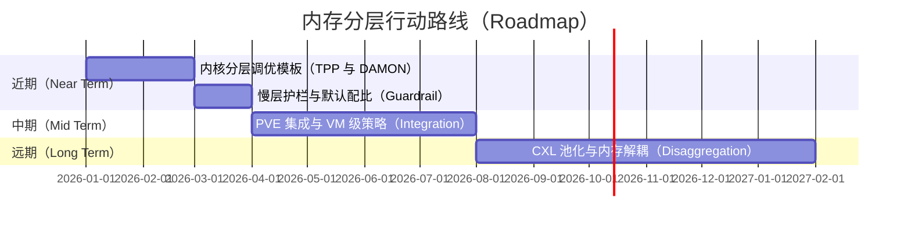
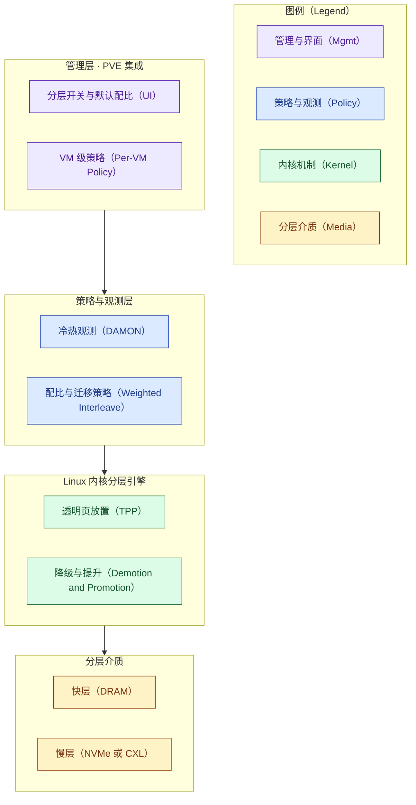
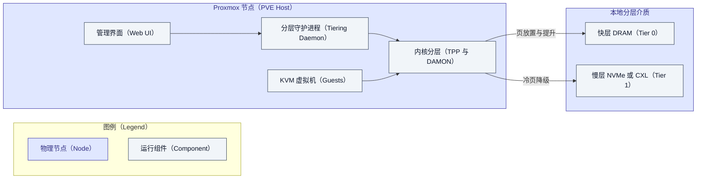

# 内存分层方向 · Proxmox VE 对标 VMware vSphere 分析报告

> 本报告由 `competitive-analysis` SOP 生成，遵循 `docs/authoring/` 写作与图表标准。检索全程
> 无授权（DuckDuckGo/WebSearch/WebFetch）。事实性内容均给出可核验来源并 `[n]` 引注；无法核验者
> 明确标注"无法确定"，不臆造。学术热点一节基于**用户提供的会议材料**，已如实标注来源。

## 章节大纲

- 目标、意图与价值假设
- 研究背景与范围界定
- 内存分层方向的学术研究热点
- Proxmox 对标 VMware 的差距分析
- 行动路线（价值筛选）
- 最优价值 MVP 架构设计
- MVP 价值兑现
- 结论
- 参考资料
- 存疑与需确认

## 零、目标、意图与价值假设

| 要素 | 内容 |
|---|---|
| 业务目标与意图 | 判断 Proxmox VE 是否、以及如何在内存分层方向投入，以缩小与 VMware vSphere 的差距，并锁定"投入产出比最高"的 MVP，支撑一次投入决策 |
| 受益者 | 有大内存与超分（overcommit）诉求、追求单机整合密度与总拥有成本（TCO）的私有云与虚拟化用户，以及 Proxmox 生态 |
| 价值主张 | 用更低成本的慢层内存（NVMe 或 CXL）安全地扩展可用内存，提升单机 VM 密度、降低每 GB 内存成本，同时不牺牲关键负载的服务质量（SLO） |
| 度量口径 | 先导：单机可安全超分比例、慢层访问占比与迁移开销、启用上手时间；滞后：每 GB 内存成本下降、单机 VM 密度提升、SLO 达标率 |

后续每一节的判断都要能追溯回这张卡。

## 一、研究背景与范围界定

内存分层的核心，是把数据在不同带宽、延迟、容量、成本的介质之间调度，让相对更快的处理器不至于
被内存"喂不饱"，同时兼顾功耗与成本——本质是一个多目标优化问题（本段背景取自用户提供的综述
材料 [8]）。它并非新概念：从硬件的多级缓存，到操作系统的虚拟内存与交换，再到企业存储的分层，
都是它的历史形态。当以 PCM 为基础的字节可寻址非易失内存（Intel Optane PMem）出现后，业界面临
"用硬件管还是用软件管"的分野；而随着 Intel 于 2022 年逐步退出 Optane 业务（公开信息），产业重心
明显转向 CXL 这类新型互连驱动的分层与内存解耦方向 [5][6][7]。

对虚拟化平台而言，"内存分层"落到两个层面：一是**分层引擎**（谁来判断冷热、迁移页面），二是
**产品化**（是否开箱可用、可观测、可运维、经过校验）。本报告即围绕这两个层面，在下列维度上对标
Proxmox VE 8.x（基于 Debian 12 与 Linux 6.x 内核，开源，AGPLv3）与 VMware vSphere/ESXi 9.x
（VCF 9，商业授权）：分层机制、慢层介质、透明性与易用性、观测与迁移策略、生态与集成、成本与
授权、成熟度。

## 二、内存分层方向的学术研究热点

> 本节内容整理自**用户提供的** OSDI 2026 Day 1 Track 2 Session 1 会议材料 [8]，聚焦数据中心
> 内存分层与 CXL。此处不额外引申材料未涵盖的细节。

五篇论文分别从不同环节切入同一组痛点——DRAM 又贵又紧、慢层（CXL、压缩内存、SSD）有延迟与
干扰，而现有页级机制既分不清"带宽与容量"，也应付不了"冷热对象混在同一页"与"元数据拖垮回收"：

| 论文 | 切入点 | 关键手段 |
|---|---|---|
| RamRyder | 只卖容量、不卖带宽 | 把 DIMM 通道作为分配单位，CXL 弹性扩带宽与容量 |
| MAC | 元数据掉进慢 CXL、回收跟不上 | 近内存加速器 offload 页描述符与 Xarray 遍历 |
| NEMO | 观测不够细或太贵 | 内存控制器内 match-update-notify 流水线 |
| OBASE | 冷热对象混页、页级分层失效 | Guide 间接引用 + 冷热堆重组，后端不改 |
| MDK | 优化指标用错（总缺页 vs SLO 下长期省内存） | 以 promotion rate 为代理，配离线最优 OPP |

其共同脉络是：分层正从"猜哪一页冷、再整页搬走"，走向**观测、布局、回收决策与 SLO、带宽/容量
解耦与元数据加速**的分工协作。这对产品的启示很直接——**页仍是迁移单位，但通道、对象、元数据与
SLO 都需要被单独建模**。这正是评估一个分层产品"上限"的标尺：VMware 与 Proxmox 目前都还停留在
相对朴素的页级/介质级分层，离学术前沿尚有距离，也因此存在长期演进空间。

## 三、Proxmox 对标 VMware 的差距分析

下表逐维对比，每条均给出可核验证据与其对价值的意义。

| 评价维度 | Proxmox VE 8.x（YYY） | VMware vSphere 9.x（ZZZ） | 差距与影响 |
|---|---|---|---|
| 分层机制 | 无一等产品特性；依赖 Linux 内核 TPP、DAMON、numa_balancing、demotion 等开源机制 [5]，另有 KSM、气球、NUMA 等既有能力 [4] | Hypervisor 原生的 Memory Tiering over NVMe：DRAM 为 Tier 0、NVMe 为 Tier 1，合成连续内存 [1] | 引擎层 Proxmox 借内核已可用；差在"成品特性" |
| 慢层介质 | NVMe、PMem、CXL 均可经内核映射为 NUMA 节点（`daxctl --mode=system-ram`）[5]，CXL-ready | 本地 NVMe，默认 DRAM:NVMe = 1:1、上限 4 TB [1] | Proxmox 介质更开放，但缺默认配比与护栏 |
| 透明性与易用性 | 需手工调内核与 sysfs（`demotion_enabled`、`numa_balancing=2` 等）[5]，无图形化开关 | 图形化管理、默认关闭、启用需维护模式 [1] | VMware 开箱易用，Proxmox 门槛高——**核心差距** |
| 观测与迁移策略 | DAMON 可自调优冷热阈值、按压力迁移 [7]；但需自行拼装 | 平台内建分层与放置，运维侧集成度高 [1] | Proxmox 有先进引擎，缺统一观测与策略面 |
| 生态与集成 | 开源、KVM/Linux 原生、社区驱动；分层能力随内核演进 | 企业生态、厂商联合验证（如 Lenovo 出具 ESXi 9.0 实施指南）[3] | VMware 有验证背书，Proxmox 靠社区 |
| 成本与授权 | 开源 AGPLv3，订阅仅为企业源与支持 | 商业授权（Broadcom 订阅） | Proxmox 无授权锁定，天然 TCO 优势 |
| 成熟度 | 内核分层已上游化，但产品化程度参差 | Memory Tiering 8.0U3 为 Tech Preview [2]，9.0/9.1 起 GA [1] | VMware 特性刚 GA、较新；两者都在早期 |

一句话概括：**Proxmox 缺的不是分层"引擎"，而是 VMware 已经补上的那层"产品化"**——图形化开关、
默认配比与护栏、统一观测与 VM 级策略、以及厂商验证。这恰好指向价值最高的着力点。

## 四、行动路线（价值筛选）

先用四维打分（价值/投入/风险/证据强度）为候选项定优先级，主指标是价值密度 = 价值 / 投入，
风险下调、证据不足者搁置（方法见 `../../value-realization-model.md`）。分值为基于上文证据的
工程判断（属个人分析，非实测）。

| 候选行动项 | 对应差距 | 价值 | 投入 | 风险 | 证据强度 | 价值密度 | 结论 |
|---|---|---|---|---|---|---|---|
| 内核分层调优模板（TPP+DAMON+加权交织）| 透明性、观测 | 4 | 2 | 2 | 4 | 2.0 | MVP 候选 |
| PVE 集成与 VM 级策略/图形化开关 | 易用性、机制 | 5 | 3 | 3 | 4 | 1.7 | MVP 候选 |
| 慢层介质护栏与默认配比 | 介质、易用性 | 4 | 2 | 2 | 3 | 2.0 | MVP 候选 |
| CXL 池化与内存解耦 | 机制、前沿 | 5 | 5 | 4 | 3 | 1.0 | 远期 |
| 对象级布局优化（借鉴 OBASE）| 前沿、效率 | 3 | 5 | 4 | 2 | 0.6 | 搁置待实证 |

据此排期：

## 五、最优价值 MVP 架构设计

MVP 取自上表价值密度最高、风险可接受、证据扎实的最小切片：**在 Proxmox 上，把 Linux 内核已有的
分层引擎"产品化"为一个可开关、可观测、带默认护栏的内存分层管理层**。它不是重造引擎，而是补上
VMware 用来拉开差距的那层易用性与运维性——这也正是"消化吸收开源实现（内核 TPP/DAMON）、只做
增量"的最优价值路径。

> 关于开源实现的吸收：本方向的关键实现（内核 TPP、DAMON、加权交织）均为开源，最有效的"逆向
> 分析"是源码与机制级研读（sysfs 开关、NUMA/`daxctl` 表示、降级/提升路径）[5][6][7]，无需二进制
> 逆向；reverse-skill 的二进制工具链在此不适用，留待遇到闭源固件/驱动时再启用（见过程记录）。

架构图刻画分层管理层的模块层次与依赖：

部署图刻画单个 Proxmox 节点上的组件、介质与运行时关系：

设计要点：管理层把"开关、默认配比、VM 级策略"暴露为一等能力（补齐 Proxmox 最大短板）；策略与
观测层用 DAMON 做自调优冷热判定、用加权交织平衡带宽与容量；内核层直接复用 TPP 的降级/提升，不
重造轮子；介质层同时支持 NVMe 与 CXL，为远期解耦内存留好接口。

## 六、MVP 价值兑现

### 产品 FAB 与价值链

价值兑现是一条可追溯的价值链：特性 → 优势 → 客户利益 → 客户 KPI → 控标差异化，每环溯回差距与
证据。

| 特性（Feature） | 优势（Advantage） | 客户利益/业务结果（Benefit） | 对应客户 KPI 或任务 | 追溯（差距与证据） | 控标差异化点 |
|---|---|---|---|---|---|
| 图形化分层开关与默认配比 | 无需手工调内核即可启用 | 部署与运维门槛大降 | 上手时间、变更风险 | 易用性差距 [1][5] | 开源平台的开箱内存分层 |
| DAMON 自调优 + 加权交织 | 冷热自适应、带宽/容量兼顾 | 慢层拖累更小、密度更高 | 慢层命中率、SLO | 观测/策略差距 [6][7] | 自调优分层策略 |
| NVMe 与 CXL 双支持 | 面向未来的介质开放性 | 平滑演进到 CXL/解耦内存 | 介质成本、演进路径 | 介质差距 [5] | CXL-ready、无介质锁定 |
| 开源 AGPLv3、无授权锁定 | 无 per-host 授权成本 | 每 GB 内存 TCO 更低 | 内存 TCO、许可成本 | 成本/授权差距 | 无厂商锁定的成本优势 |

### 客户语言的价值

对客户可以这样讲：**用一块本地 NVMe（或未来的 CXL 内存），在不加同等 DRAM 的前提下把单机能装下
的虚拟机数量做上去，把每台机器的内存账单压下来；冷数据自动沉到慢层、热数据留在 DRAM，关键业务
的响应不受明显影响。** 与 VMware 相比，同样的分层收益，却没有按主机计费的授权账单，也不被单一
厂商锁定。

### 价值度量与验证计划

| 价值假设 | 先导指标（Leading） | 滞后指标（Lagging） | 目标值 | 验证时点 |
|---|---|---|---|---|
| 慢层安全扩容不伤 SLO | 慢层访问占比、迁移开销 | 关键负载 P99 延迟 | 待基线后设定 | MVP 上线后 4 周 |
| 提升密度、降低 TCO | 单机可超分比例 | 每 GB 内存成本、VM 密度 | 待基线后设定 | MVP 上线后 8 周 |
| 易用性达标 | 启用上手时间 | 采用率、变更失败率 | 待基线后设定 | MVP 上线后 4 周 |

> 目标值标注为"待基线后设定"，因为尚无本环境实测数据；先建基线再定目标，避免拍脑袋（这是刻意
> 遵守防幻觉与"价值可度量"的做法）。验证闭环：采集指标 → 对照目标 → 兑现或修正。

### 控标经典案例

**无法确定。** 未检索到 Proxmox 内存分层相关、可公开核验的招投标"控标"案例（这类开源基础设施
通常不以招投标控标形式留存公开案例）。因此此处不杜撰客户、项目或金额。可作为招标差异化表述的
**能力点**（中性、合规）包括：开源无授权锁定、CXL-ready 的介质开放性、自调优分层策略；但是否
构成有效控标点，需结合具体招标与真实成功案例再定，当前不下结论。

## 七、结论

把七个维度收束到一句话：**在内存分层方向，Proxmox 与 VMware 的差距不在"引擎"，而在"产品化"。**
分层引擎层面，Linux 内核的 TPP、DAMON、加权交织等开源机制已经可用，Proxmox 天然继承 [5][6][7]；
真正被 VMware 拉开的，是图形化开关、默认配比与护栏、统一观测与 VM 级策略，以及厂商验证背书
[1][3]——而这些恰恰是投入产出比最高的补齐点。

因此最优价值的 MVP，不是去重造分层引擎，而是**在 Proxmox 上把内核已有的分层能力"产品化"成一个
可开关、可观测、带护栏的管理层**，以"更低 TCO、更高密度、无授权锁定"为价值主张，用先导/滞后
指标验证兑现。至于 CXL 池化与内存解耦，是与学术前沿一致的战略方向 [8]，但投入大、风险高，宜放
远期。最终价值仍需真实负载与市场检验——本报告给出的是有据可依的投入判断，而非结论性承诺。

## 参考资料

[1] Broadcom TechDocs — Memory Tiering over NVMe（vSphere 9.1，vSphere Resource Management）. https://techdocs.broadcom.com/us/en/vmware-cis/vsphere/vsphere/9-1/vsphere-resource-management/memory-tiering-over-nvme.html
[2] VMware Cloud Foundation Blog — vSphere Memory Tiering, Tech Preview in vSphere 8.0U3（2024-07-18）. https://blogs.vmware.com/cloud-foundation/2024/07/18/vsphere-memory-tiering-tech-preview-in-vsphere-8-0u3/
[3] Lenovo Press — Implementing Memory Tiering over NVMe using VMware ESXi 9.0. https://lenovopress.lenovo.com/lp2288-implementing-memory-tiering-over-nvme-using-vmware-esxi-90
[4] Proxmox VE Wiki — Dynamic Memory Management（KSM、Ballooning）. https://pve.proxmox.com/wiki/Dynamic_Memory_Management
[5] Steve Scargall — Using Linux Kernel Tiering with Compute Express Link (CXL) Memory（2024-05）. https://stevescargall.com/blog/2024/05/using-linux-kernel-tiering-with-compute-express-link-cxl-memory/
[6] LWN.net — Weighted interleaving for memory tiering. https://lwn.net/Articles/948037/
[7] LWN.net — DAMON based tiered memory management for CXL memory. https://lwn.net/Articles/978313/
[8] 用户提供材料 — 内存分层背景综述，及 OSDI 2026 Day 1 Track 2 Session 1（RamRyder、MAC、NEMO、OBASE、MDK）会议整理（本对话内提供，未独立核验）。

## 存疑与需确认

以下为"价值阐述存疑/落地条件待确认"项，遵循带着问题去核实的原则，暂不下结论：

- Proxmox 上 NVMe/CXL 分层的**生产可用性与运维成熟度**（稳定性、故障域、热插拔限制）需实测确认；
  VMware 已明确列出多项限制 [1]，Proxmox 侧对应限制**无法确定**，需实验验证。
- 学术热点中的 OSDI 2026 五篇为**用户提供材料** [8]，本报告未独立核验其发表状态与数据。
- 价值度量的目标值需先在真实负载上建立基线再设定，当前为空。
- 加权交织、DAMON 的具体性能收益随负载与硬件差异较大，本报告只引用来源的定性结论 [6][7]，未在
  本环境复现。
