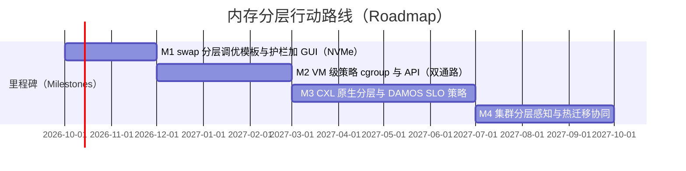
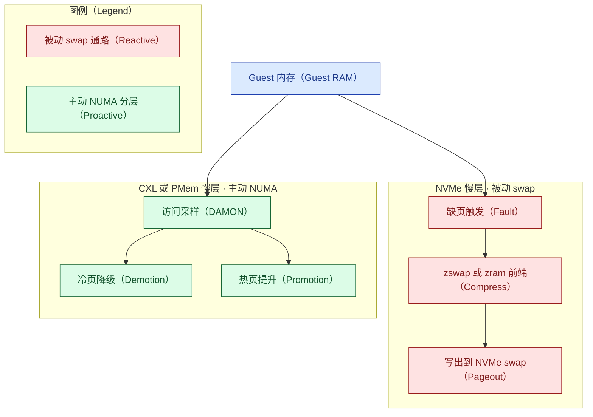
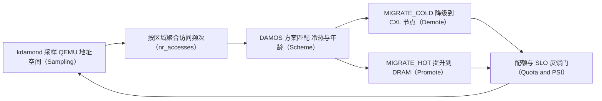

# 内存分层方向 · Proxmox VE 如何超越 VMware vSphere —— 对标分析与业务/技术规划

> 本报告由 `competitive-analysis` SOP 生成，遵循 `docs/authoring/` 写作与图表标准。检索使用**免密钥
> （keyless）**方式（DuckDuckGo/WebSearch/WebFetch）。事实性内容给出可核验来源并 `[n]` 引注；估算
> 明确标注并给推导；无法核验者写"无法确定"。学术热点一节基于**用户提供、未独立核验**的材料 [8]。
>
> 本版为 v3：经四路 reviewer 对抗式评审后重写，修正了 v1/v2 的多处**机制性事实错误**（详见文末
> "修订说明"与 [process-notes.md](process-notes.md)）。

## 章节大纲

- 目标、意图与价值假设
- 研究背景与范围界定（含代次校准与机制真相）
- 学术研究热点及其对设计的含义
- 内核视角：Linux 内存分层的历史、现状、演进与预测
- Proxmox 对标 VMware 的差距分析（按两条通路）
- 如何超越：超越论点
- 行动路线（价值筛选）
- 最优价值 MVP 架构设计
- 业务规划
- MVP 价值兑现
- 对比测试设计（意图与预估）
- 结论与投资建议
- 参考资料 / 修订说明 / 存疑与需确认

## 零、目标、意图与价值假设

| 要素 | 内容 |
|---|---|
| 业务目标与意图 | 回答"Proxmox VE 在内存分层方向**如何超越** VMware vSphere"，并给出配套的业务与技术规划，支撑一次"是否投入、投多少、先打谁"的决策 |
| 受益者 | 见"业务规划"的四类具名买家段（CSP/托管、Broadcom 迁移难民、公共部门/信创、边缘/电信） |
| 价值主张 | 以更低成本的慢层内存安全扩容、提升密度、降低 TCO，且以**开源自主可控 + CXL 原生分层**建立 VMware 结构上难以复制的差异化 |
| 度量口径（分通路） | 见"价值兑现"与"对比测试设计"，先导/滞后指标分 NVMe-swap 与 CXL-NUMA 两条通路给出 |

## 一、研究背景与范围界定

内存分层的核心，是把数据在带宽、延迟、容量、成本各异的介质间调度，兼顾性能与成本（背景取自用户
材料 [8]）。以 PCM 为基础的 Optane PMem 曾是硬件路线代表，但 **Intel 已于 2022-07 宣布退出 Optane
业务并计提约 5.59 亿美元减值，明确将"产业转向 CXL"列为原因**（支持至 2025）[14]。产业重心因此转向
以 CXL 为代表的新型互连内存。

**代次校准（v3 关键修正）**：内存分层能力强绑内核版本。加权交织 `MPOL_WEIGHTED_INTERLEAVE` 于内核
6.9 合入、DAMON 迁移动作于 6.11 合入 [6][12]；**Proxmox VE 8.x 默认内核为 6.8，二者均不具备**。
**Proxmox VE 9.0 于 2025-08-05 发布，默认内核 6.14** [15]，才真正具备这些机制。故本报告以
**Proxmox VE 9.0（内核 6.14）对 VMware vSphere/ESXi 9.x** 为对标代次（v1/v2 误用 PVE 8.x，已修正）。

**机制真相（贯穿全报告）**：Linux 上"内存分层"有两条**机制不同**的通路，必须分别评估：

- **CXL/PMem 慢层 = 主动 NUMA 分层**：慢层被内核当作**内存 NUMA 节点**，由 TPP、DAMON、降级/提升、
  加权交织主动管理 [5][6][7]。
- **NVMe 慢层 = 被动 swap/zswap**：NVMe 是**块设备**，无法经 `daxctl` 变为 system-ram NUMA 节点
  （`daxctl` 只作用于 PMem/CXL 的 device-dax）；在 Linux 上作慢层实为 **swap/zswap**（缺页触发、
  软件 PTE），**与 TPP/DAMON 分层引擎无关** [5][12]。

VMware 的"Memory Tiering over NVMe"恰恰是把 **NVMe** 作分层介质。因此像样的对标必须区分：在 NVMe
这条 VMware 主打的通路上，Linux 上游**没有**等价的主动分层引擎（只有被动 swap）；在 CXL 这条通路上，
Linux 有主动引擎，但生产级 CXL 硬件仍早期。评价维度据此设为：分层机制（分通路）、慢层介质、透明性/
易用性、**热迁移与集群协同**、**大页/THP 交互**、**故障域与安全**、观测与策略、生态与验证、成本与
授权、成熟度。

## 二、学术研究热点及其对设计的含义

> 本节整理自**用户提供、未独立核验**的 OSDI 2026 Day 1 Track 2 Session 1 材料 [8]。为避免"点名不用"，
> 每篇给出对本 MVP/benchmark 的**一句含义**。

| 论文 | 切入点 | 对本设计的含义 |
|---|---|---|
| RamRyder | 只卖容量不卖带宽；通道作分配单位 | 警示"带宽 vs 容量"不可混：**加权交织是带宽聚合分配策略，不是冷页下沉**，不能塞进容量型分层 MVP（见第七节纠正）|
| MAC | 元数据掉进慢 CXL、回收跟不上 | 大内存 VM 的页表/元数据放置需关注，慢层不宜承载元数据 |
| NEMO | 观测太粗或太贵 | MVP 的观测应低开销、可按层/按 VM，呼应 DAMON 采样 |
| OBASE | 冷热对象混页、页级失效 | 页级分层有上限；远期可探对象级布局，近期不纳入 |
| MDK | 目标应是"SLO 下长期省内存"，非最少缺页 | **直接采纳**：DAMOS 策略目标设为 promotion-rate/SLO，benchmark 增设 promotion-rate 指标（见第十节）|

## 三、内核视角：Linux 内存分层的历史、现状、演进与预测

内存管理绝大部分来自 Linux 内核，故内核轨迹是一等分析源。但须避免一面倒：VMware 的 vmkernel（非
Linux）虽拿不到内核上游红利，却在气球、透明页共享、超分、hypervisor swap 上有约二十年积累，并**率先
把 NVMe 主动分层做到 GA** [1]——"拿不到红利"只是硬币一面，另一面是"它自建了 Linux 尚缺的 NVMe 主动
引擎"。

- **历史**：分层脱胎于 NUMA 均衡与页回收；引入源自 Meta 的 TPP、访问监控 DAMON、降级/提升 [5][7]。
- **现状（截至 2026-09）**：内核已有显式内存层、加权交织（6.9）、DAMON 迁移（6.11）、CXL 经 `daxctl`
  映射为 NUMA 节点 [5][6][12]；在研的有 AMD 主导的 pghot 热页提升框架（尚未合入，与 DAMON 有职责
  之争）与"分层感知内存 cgroup"（两套竞争补丁，倾向 Hahn 方案）[12]。**关键缺口：NVMe 作主动内存
  分层层的上游工作不存在，NVMe 仍是 swap-only** [12]。
- **演进**：慢层热页检测、层级配额语义仍在打磨 [12]，与学术"观测/布局/回收-SLO/带宽-元数据"分工一致 [8]。
- **预测（推断，非定论）**：大概率向"自调优 + CXL 原生 + 更细层级/对象/按 VM 治理"演进；"分层感知
  内存 cgroup" [12] 一旦合入，正是按 VM 分层策略的上游基元。

结构性含义：**Proxmox 在 CXL 通路上随内核水涨船高（VMware 目前仅本地 NVMe），这是它的顺风；但在
NVMe 通路上 Proxmox 反而落后（只有被动 swap，VMware 是主动分层）。** 这直接决定了"如何超越"。

## 四、Proxmox 对标 VMware 的差距分析

按两条通路分别对比（PVE 9.0/内核 6.14 对 vSphere 9.x），每条给证据与影响。

| 评价维度 | Proxmox VE 9.0（YYY） | VMware vSphere 9.x（ZZZ） | 差距与影响 |
|---|---|---|---|
| NVMe 通路机制 | **被动 swap/zswap**（`swappiness`、zswap、`memory.swap.max`），无主动分层引擎 [5][12] | **主动** hypervisor 分层：DRAM Tier0 + 本地 NVMe Tier1，默认 1:1、每分层分区上限 4 TB，默认关闭、启用需维护模式 [1] | **机制差距（非包装差距）**：NVMe 上 Proxmox 落后，被动 swap 尾延迟劣于主动分层 |
| CXL 通路机制 | **主动 NUMA 分层**：TPP、DAMON 迁移、加权交织 [5][6][7]（内核 6.14 具备）[15] | 当前**未见** CXL 原生分层（仅本地 NVMe）[1] | **Proxmox 领先**，但生产级 CXL 硬件早期 |
| 慢层介质 | NVMe（swap）、PMem/CXL（NUMA）；CXL-ready | 本地 NVMe（GA）[1] | Proxmox 介质更开放、面向 CXL |
| 透明性/易用性 | 需手工 sysfs/内核调优，无图形化 [5] | 图形化管理、默认配比与护栏 [1] | VMware 开箱易用——近期核心短板 |
| 热迁移与集群协同 | QEMU 热迁移需读回全部 guest RAM，慢层页需换入，迁移时间/带宽受损；集群缺分层感知调度 | vMotion/DRS/HA **分层感知** [1] | **VMware 明确护城河**，Proxmox 未解 |
| 大页/THP 交互 | 1 GiB 大页实际不可分层、THP 需拆分；大 VM 可能得不到分层 | vmkernel 层透明处理大页 guest | Proxmox 需明确护栏，属未解风险 |
| 故障域与安全 | swap 落盘**明文**需 dm-crypt；慢层设备故障可致 guest 崩；跨 VM 侧信道/带宽噪声未治理 | 平台级处理，文档列明限制 [1] | Proxmox 侧需补齐（部分可查、部分待测）|
| 观测与策略 | DAMON 可自调优 [7]，但需自行拼装、无按 VM 策略面 | 平台内建 [1] | 有先进引擎、缺产品化策略面 |
| 生态与验证 | 开源、KVM/Linux 原生、社区；厂商验证少 | 企业生态、厂商联合验证（如 Lenovo ESXi 9.0 指南）[3] | VMware 有背书 |
| 成本与授权 | 开源 AGPLv3，订阅仅企业源与支持 | 商业订阅（Broadcom）[13] | Proxmox 无按核授权，TCO 顺风 |
| 成熟度 | CXL 分层随内核，NVMe 仅 swap；产品化早期 | NVMe 分层 8.0U3 为 Tech Preview [2]，9.1+ 起要求见 [1]（具体 GA 版本以 [1] 为准）| 两者都新，各有短板 |

一句话：**NVMe 上 Proxmox 是机制落后，CXL 上 Proxmox 是产品化落后但引擎领先。** 因此"超越"不能靠在
NVMe 上硬追 VMware，而要换战场。

## 五、如何超越：超越论点

**结论先行的反面**——超越论点是全报告的落点，故此处点明，论证已在前四节展开：

**Proxmox 不靠在 NVMe 上照抄 VMware，而靠换到四条 VMware 结构上难以跟随的战线，并卡准时机窗口。**

1. **CXL 原生分层领先**：内核是 CXL-first，Proxmox 9 已具主动分层引擎；VMware 当前仅本地 NVMe [1]。
   当 CXL Type-3 内存与内存池化落地，Proxmox 可**先于** VMware 提供 CXL 原生分层——这是最硬的技术
   超越点（非追赶）。
2. **自调优 + 可观测**：以 DAMON + DAMOS 的 SLO 目标策略（采纳 MDK [8]）做自适应冷热，减少人工。
3. **开源自主可控**：源码可审计、无境外单一厂商授权/断供风险——VMware **结构上无法对标**，在信创/
   公共部门是决定性差异化。
4. **无按核授权的 TCO**：把 Broadcom 涨价的经常性账单，换成一次性迁移 + 更便宜的慢层介质 [13]。

**时机窗口（why now）**：三股力量在同一 18 个月窗口叠加——Broadcom 2024-01 终止永久授权、转订阅、
一度停免费 ESXi，驱动**在途迁移潮** [13]；2025–2026 DRAM 价格大涨使分层 ROI 处于周期高点 [9][10]；
内核分层随 PVE 9（6.14）成熟 [15]。错过则难民被 Nutanix/OpenShift Virtualization/XCP-ng/Harvester
等 KVM 同类抢走。

**近期务实打法**：NVMe 通路承认打不过 VMware 的主动分层，就把它定位成"**够用且更便宜的密度补充**"
（swap/zswap 调优 + 护栏 + GUI），服务成本敏感与边缘；把"超越"押在 CXL 原生 + 开源自主可控上。

## 六、行动路线（价值筛选）

评分改用带锚点的 rubric（消除 v2 "武断打分"问题）：**投入**按工程人周（1=<2 周、3≈2 月、5=>6 月）；
**价值**绑第零节目标（5=同时推动密度与 TCO 且构成对 VMware 的差异化）；**风险**（越高越险）；**证据**
按来源等级（5=厂商文档+可复现，2=推断）。优先级 = 价值 × (证据/5) ÷ (投入 × 风险系数)，算式显式。

| 候选项 | 通路 | 价值 | 投入 | 风险 | 证据 | 优先级 | 结论 |
|---|---|---|---|---|---|---|---|
| swap/zswap 调优模板 + 护栏 + GUI | NVMe | 3 | 2 | 2 | 4 | 3×0.8÷(2×1.2)=1.0 | **MVP 近期切片** |
| VM 级策略（cgroup/mempolicy）+ API/GUI | 双 | 4 | 3 | 3 | 3 | 4×0.6÷(3×1.4)=0.57 | 中期 |
| CXL 原生分层 + DAMOS SLO 策略 | CXL | 5 | 4 | 4 | 3 | 5×0.6÷(4×1.6)=0.47 | **超越核心，分期** |
| 集群分层感知调度 + 热迁移协同 | 双 | 4 | 5 | 4 | 3 | 4×0.6÷(5×1.6)=0.30 | 远期 |

近期 MVP 取**最小、证据最强、可独立交付**的 swap 调优 + 护栏 + GUI 切片（它是"够用密度"的落脚点，
也为 VM 级策略与 CXL 铺路）；CXL 原生分层是**超越核心**，作为战略分期投入。里程碑（自 2026-10 起）：

每个里程碑的交付物、进出准则与 benchmark 门见下表（节选 M1）：M1 交付"文档化的 sysctl/daxctl 调优
profile + ansible 角色 + GUI 开关"；退出准则=benchmark 配置 B 通过门（P99 增幅 ≤ 约定阈值、介质单价
降 ≥ 20%）；依赖=无；后继门控 M2。

## 七、最优价值 MVP 架构设计

MVP=把 Proxmox 已有/内核已有的能力**产品化**为可开关、可观测、带护栏、可按 VM 的分层管理层，**双
通路分别落地**（纠正 v2 把 TPP/DAMON 画在 NVMe 上的错误）。

具体 Proxmox 集成点（消除"空盒子"）：
- **控制面**：`pve-manager`（ExtJS）加分层开关与默认配比面板，后端新增 `PVE::API2` 端点；按 VM 策略
  以新键写入 `/etc/pve/qemu-server/<vmid>.conf`（如 `memtier: track=nvme-swap,ratio=1:1,cap=...`），由
  `PVE::QemuServer` 解析。
- **执行路径（按通路择一并写清）**：NVMe 通路用 cgroup v2 对 `qemu.slice/<vmid>.scope` 设
  `memory.high`/`memory.swap.max` + zswap 参数；CXL 通路用 QEMU `memory-backend-ram host-nodes=` +
  guest `-numa`，或对 QEMU PID `mbind`/`set_mempolicy2`，并接内核 TPP/DAMON。
- **守护进程 I/O 契约**：读 `/sys/kernel/mm/damon/admin/`（`tried_regions`/统计）与 `/proc/pressure/
  memory`；写 DAMOS 方案参数与 per-scope cgroup 上限。按 VM 策略优先建于在研的"分层感知内存 cgroup"
  [12]（未合入则以 `memory.swap.max` + 加权交织回退，风险显式）。

两条通路（纠正后的机制图）：

CXL 通路的真实控制环（DAMON 自调优，替代 v2 的通用层叠图）：

按 VM 策略如何落到进程与介质（部署/机制）：

## 八、业务规划

**定位**：不与 VMware 拼 NVMe 分层特性，而以"开源自主可控 + CXL 原生就绪 + 无按核授权"承接 Broadcom
迁移潮，并与其他 KVM 同类（Nutanix/OpenShift Virtualization/XCP-ng/Harvester）竞速。

具名买家段与打法（先难民潮 + 信创，后 CSP）：

| 买家段 | 待办任务（JTBD） | 主价值杠杆 | GTM 次序 |
|---|---|---|---|
| Broadcom 迁移难民（中端企业）| 逃离续费又不丢能力 | GUI 一键 + 迁移安全 + 无按核订阅 [13] | 第一（最大、最紧迫）|
| 公共部门/信创 | 自主可控、capex 受限 | 开源可审计 + 规避断供 + 已有硬件多装载 | 第一（差异化最硬）|
| CSP/托管 | 密度换毛利 | 每 VM 成本、多租户 P99 隔离、自调优 | 第二 |
| 边缘/电信 | DRAM 紧张小节点多装载 | 小节点 NVMe-swap 密度 | 第三 |

**定价**：核心能力开源（AGPLv3），企业订阅=源码+支持+验证，锚定"比 Broadcom 续费便宜且可预期"。
**设计伙伴**：各段签 1–2 家，用其数据把估算变实测（见第十节），并作为验证背书补齐生态短板。
**护城河**：CXL 原生 + 自主可控是对 VMware 的结构性差异；对 KVM 同类，护城河是 Proxmox 装机量 +
一体化管理 + 更快贴内核上游。

## 九、MVP 价值兑现

### 产品 FAB 与价值链（按买家段，落到买家的钱）

| 买家段 | 特性（Feature） | 优势（Advantage） | 客户利益（买家货币）| 追溯 |
|---|---|---|---|---|
| CSP | DAMON 自调优 + 按 VM 策略 | 冷热自适应、多租户隔离 | 每宿主多装 VM、内存 $/VM 下降、租户 P99 可观测 | 观测/策略差距 [7] |
| 难民 | GUI 一键分层 + 迁移路径 | 无需手工内核调优 | 把 Broadcom 涨价的经常性账单换成一次性迁移，密度不降级 | 易用/授权差距 [13] |
| 信创 | 开源可审计 + CXL-ready | 自主可控、面向未来 | 已有硬件多装载、规避断供、合规达标 | 成本/自主可控差距 |

### 客户语言的价值

对难民买家：*"用一块本地 NVMe 把单机多装约一档 VM，内存账单下来一截；升级到 PVE 9 后冷数据自动
沉到慢层——只是要说清：NVMe 走的是智能 swap，尾延迟不如 VMware 的主动分层，适合冷数据多的负载；
真正拉开身位的是 CXL 原生分层与开源自主可控。"*（诚实区分通路，避免过度承诺。）

### 控标经典案例与差异化条款

真实**案例**：**无法确定**（未检索到 Proxmox 内存分层的可核验招投标案例，不杜撰）。但**招标差异化
条款语言**不是事实断言、不构成幻觉，故据实给出（标注为**建议表述，须结合真实招标校准**）：

- 内核原生：*"内存分层须由操作系统内核态原生机制实现，开源可审计，投标方须提供内核版本与机制
  （透明页放置、访问监控、加权交织）说明及社区提交记录。"*
- CXL-ready：*"慢层须支持经标准 NUMA/DAX 将 CXL Type-3 内存映射为系统内存层；策略与介质解耦，不得
  锁定单一慢层介质。"*
- 自调优可观测：*"冷热判定须支持基于实际访问的自适应，并可导出页级/层级统计供容量规划。"*
- 无授权锁定：*"核心虚拟化与分层能力不得依赖按主机/按核订阅解锁；授权到期平台须可继续运行。"*
- 自主可控/供应链：*"平台须开源、源码可获取可审计，关键能力可脱离单一境外商业厂商授权与支持持续
  演进，规避断供风险。"*

### 异议应答（预置弹药）

| 买家异议 | 应答 |
|---|---|
| "手工调优、无 GUI" | 正是 MVP 内容：GUI 开关 + 默认护栏随 M1/M2 交付，差距在收敛 |
| "无生产成熟度数据" | 用设计伙伴 benchmark（第十节）作证据生成，并公布结果；内核机制已在生产内核 |
| "无担责厂商/SLA" | 提供 AGPLv3 企业订阅（源码+支持）；反问："刚给你涨价的'担责厂商'，担责保住你的预算了吗？" |

### 价值度量与可证伪假设（分通路）

| 假设 | 先导指标 | 滞后指标 | 通路差异 |
|---|---|---|---|
| 慢层安全扩容不伤 SLO | 慢层访问占比、迁移/换入开销 | 关键负载 P99 | NVMe 看 `pswpin/out`、PSI；CXL 看 `pgdemote/pgpromote`、promotion-rate |
| 降介质成本、提密度 | 可超分比例 | 介质单价降幅、VM 密度 | 两通路分别核 |

**可证伪 MVP 假设 + kill-gate**：*"难民/信创段会采用，因为密度+TCO 且无授权账单；若设计伙伴在 Q1 内
达到 启用 <30 分钟 且 冷热分明负载下慢层导致的 P99 增幅 < 15%（NVMe）/ < 10%（CXL）、密度 ≥ +50%，
则加倍投入；若 P99 增幅 > 25% 或密度 < +30%，则收缩为 CSP-only 或止损。"*（阈值待基线校准，见第十节。）

## 十、对比测试设计（意图与预估）

**意图**：把上文估算变实测，验证两条价值假设，划出适用/不适用边界。基线取"纯 DRAM"**与文献**双参照
（基线不限自测）。可执行方案与脚本见 [benchmark-plan.md](benchmark-plan.md) 与 [scripts/](scripts/)。

要点（纠正 v2 不可执行问题）：真实负载命令（如 `memtier_benchmark --key-maximum=... --ratio=1:4
--data-size=1024 --test-time=300`、`db_bench --benchmarks=readrandom`）；**用 cgroup `memory.high` 或
host `mem=` 压低 DRAM 逼出分层**（否则工作集全驻内存）；**B(1:1) 与 C(1:2) 真正改配比**；**按 VM 采集**
（`qemu.slice/<vmid>.scope/memory.stat`、per-PID 计数）；**NVMe 用 swap 计数器、CXL 用降级/提升+
promotion-rate（MDK）**；增设**热迁移**与 **THP 开/关**两个维度；数值化 SLO 门。

预估（据锚点，属预估非实测，逐条可证伪）：
- NVMe B vs A（冷热分明）：介质单价降约 40%–45%（1:1，按 (0.5+0.5r)、r≈1/5–1/10 [9][10]，注：为**介质
  采购单价**非全 TCO，未含电力/磨损/CPU/性能损失，且为消费级价格，企业级比值不同）；密度**理论上限
  +100%（1:1）**、实际受"热工作集须命中 DRAM"约束显著更低（[1] 仅支持方向，不含具体数值）；P99 由
  NVMe µs 级换入主导，**无法用 [7] 的 CXL 数值推断，留待实测**。
- NVMe B vs A（均匀热/随机）：预估 P99 方向性显著上升（幅度无法确定），列为不适用边界。
- CXL D vs B：CXL 延迟据 [11] 为 140–410 ns（经 CXL 交换机可达约 600 ns）、**尾延迟高**，约为本地
  DRAM 的 2–4 倍（DRAM 基线约 50–100 ns）；[7] 的"11%→3–5%"是 Redis/YCSB 在 CXL 慢层的**执行时间**
  减速（非 P99），仅作 CXL 行的方向性参考。

## 十一、结论与投资建议

**结论（最终答案）**：Proxmox 在内存分层上**超越** VMware，不是在 NVMe 上追平其主动分层（那是机制
劣势），而是换战场——**以 CXL 原生分层（骑内核上游、VMware 目前没有）+ 开源自主可控（VMware 结构上
无法对标）+ 无按核授权的 TCO**，卡准 Broadcom 迁移潮与 DRAM 涨价窗口取胜；NVMe 通路以"更便宜的够用
密度"作近期滩头，诚实不过度承诺。

**投资建议**：
- **决策**：投。近期 2 个季度小队（M1+M2，约合前表投入 2–3 档）先做 swap 调优+护栏+GUI 与 VM 级策略，
  **先打难民 + 信创**；CXL 原生（M3）作为超越核心分期投入。
- **预期回报**：难民段=把 Broadcom 续费差额转为一次性迁移；信创段=自主可控合规 + 硬件多装载；CSP=
  每 VM 成本与密度。
- **决策门（约第 3 个月）**：设计伙伴达到上文 kill-gate 阈值则加倍并推 GA+验证背书；否则收缩或止损。
- **不投的代价**：把迁移难民与信创窗口让给 Nutanix/XCP-ng/OpenShift Virtualization/Harvester，并错过
  DRAM 高价周期的分层 ROI。

真实价值仍需第十节实测检验；本报告给出的是有据可依、且已修正机制错误的投入判断与超越路径，而非
结论性承诺。

## 参考资料

> 来源分级：独立核验来源正常引注；[8] 为**用户提供、未独立核验**。消费级价格 [9][10] 波动大、仅作
> 数量级参考，企业级比值不同。

[1] Broadcom TechDocs — Memory Tiering over NVMe（vSphere 9.1）. https://techdocs.broadcom.com/us/en/vmware-cis/vsphere/vsphere/9-1/vsphere-resource-management/memory-tiering-over-nvme.html
[2] VMware Cloud Foundation Blog — Memory Tiering Tech Preview（vSphere 8.0U3，2024-07-18）. https://blogs.vmware.com/cloud-foundation/2024/07/18/vsphere-memory-tiering-tech-preview-in-vsphere-8-0u3/
[3] Lenovo Press — Implementing Memory Tiering over NVMe using VMware ESXi 9.0. https://lenovopress.lenovo.com/lp2288-implementing-memory-tiering-over-nvme-using-vmware-esxi-90
[4] Proxmox VE Wiki — Dynamic Memory Management. https://pve.proxmox.com/wiki/Dynamic_Memory_Management
[5] Steve Scargall — Using Linux Kernel Tiering with CXL Memory（2024-05）. https://stevescargall.com/blog/2024/05/using-linux-kernel-tiering-with-compute-express-link-cxl-memory/
[6] LWN.net — Weighted interleaving for memory tiering（内核 6.9）. https://lwn.net/Articles/948037/
[7] LWN.net — DAMON based tiered memory management for CXL memory. https://lwn.net/Articles/978313/
[8] 用户提供材料 — 内存分层背景综述 + OSDI 2026 Day1 Track2 Session1（RamRyder/MAC/NEMO/OBASE/MDK），本对话内提供、未独立核验。
[9] Stanford DAM — Memory Prices. https://dam.stanford.edu/memory-prices.html
[10] RAM vs SSD Price Trends（消费级市场数据，波动大，仅作数量级参考）. https://rampricehistory.com/blog/ram-vs-ssd-price-trends-2026
[11] Maruf 等 — Dissecting CXL Memory Performance at Scale（arXiv:2409.14317，CXL 140–410 ns、尾延迟）. https://arxiv.org/pdf/2409.14317
[12] LWN.net — Recent work in memory tiering（截至 2026-09；pghot、分层感知 cgroup）. https://lwn.net/Articles/1092001/
[13] The Register — Broadcom 终止 VMware 永久授权、转订阅、停免费 ESXi（2024）；另见 Broadcom KB 309138. https://www.theregister.com/2024/02/13/broadcom_ends_free_esxi_vsphere/
[14] Tom's Hardware — Intel 结束 Optane 业务（2022-07，约 5.59 亿美元减值，因 CXL 转向）. https://www.tomshardware.com/news/intel-kills-optane-memory-business-for-good
[15] Proxmox — Proxmox VE 9.0 发布（2025-08-05，Debian 13，默认内核 6.14）. https://www.proxmox.com/en/about/company-details/press-releases/proxmox-virtual-environment-9-0

## 修订说明（v3，经四路评审）

- 机制修正：NVMe=swap/zswap（非 TPP/DAMON；`daxctl` 不适用于 NVMe）；TPP/DAMON 降级=迁到 NUMA 层
  （非写 NVMe）。图与话术全面纠正，分两通路。
- 代次修正：对标改为 PVE 9.0（内核 6.14）对 vSphere 9.x [15]；加权交织(6.9)/DAMON 迁移(6.11) 仅 PVE 9 具备。
- 数值修正：删除误用 [7] 的"P99<10%"；密度"+80–100%"改为"理论上限+100%、实际更低"，[1] 仅支持方向；
  TCO 改称"介质采购单价降幅"并列明未含项与消费级价格局限；CXL 延迟改为 140–410 ns 区间 + 尾延迟。
- 论点修正：NVMe 上是机制差距（非包装）；超越靠 CXL 原生 + 自主可控 + TCO + 时机，非追赶 NVMe。
- 补齐维度：热迁移×分层、大页/THP、故障域/安全/vNUMA/KSM、why-now、具名买家段、控标条款语言、
  异议应答、可证伪假设+kill-gate、投资建议、业务/技术双规划。

## 存疑与需确认

- **NVMe 引擎对等未成立**：Linux 上游无 NVMe 主动分层，Proxmox NVMe 侧仅被动 swap，与 VMware 主动
  分层非对等；这是最需实测的落差。
- 生产成熟度、故障域、热迁移惩罚、THP 交互：部分可查、部分**无法确定**，须按第十节实测。
- 价值目标值为**基于公开材料的估算**（介质单价降幅可推、密度与 P99 待实测），企业级价格比值与非介质
  TCO 分项未定。
- [8] OSDI 材料未独立核验；[9][10] 为消费级价格。
