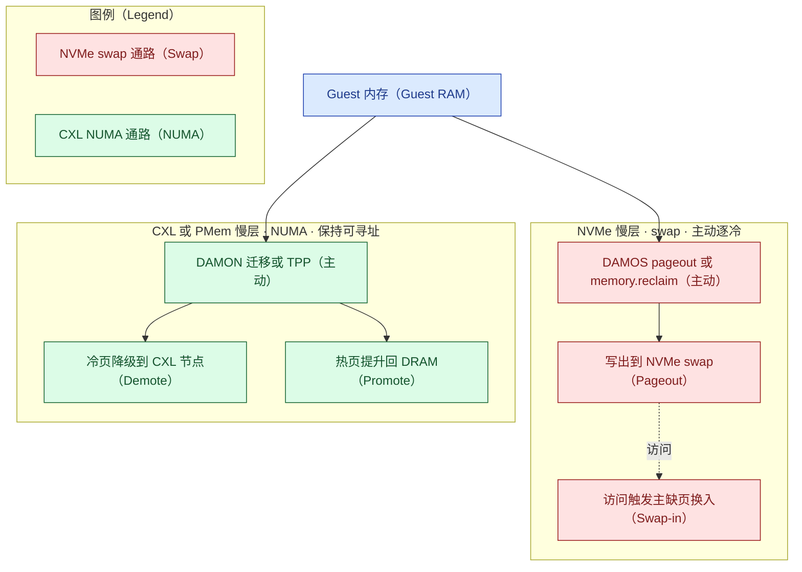
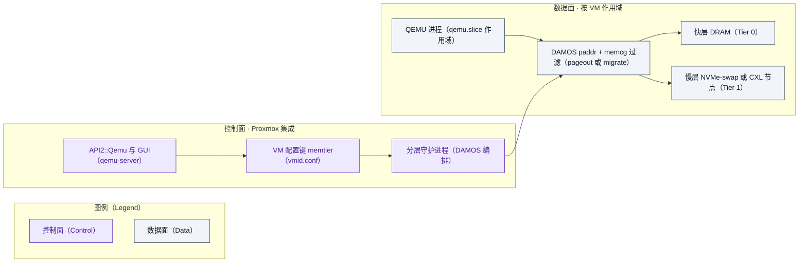

# 内存分层方向 · Proxmox VE 如何超越 VMware vSphere —— 对标分析与业务/技术规划

> 由 `competitive-analysis` SOP 生成，遵循 `docs/authoring/` 标准。检索用**免密钥（keyless）**方式。
> 事实性内容 `[n]` 引注；估算显式标注；不留悬留存疑——每条经核验后落到"事实 / 预测+门 / 确定的
> 不可得判定+处理"三种闭环形态之一（见文末"结论校准与验证闭环"表）。学术热点一节的 OSDI '26 材料
> **已由主 agent 抓 USENIX 官方议程一手确认**（升级自用户线索 [8]）。
>
> **本版 v4：经两轮共 7 路 reviewer 对抗式评审（第二轮全部用与主 agent 一致的 Claude Fable 5，含一路
> 对 v6.14 内核源码逐条核验）后重写。v4 纠正了 v3 的一处方向性错误**——见文末"修订说明"。
> **v4.3–v4.4：按升级后 SOP 的"机制底座（逆向消化）"必过门，机制性判断统一挂接到
> [reverse-digest.md](reverse-digest.md)（术语贴回函数 + 论文增量表，证据分级标注）；随后经一路
> Fable-5 机制底座对拍（判 FAIL、9 条必修）返修——含一处作者归属改正与计数器按 VM 口径的
> 分版本重述，均经一手再核验。**
> **v4.5：按"结论闭环（不留悬留存疑）"规则，启动五路资深 reviewer（Opus，配置同主 agent）并行对拍，
> 把原"存疑与需确认"逐条推进到闭环。本轮已闭环：OSDI '26 五篇（含 NEMO/OBASE）升为一手确认、
> 头对头 P99 删除循环的 ±15% 区间改为悬崖结构 + 可证伪门、产品化拆 M1a/M1b + 五卡点、vMotion/大页
> 改挂第一方源、介质降幅改方向性。主 agent 对 reviewer 一手结论再核验（USENIX 议程、Broadcom
> best-practices、TrendForce、PVE roadmap 均亲自复抓），并**否决了 reviewer 两条误报**（代次表、[1]
> 归属——报告原本正确）。CXL/信创/TCO/控标案例的闭环见文末"结论校准与验证闭环"表。**

## 章节大纲

- 目标、意图与价值假设
- 背景、代次校准与机制真相
- 学术热点与生产级证据
- 内核视角：历史/现状/演进/预测
- 差距分析：差在产品化，不在引擎
- 如何超越：产品化 + 结构性护城河
- 行动路线与最优价值 MVP
- 业务规划
- MVP 价值兑现
- 对比测试设计（含与 ESXi 头对头）
- 结论与投资建议
- 参考资料 / 修订说明 / 结论校准与验证闭环（无悬留存疑）

## 零、目标、意图与价值假设

| 要素 | 内容 |
|---|---|
| 业务目标与意图 | 回答"Proxmox VE 在内存分层方向**如何超越** VMware vSphere"，给出业务/技术规划，支撑"是否投入/投多少/先打谁"的决策 |
| 受益者 | Broadcom 迁移难民 · 公共部门/信创（有限定）· CSP/托管 · 边缘（见业务规划）|
| 价值主张 | 把内核**已具备的主动分层机制**产品化为集成、可按 VM、带护栏、迁移/HA 感知的能力；以**开源自主可控 + 无按核授权 TCO** 建立 VMware 难以复制的结构性差异 |
| 度量口径 | 分 NVMe-swap 与 CXL-NUMA 两通路给指标（见价值度量）|

## 一、背景、代次校准与机制真相

内存分层把数据在带宽/延迟/容量/成本各异的介质间调度（背景取自用户材料 [8]）。Intel 已于
2022-07 退出 Optane 业务、明确因"产业转向 CXL" [14]，硬件重心转向 CXL。

**代次校准（v4 更新）**：内存分层强绑内核版本。Proxmox VE 9.0（2025-08，内核 6.14）[15] 起具备较完整
分层；**9.1（2025-11，内核 6.17）、9.2（2026-05，内核 7.0）** 更进一步（6.16 加 DAMOS 目标度量与加权
交织自调优、6.17 加 vaddr 上的 DAMON 迁移）[19]。本报告以 **PVE 9.2（内核 7.0）对 vSphere/ESXi 9.x**
为基准（PVE 8.4 起可选装 6.14，故并非"8.x 全无"）。

**机制真相（v4 关键纠正）**：两条慢层通路机制不同，但**都已有主动机制**——区别在**可寻址性**，不在
"主动/被动"：

- **NVMe 慢层 = swap 通路**：NVMe 是块设备，`daxctl` 不适用；但 Linux 早已能**主动**把访问-冷页逐到
  swap——`DAMON_RECLAIM`（内核 5.16）、`DAMOS pageout`（paddr，可按 memcg 过滤到 `qemu.slice/<vmid>.
  scope`）、cgroup v2 `memory.reclaim` [16]。慢层页被换出后，访问需**主缺页 + µs 级 I/O**。
- **CXL/PMem 慢层 = NUMA 通路**：慢层是内存 NUMA 节点，页**保持映射/字节可寻址**，访问**不产生
  主缺页、无 I/O**（提升依赖的 hint fault 是采样性的轻量缺页，代价与 swap 主缺页不同量级）；由
  TPP 降级/提升、DAMON 迁移（paddr）管理 [5][16]。

> **机制底座**：以上两通路的函数级依据见 [reverse-digest.md](reverse-digest.md)——同一次回收扫描里
> 由 `can_demote()` 分岔：降级 = `demote_folio_list`→`migrate_pages()`（页保持映射），换出 = `pageout`
> 解除映射写 swap；冷/热判定三套并行（DAMON `nr_accesses` 与 LRU 老化判冷、hint fault 选热页）。

VMware 的 Memory Tiering over NVMe 也是"按 recency+frequency 在 4 KB 粒度分类、访问时 page-in" [1]——
**与 DAMON(paddr)+DAMOS pageout 到 swap 属同一类机制**。因此 v3"NVMe 上是机制差距"的结论**不成立**；
真正的差距是**产品化/集成**（默认配比与护栏、按 VM 策略面、DRS 式分层感知放置、迁移/HA 协同、
guest 透明）。评价维度据此设为：主动机制（双通路均有）、产品化/集成、按 VM 策略、迁移/HA、大页、
故障域/安全、成本/授权、成熟度。

## 二、学术热点与生产级证据

学术前沿（用户以**线索**提供，主 agent 已独立核验 [8]）：OSDI '26 的 "Memory Tiering and CXL" track
**五篇论文题名与作者全部经 USENIX 官方技术议程一手核实**（主 agent 直接抓取 [8]，含中性无提示复抓以
排除提示污染），无一项停留在"命名存疑"：
- **RamRyder**（"Break On Through to the Other Side: Pooling Memory Elastically with RamRyder"，Zhou/
  Xu/Seo/Manzanares/Swanson [28]）：软件定义弹性内存，把 guest 页到内存通道的映射作分配单位；摘要
  verbatim 报告容量/带宽利用率各 **+28.6%/+43.2%**——该数字证据级由"用户材料"**升为论文一手**，并
  印证加权交织是带宽聚合、非冷页下沉。
- **MAC**（"Metadata Acceleration for Sustainable Performance in Big-Data Systems with CXL DRAM"，
  Lee/Sun/Ji 等 [8]）：CXL DRAM 元数据加速，加速的正是 kswapd 扫 `struct folio`+Xarray 的路径。
- **NEMO**（"Finding NEMO: Nimble and Expressive Memory Observability"，Li/Giordano/Garg/Kadekodi/
  Berger/Kasikci/Anderson/Peter [29]）：面向内存控制器的硬件遥测引擎，为 OS 各子系统提供按策略定制的
  内存行为视图——**命名与题名已一手确认**（此前"未确认"结论已作废）。
- **OBASE**（"Object-Based Address-Space Engineering to Improve Memory Tiering"，Banakar/Yang/Wu/
  Arpaci-Dusseau×2/Keeton；arXiv 2603.00378 [30]）：指出分层低效根因是分配器按 size-class 摆放致冷热
  对象混入同页的 **hotness fragmentation**，用地址空间重排使冷热各自聚页——**命名与题名已一手确认**，
  其 hotness 谱系上承 SoarAlto "Beyond Hotness" [22]。
- **MDK**（"Rethinking the Data Center Memory Reclamation Problem"，Patel/Yang/Wang 等 [8]）：把回收
  目标设为"SLO 下多容纳作业"，对应 DAMOS 目标 `some_mem_psi_us`、`promotion-rate` 经 `user_input`
  反馈 [16]。

**更贴近本 MVP 的是生产级证据**：Meta 的 TMO（Transparent Memory Offloading，ASPLOS'22）在机群规模用
PSI 驱动把冷页主动 offload 到 zswap/NVMe swap [17]；Google 远内存（ASPLOS'19）用 zswap 同理。§七 的
"读 `/proc/pressure/memory` → 写 per-scope cgroup 上限"正是 TMO 的架构——这说明 **NVMe swap 通路的
主动分层是已被生产验证的成熟做法，不是"缺失的引擎"**。

另有直接相关的已核验工作：**Equilibria**（面向 CXL 分层的公平多租户 OS 框架，按容器/租户调控提升与
降级）[20] 为 CSP"按 VM 多租户隔离"提供了学术先例；**Managing Memory Tiers with CXL in Virtualized
Environments（Memstrata，OSDI '24，微软）**[21] 表明 **CXL 分层在虚拟化环境已有系统性研究**——部分
回应"KVM guest 上分层无实测"之虑（但仍非 Proxmox+DAMON 的直接实测，见"存疑"）。

> **机制底座（论文增量）**：上述论文相对内核上游的增量已逐条"贴回函数"——RamRyder 的 channel 在 mm
> 中**无对应层级**（源码核验）、MDK 的 promotion-rate 上游只是副产品（`pgpromote_success`/DAMOS
> stats，源码核验）、MAC 加速的正是 kswapd 扫 `struct folio`+Xarray 的路径（源码核验）、OBASE 重构
> 的是分配器 size-class 造成的冷热混页（**阅读式**——分配器源码研读、未运行）。全表与逐条证据
> 分级见 [reverse-digest.md](reverse-digest.md) 收束二；"贴不上的部分即论文增量"。

## 三、内核视角：历史、现状、演进、预测

内存管理绝大部分来自 Linux 内核，是一等分析源；但须平衡看：VMware 的 vmkernel（非 Linux）虽不继承
内核上游，却率先把 NVMe 主动分层做到 GA 且 **guest 透明** [1]。

- **历史**：降级"reclaim 时下沉"由 Intel 提交（Dave Hansen，5.15）；提升"hint-fault 选热页"由 Intel
  提交（Huang Ying，6.1）；**显式内存层**（`mm/memory-tiers.c`）由 IBM 的 Aneesh Kumar K.V 提交
  （commit `992bf775`，2022-08 作、入 6.1；作者与日期经 GitHub API 一手核验）[27]；"TPP"是 Meta
  论文命名。DAMON 访问监控与 `DAMON_RECLAIM` 见 5.15/5.16 [16]。
- **现状（截至 2026-09 [12]）**：加权交织（6.9）、DAMON 迁移 paddr（6.11）、DAMOS 目标度量与加权交织
  自调优（6.16）、DAMON 迁移 vaddr（6.17）；在研 pghot（`kmigrated` + AMD IBS）与"分层感知内存 cgroup"
  （两套竞争补丁，Hahn 方案被认为更值得推进）[12]。**注意**：DAMON 迁移动作在 6.14 仅 paddr 支持，
  vaddr 要到 6.17（PVE 9.1+）。
- **演进/预测（推断）**：向自调优 + 按 VM（分层感知 memcg）+ CXL 更细治理演进。
- **结构性含义**：主动分层机制**两条通路都已具备且在快速演进**；VMware 与 Proxmox 都还在"整合"阶段。
  "骑内核上游"是**所有 KVM 同类共享**的——这部分上游代码由多厂工程师共写（显式内存层来自
  IBM [27]、hint-fault 提升来自 Intel、PSI/`memory.reclaim` 一线来自 Meta [17]），任一 KVM 发行方都
  同等继承，故对同类不构成差异。

## 四、差距分析：差在产品化，不在引擎

按已核验事实（PVE 9.2/内核 7.0 对 vSphere 9.x）：

| 维度 | Proxmox VE 9.2 | VMware vSphere 9.x | 差距 |
|---|---|---|---|
| 主动分层机制 | 有：NVMe 走 DAMOS pageout/`memory.reclaim`；CXL 走 TPP/DAMON 迁移 [16] | 有：NVMe 主动分层（recency+frequency，4 KB，1:1 默认、每分层区上限 4 TB、默认关、维护模式）[1] | **同类机制，非差距** |
| 产品化/集成 | 需手工拼装（sysctl/DAMOS/cgroup），无统一默认与 GUI [5] | 平台内建、默认护栏、GUI [1] | **核心差距** |
| 按 VM 策略 | 内核基元在研（分层感知 memcg [12]）；今可用 DAMOS paddr + memcg 过滤到 `qemu.slice/<vmid>.scope` | 平台级 | 差在产品面 |
| 迁移/HA | QEMU 迁移需换入慢层页；集群缺分层感知放置 | vMotion 分层页需先取回（**1.5–2×**更慢，Broadcom 一手 best-practices 页 verbatim "vMotion will take longer (1.5X to 2X) to complete, since pages must be fetched from the NVMe tier first"，但"运行中 VM 几乎无性能影响" [31]）、DRS 有分层放置逻辑 [1] | VMware 优势在 **DRS 放置**（迁移惩罚双方都有）|
| 大页 | THP 整体迁移、-ENOMEM 才拆；hugetlb（1 GiB）不可分层 | 启用分层即**每 VM 关大页**、按 4 KB（VMware VCF 官方博客 verbatim "ESX intentionally disables host-level large pages when Memory Tiering is configured"，且 1 GB 页 VM 自动锁 Tier 0 DRAM [34]；[18] 佐证）| **双方都牺牲大页** |
| 故障域/安全 | 慢层设备故障丢 VM；swap 明文需 dm-crypt | 无 RAID-1 时 NVMe 故障→HA 重启（丢 VM）；加密可选 [1] | 双方慢层故障都丢 VM |
| 成本/授权 | 开源 AGPLv3、无按核授权 | 商业订阅（Broadcom，2024-01 起停永久授权）[13] | **Proxmox 结构性顺风** |
| 成熟度 | 分层随内核演进、产品化早期 | NVMe 分层 8.0U3 TP（4:1）[2]、**9.0 起 GA**（1:1/4TB）[1][3] | 两者都新 |

一句话：**差距在"整合成品"，不在"分层引擎"。**"主动分层机制"一行的函数级依据（观测/降级/换出/
提升四件套在上游齐备）见 [reverse-digest.md](reverse-digest.md)（其"反哺"节把 ADR-0001/0003 由概念级
证据升为函数级）。"大页"一行 Linux 侧的机制位置——`migrate_pages()` 整体迁移大 folio、目标侧分配
失败才 split 重试；hugetlb 不入 LRU、既不换出也不降级——亦见 reverse-digest（标注为阅读式）。

## 五、如何超越：产品化 + 结构性护城河

**超越论点（v4 收敛后）**：

1. **把内核已有的主动机制产品化**——在 Proxmox 上做出集成的、按 VM、带护栏、迁移/HA 感知的分层
   产品（NVMe 走 DAMOS pageout + memcg 过滤 + GUI + 分层感知放置）。差距是产品化，能靠贴内核**快速
   补齐**，无须重造引擎。
2. **结构性护城河（VMware 难以复制的只有这两条）**：**开源/AGPL**（可审计、可 fork、无锁定）与
   **无按核授权 TCO**。其余（CXL、自调优）VMware 可跟随。
3. **CXL 是时机领先，不是结构性超越，且 VMware 侧近期已降温**：截至 2026-09，VMware/Broadcom **未把
   CXL 纳入 Memory Tiering**——vSphere 9.0/9.1 全部一手产品文档 CXL 命中为 0（主 agent 亲验 9.1 Memory
   Tiering 页仅定义 Tier 1 = NVMe [1]），唯一可核实的一手 CXL×ESXi 表态是 VMware Explore 2024 的
   **Project Peaberry"CXL 加速器"前瞻演示、带无交付义务免责**（据对拍 reviewer，单一来源、主 agent
   未再核）。即 **Proxmox 与 VMware 在 CXL 上同处"未 GA"起跑线**，VMware 甚至两年未重申——这比"trade
   press 列候选"是**更强的反 why-now 证据**。且 CXL 扩展器 $/GB ≥ DIMM，DRAM 涨价同样抬高它——故 CXL
   **不接** "why-now" 的成本论。CXL 作为期权，随内核（6.16/6.17/7.0）成熟推进。

**why-now（只对 NVMe/现有通路成立）**：Broadcom 2024-01 停永久授权、转订阅、一度停免费 ESXi → 迁移潮
[13]；2025–2026 DRAM 涨价使 swap 分层 ROI 高 [9][10]。对手（抢同一批难民）：Nutanix、OpenShift
Virtualization、Harvester（均 KVM/Linux）、XCP-ng（**Xen，非 KVM**）、及国产 HCI（华为/浪潮/H3C/
ZStack/SmartX/深信服）。

## 六、行动路线与最优价值 MVP

评分：投入按人周（1=<2周,3≈2月,5=>6月）；价值按第零节目标；**证据作门槛（非乘子）**；价值按买家 JTBD
计。近期 MVP 取"可独立交付、直击产品化差距"的切片：

| 里程碑（自 2026-10）| 内容 | 门 |
|---|---|---|
| **M1a 功能（~2 月）** | 按 VM DAMOS pageout 策略 + memcg 过滤 + GUI + 护栏（NVMe 通路）——所需内核基元 6.14 全就绪（见下"能否快速补齐"闭环）| 功能门：`memtier:` 键→DAMOS(paddr) pageout + memcg 过滤到 `<vmid>.scope`→冷页落 NVMe swap→GUI 呈现 per-VM swap/PSI，**且 VM stop/start 后自动恢复生效**（DAMOS stats 重新计数）|
| **M1b 达标（调参预算另计，不含在 M1a 两月内）**| 在 M1a 基础上调 DAMON/DAMOS 参数至过性能门 | 与 ESXi 头对头（config E）见 §八/§九 的悬崖结构门与双指标；调参设预算上限（≤N 人日），超出即 FAIL |
| M1 并行 | **迁移/HA 分层感知**（放置 + 迁移前预热/换入）| 迁移时长 ≤ 基线 2×；HA 故障切到无慢层节点安全 |
| M2（3 月）| 分层感知集群放置（DRS 式）| 集群级密度提升可测 |
| M3（4 月）| CXL 原生分层 + DAMOS SLO 策略（随内核）| 有 CXL 硬件的设计伙伴上验证 |

**"能否快速补齐"闭环（工程判断，非实测）**：能，但须把 M1 拆成"功能（M1a）"与"达标（M1b）"两段
计时。所需内核基元**在 6.14 全部就绪**（经 kernel.org v6.14 一手文档核验）：`paddr` 物理地址监控、
`pageout` 动作、`memcg` 过滤器（把 cgroup 路径写入 `memcg_path`）、以及 **allow-list 语义**（`allow`
文件写 `Y`/`N` 决定满足条件的内存是否允许施加动作，故"只对 `qemu.slice/<vmid>.scope` 生效"可直接
表达）。**增强项**"分层感知内存 cgroup"（Hahn 2026-08-07 / Liu 2026-08-18 两套 LWN 在讨论的补丁系列）
截至 2026-09 **在任何已发布内核中都不可得**——此判断由**日期论证**承重：补丁注期晚于内核 7.0（2026-05）
发布，结构上不可能在其中；pghot/`kmigrated` 另被 LWN 记为 "likely to be stuck on the ground floor for
some time yet" [12]。但这两者**都只是增强、非 MVP 前提**：MVP 走"每 VM 一条 scheme + memcg 过滤"与它们
完全解耦。工作量级判断 **~1.5–2 人月（预测非实测）**，隐含前提：小队已熟悉 PVE Perl/ExtJS、仅指功能
（非达标）、不含迁移/HA、不含上游合入、不含 guest 透明化。

**五条产品化编排卡点（卡点不在引擎、不在缺基元）**：

| 卡点 | 为何硬 | 证据级 |
|---|---|---|
| ① **memcg 过滤器 VM 重启后静默失效** | `memcg_path` 在 commit 时解析为**数字 id**；VM stop/start 令 systemd 重建 `<vmid>.scope`→新 id→过滤器持旧 id→scheme **静默变 no-op**（不报错、分层悄悄停摆）。守护进程须在每次 VM 生命周期事件后重新 commit + 看门狗 | 推断（据 lore 补丁镜像）；**极易实测**（重启 VM 看 DAMOS stats 是否归零），列 M1a 首测项 |
| ② 单 kdamond 单 context（v6.14 原文 "only one context per kdamond is supported"）| 多 VM 可挂多 scheme 但共享采样/聚合区间与配额账；真按 VM 差异化调激进度需 N 个 kdamond=N 内核线程，CPU 随 VM 数线性增长 | 一手文档 |
| ③ DAMON sysfs 无所有权仲裁 | 守护进程与管理员手工 `damo` 写同一棵树互相覆盖，产品须独占接口并检测外部改动 | 推断 |
| ④ balloon/KSM 与 DAMOS pageout 无协调 | PVE 默认启用 balloon/KSM，两个互不知情的回收控制器作用于同一内存；VMware 自家数据显示 balloon 远优于盲目 swap，故 MVP 须**与 balloon 协同而非取代** | 推断 |
| ⑤ 护栏失效爆炸半径是宿主级 | DAMOS 配额失配→跨 VM 宿主级 swap 风暴，须宿主级总配额 + PSI 熔断 | 推断 |

**M1 第 0 天前置检查**：PVE 发行版内核是否编入 `CONFIG_DAMON_SYSFS/DAMON_PADDR/MEMCG`（keyless 无法
确认发行版编译开关，故"上游 6.14 已具备"须与"PVE 是否编入"分开——一条 `grep DAMON /boot/config-$(uname -r)`
即自证；若未编入，"两月"需加内核重建与支持策略变更）。

MVP 集成点（内核侧结论=源码核验，见 [reverse-digest.md](reverse-digest.md)；Proxmox 侧集成点
【`PVE::API2::Qemu`、`vmid.conf`、`PVE::QemuServer`】=qemu-server 源码研读，属**阅读式**，
详见 ADR-0003）：
- 控制面：**`PVE::API2::Qemu`（qemu-server，非 pve-manager）** + GUI；按 VM 策略写 `/etc/pve/
  qemu-server/<vmid>.conf` 新键（如 `memtier: track=nvme-swap,ratio=1:1,cap=...`），`PVE::QemuServer`
  解析。
- 执行：NVMe 通路用 **DAMOS paddr + memcg 过滤到 `qemu.slice/<vmid>.scope` + `pageout`**（今 6.14 即
  可），辅以 `memory.high`/`memory.swap.max`、`memory.reclaim`；CXL 通路用 TPP/DAMON 迁移。**勿把 guest
  RAM `policy=bind` 到慢层节点**（会使其永不"misplaced"、提升永不触发）[16]。守护进程读 DAMOS `stats`
  与 `/proc/pressure/memory`、`qemu.slice/<vmid>.scope/memory.pressure`。
- 观测面：**照 damo/DAMON 的分工**——热判断与开销控制在内核、产品层只做配置与呈现；GUI 数据源可
  直接参照（甚至复用）`damo report heatmap/wss`（见 [reverse-digest.md](reverse-digest.md) 反哺节）。

两条通路（已修正方向：swap-out 由回收/`memory.high`/DAMOS 触发，缺页触发 swap-in）：

按 VM 产品化控制面（今 6.14 即可落地的路径）：

## 七、业务规划

**定位**：以"开源自主可控 + 无按核授权 + 产品化分层"承接 Broadcom 迁移潮，并与 KVM 同类竞速。

| 买家段 | JTBD | 主价值杠杆 | 次序 |
|---|---|---|---|
| Broadcom 难民 | 逃续费又要**对等**能力 | 无按核订阅 + 迁移安全 + 产品化分层 [13] | 第一 |
| CSP/托管 | 密度换毛利 | 按 VM 策略 + 分层感知放置 + 每 VM 成本 | 第一（**CXL 期权的首用买家**）|
| 公共部门/信创（限定）| 自主可控、capex 受限 | 开源可审计 + 无锁定 | 第二（须限定）|
| 边缘 | 小节点多装载 | NVMe-swap 密度 | 第三 |

**信创限定与 YYY 双形态（v4.5 明确）**：本方 YYY = 最新版 Proxmox VE，可泛化为**国内基于 Linux/KVM
的衍生/同类 HCI**（深信服 aSV / Sangfor HCI、SmartX SMTX OS/ELF 等——它们与 PVE **同承 Linux/KVM 上游**，
故本报告的内核分层机制分析对它们同等适用；证据级：KVM 基座属业界共识，具体入围/认证条目主 agent 本轮
未能独立核验，见"结论校准与验证闭环"表）。据此信创分两形态：
- **形态 A（Proxmox VE 直接入目录）**：Proxmox 为奥地利厂商（Proxmox Server Solutions GmbH），直接进
  中国信创/央采目录**现实可及性低**（目录重"国产厂商主体/自主可控"）——现实路径是国内厂商基于其
  AGPL 源码的二次发行，而非 Proxmox 原厂。
- **形态 B（国产 KVM HCI）**：深信服/SmartX 等**本就在国产化生态经营**，主体资格不是问题。但**分层特性
  仍受内核代次卡住**：信创 OS（麒麟、统信 UOS）内核多停留在 5.x/6.6 一线（据对拍 reverse 轴：麒麟 V11≈
  6.6、UOS V20≈4.19，主 agent 未逐一再核），**滞后于分层所需的 6.14+**；国产 CPU（鲲鹏/飞腾/龙芯）
  多无公开 CXL 支持。故"内核 6.14+ 分层"这条链在信创现实可及的仅**"x86 信创（海光/兆芯）+ 可上 6.14+
  内核 + 无 CXL + 非 CoCo"**子集。

**CoCo 边界（v4.5 纠正因果）**：机密计算（SEV-SNP/TDX）VM 的**私有内存在现行 Linux 下不能被 host 动态
分层（swap/迁移）**——但这是**实现缺口、非加密的架构禁止**：AMD（`SNP_PAGE_MOVE`/`SNP_PAGE_SWAP_OUT`）
与 Intel（`TDH.MEM.PAGE.RELOCATE`）的固件 ABI 都已具备 relocate/swap 私有页的能力，Linux 未接；且
`guest_memfd` 的"不可换出/不可迁移"限制**对非机密 guest 同样成立**，可见加密非主因（LWN "The state of
guest_memfd" verbatim："Private memory cannot (on the host) be mapped into user space, swapped out, or
migrated." [36]；ABI 细节据对拍一手核验、主 agent 未逐条再核）。**例外**：CoCo VM 的**共享页可正常分层**，
私有页的**静态 NUMA 放置今已可用**。对本案例的净含义不变：面向 CoCo 卖点应是"共享页分层 + 静态放置"，
不承诺私有页动态分层。

定价：核心 AGPLv3，企业订阅=源码+支持+SLA（**分层 GUI/策略须在 AGPL 核心，否则与"不得按核解锁"控标
条款自相矛盾**）。价格结构性差异是护城河的耐久驱动——Proxmox **按 CPU 插槽定额订阅 + 可选**对 VMware
VCF **按核强制订阅**；**精确比值公开不可得**（Broadcom 2024 后实价多在 NDA），故报告以"结构性不对称"
而非某个倍数支撑 TCO 论点（见闭环表 4c）。

## 八、MVP 价值兑现

### FAB 价值链（落到买家的钱）

| 买家段 | 特性→优势 | 客户利益（买家货币）|
|---|---|---|
| 难民 | 无按核订阅 + 产品化分层 | 把 Broadcom 续费差额换成一次性迁移；同硬件对等密度 |
| CSP | 按 VM DAMOS 策略 + 分层感知放置 | 每宿主多装 VM、内存 $/VM 下降、可迁移可运维 |
| 信创（限定）| 开源可审计、无锁定 | 自主可控合规、已有硬件多装载 |

### 客户语言

对难民：*"用一块 NVMe 把单机多装一档 VM、内存账单降一截；冷页由内核主动逐到慢层、按 VM 可控。要
说清：NVMe 走智能 swap，尾延迟不如 DRAM 常驻，适合冷数据多的负载；真正拉开身位的是开源无锁定与
按 VM 的产品化，而非某个独家引擎。"*

### 控标条款（真实案例按闭环表 form ③：不杜撰、给条款语言 + 提升路径；条款为建议表述）

内核原生可审计 / 按 VM 策略与观测 / CXL-ready 介质开放 / **不得按主机或按核订阅解锁分层** /
自主可控·供应链。异议应答：无 GUI→正是 MVP；无成熟度→设计伙伴 benchmark + 公布；无担责厂商→
AGPLv3 企业 SLA。

### 价值度量与可证伪假设（分通路 + 分门）

| 假设 | 指标 | 结构性预测（非实测，闭环形态②：预测 + 门）|
|---|---|---|
| NVMe 不伤 SLO | 关键负载 P99（同报 gap-vs-E 与 inflation-vs-A 两个量）；`pswpin/out`、`zswp*`、DAMOS stats | **同量级、同悬崖结构**：双方缺页量子相同（一次 4 KB NVMe 随机读约 **20–80µs**，企业盘典型；Micron 7500 MAX 官方 70µs typ / 80µs P99 [33]），故 P99 呈**阶跃而非连续劣化**——99 分位请求要么全命中 DRAM（≈基线）、要么含至少一次缺页（跃升约 80µs）。**不给百分比区间**（p、k、基线 P99 三者皆未实测，给区间即编造）；差距方向两侧开放、风险略偏 Proxmox（双重分页 + 通用 swap 栈，见下）|
| 降成本提密度 | 介质单价、VM 密度 | 把冷页从 DRAM 下沉 NVMe，按"下沉比例 × DRAM:NVMe 每 GB 价差"降混合介质单价：**方向明确、幅度可观，但属数量级/方向性**（[9][10] 为消费级零售现货口径，每 GB 价差已扩至约 100–150×、2024 约 30–40×；服务器 DRAM **合约价**仍在涨，TrendForce 3Q26 环比 +13–18% [35]）——**不作"约 40–45%"精确定值**，实测校准前以"混合介质单价按数量级下降"表述 |
| CXL（期权）| P99；TPP 路径看 `pgpromote/pgdemote`，DAMON 迁移看 `pgmigrate_*`/DAMOS stats（按 VM 口径见第九节）| 见 §五 CXL 作期权论点；KVM guest 上 TPP/DAMON 的开销/精度以 CXL 硬件设计伙伴实测闭环（M3 单独门，不用 NVMe 证据判）|

**kill-gate（分门，Reviewer 对拍修正）**：M1 门（NVMe）——**先刻画负载访问偏斜 CDF/冷集占比**（否则一次
FAIL 不可归因，分不清"负载不适合分层"还是"实现不成熟"）；启用 <30 分钟；config E（vs ESXi）**同报两个
量**——`gap vs E`（同密度同配比）与 `inflation vs A`（相对纯 DRAM 基线），门的真实含义是"**99 分位请求
的缺页概率 p < 约 1%/k**（k=每请求页足迹）"而非"允许 15% 劣化"；密度以"**P99 约束下的最大 VM 数**"单一
指标表达（与 §九一致）；迁移 ≤ 2× 基线；**调参设预算上限**（≤N 人日/≤M 组参数），超出即 FAIL。**起始
工作点取 1:2 配比**（与 TMO 证据一致，见下），zswap 作后手（其收益是**叠加**到下沉预算、以 CPU 换 I/O，
非乘数）。达标进 M2/M3；不达则收缩。**CXL 门在 M3 单独评**。

**结构性预测的依据（三条现实锚，各自只支撑其该支撑的部分）**：① **分水岭是选页质量而非介质**——
VMware 自家白皮书实测：ballooning 下 kernel compile 内存限到 1/4 仅损 **3%** 吞吐，而 hypervisor
swapping 同点损约 **34%**（Oracle/Swingbench 损 17%），白皮书明确归因 "random page selection policy"
[32]；DAMOS 的热度引导与 VMware 的 recency+frequency 正是双方各自对这一缺陷的修复（该实验属 2009
年代 FC SAN 后端，**仅作定性**，其 17–34% 高估 NVMe 时代代价）。② **TMO 不支撑 1:1**：其 10–19% NVMe
下沉比是 PSI 自适应收敛出的**因变量** [17]，支撑的是"低下沉比 + PSI 反馈下 swap 通路在生产规模安全"；
1:1 是**安装容量比**而非达成下沉比——+50% 密度对应约 **33%** 页面驻慢层（+100% ⇒ 50%），为 TMO 已证
band 的 1.7–3.3 倍，**处于已证区间之外、但同量级**，正是 M1b 要测的外推区。③ **密度容量算术成立、
但口径可比性是最大未验证假设**：热集装得进 DRAM 需密度倍数 m ≤ 1/活跃比 a；a=10–30% ⇒ m ≤ 3.3、1:1
又压到 2，故 +50%/+100% 均在约束内，且 VMware 以 1:1 为默认并自述"多数负载 active memory 仅 10–30%"
[1]——**这证明 2× 超分可行的负载类客观存在、且是厂商自己下的赌注**；但 Proxmox 达同等密度额外需要
**DAMON 冷集判定与 ESXi active-memory 抽样在同一负载给出可比冷集**，而两者估计器根本不同（ESXi 每
周期随机失效约 100 页/60 秒 + 加权移动平均、Broadcom KB 明言与 guest 内指标无关；DAMON 按区域统计
`nr_accesses`）——**此可比性无公开对照实验，是本预测最大的未验证假设**，列 M1b 首验。**反向风险偏
Proxmox**：host 级 swap 不透明 guest RAM 结构性暴露于**双重分页**（guest 自身回收把已被 host 换出的页
再写向自己的 swap，VSwapper/Tesseract 有专文），ESXi 有 active-memory 抽样 + balloon 成熟协同与专建
内存层，Linux 侧则复用为别的目的调优的通用 swap 栈。

## 九、对比测试设计（含与 ESXi 头对头）

见 [benchmark-plan.md](benchmark-plan.md) 与 [scripts/](scripts/)（三个脚本骨架：`setup-tiers`
配置分层、`run-bench` 编排跑测、`collect-metrics` 只读采集；改系统状态的默认 DRY-RUN，须显式
`MTP_CONFIRM=1` 才执行）。要点（v4 修正）：
- **配置**：A 纯 DRAM；B NVMe DAMOS pageout（无 zswap）；B-z 叠 zswap；C 1:2；**D2 DAMON paddr+memcg
  迁移**（CXL，`demotion_enabled=false`/`numa_balancing=0` 隔离）；**E ESXi 9 分层 1:1（同硬件头对头）**。
- **逼出分层**：host `mem=` 或 `memory.high` 压低快层。
- **计数器归属（源码/文档核验）**：NVMe 看 `pswpin/pswpout`＋（zswap 时）`zswpin/zswpout/zswpwb`；
  DAMON 迁移**不进** `pgpromote/pgdemote`，看 `pgmigrate_success/fail` 与 DAMOS `stats`；TPP 才看
  `pgpromote/pgdemote`。
- **按 VM 口径分版本（v6.14 对 master 的 `cgroup-v2.rst` 一手对照 [26]）**：v6.14 的 `memory.stat`
  **已有** zswap 计数与 `pgdemote_*`（按 VM 采 zswap 活动与降级即刻可行）；`pswpin/pswpout` 在 6.14
  **仅有全局**（master 才加入 memory.stat，标 npn）——按 VM 需更新内核，期间用每 VM
  `memory.swap.current` 增量 + `memory.pressure` 近似；`pgpromote` 与 `pgmigrate_*` 仅全局——DAMON
  迁移的按 VM 归因走"每 VM 一条 DAMOS scheme + memcg 过滤"的 `stats`，或靠 config D2 的单 VM 隔离。
  完整对照表见 [reverse-digest.md](reverse-digest.md) 收束三。
- **两维**：热迁移（NVMe=换入风暴、CXL=常驻只是慢，分通路测）；大页（THP 整迁/拆分、hugetlb 排除）。
- **数值门（对拍修正，替代旧的"P99 ≤ +15%"循环阈值）**：先测负载偏斜 CDF；主指标为"**P99 约束下的
  最大 VM 数**"（密度与 P99 是一条联合曲线，非两个独立阈值），同法测 config E 后比 `gap vs E`；同时报
  `inflation vs A`（相对纯 DRAM）；判据是"99 分位请求缺页概率 p < 约 1%/k"而非固定百分比；介质单价降
  以数量级/方向性判（不设"≥20%"伪精确阈值）；调参设人日预算上限，超出即 FAIL。**config E 必须控制
  guest 自身是否在换页**（guest 内存 sized 到不换页，或强制同时报告 guest 级 swap 活动），否则头对头
  被双重分页污染。

## 十、结论与投资建议

**结论（v4）**：Proxmox 超越 VMware 的关键**不在造/换分层引擎**（两条通路内核都已有主动机制，NVMe
的主动逐冷已被 Meta TMO 等生产验证 [16][17]），**而在把它产品化**——集成默认、按 VM 策略、分层感知
放置与迁移/HA；并在 VMware 结构上无法复制的两点上取胜：**开源自主可控**与**无按核授权 TCO**。CXL 是
随内核推进的**期权与时机领先**，非结构性超越，且其成本论不成立，不作近期主打。

**投资建议**：投。近期 2 季度小队做 M1（按 VM DAMOS pageout 产品化 + GUI + 护栏）**并行**迁移/HA 感知；
先打**难民 + CSP**（CSP 是 CXL 期权首用买家），信创作限定第二。决策门在第 ~3 月按 M1（NVMe，含与 ESXi
头对头）判；CXL 门在 M3 单独判。不投的代价：把难民让给 Nutanix/OpenShift Virt/Harvester/国产 HCI，
错过 DRAM 高价 ROI 窗口。真实价值仍需第九节实测（尤其与 ESXi 头对头）检验。

## 参考资料

[1] Broadcom TechDocs — Memory Tiering over NVMe（vSphere 9.1，含 considerations）. https://techdocs.broadcom.com/us/en/vmware-cis/vsphere/vsphere/9-1/vsphere-resource-management/memory-tiering-over-nvme.html
[2] VMware Cloud Foundation Blog — Memory Tiering Tech Preview（8.0U3，4:1 默认，2024-07-18）. https://blogs.vmware.com/cloud-foundation/2024/07/18/vsphere-memory-tiering-tech-preview-in-vsphere-8-0u3/
[3] Lenovo Press — Memory Tiering over NVMe on ESXi 9.0（LP2288，内容需登录）. https://lenovopress.lenovo.com/lp2288
[4] Proxmox VE Wiki — Dynamic Memory Management（KSM/ballooning）. https://pve.proxmox.com/wiki/Dynamic_Memory_Management
[5] Steve Scargall — Linux Kernel Tiering with CXL Memory（2024-05；个人博客，仅作机制入门）. https://stevescargall.com/blog/2024/05/using-linux-kernel-tiering-with-compute-express-link-cxl-memory/
[6] LWN — Weighted interleaving for memory tiering（提案；6.9 合入据 kernelnewbies）. https://lwn.net/Articles/948037/
[7] LWN(lore) — DAMON tiered memory management（Honggyu Kim 补丁，"11%→3–5%"为执行时间减速）. https://lwn.net/Articles/978313/
[8] 用户提供的**线索**（OSDI 2026 Day1 Track2 Session1 + 背景综述），主 agent 已独立核验：OSDI '26 "Memory Tiering and CXL" track 议程 https://www.usenix.org/conference/osdi26/technical-sessions ——RamRyder/MAC/NEMO/OBASE/MDK **五篇题名与作者全部一手确认**（含中性无提示复抓排除提示污染）；MAC = Lee/Sun/Ji 等，MDK = Patel/Yang/Wang 等.
[9] Stanford DAM — Memory Prices. https://dam.stanford.edu/memory-prices.html
[10] RAM vs SSD Price Trends（消费级市场数据，波动大，仅数量级参考）. https://rampricehistory.com/blog/ram-vs-ssd-price-trends-2026
[11] Jinshu Liu, Hamid Hadian, Hanchen Xu, Daniel S. Berger, Huaicheng Li — Dissecting CXL Memory Performance at Scale（arXiv:2409.14317；CXL 140–410 ns）. https://arxiv.org/abs/2409.14317
[12] LWN — Recent work in memory tiering（Corbet，2026-09；pghot、分层感知 memcg；未涉 NVMe/swap）. https://lwn.net/Articles/1092001/
[13] The Register — Broadcom 停 VMware 永久授权、停免费 ESXi（2024-02-13；另见 Broadcom KB 309138，替代 2024-01-15 的 KB 96168）. https://www.theregister.com/2024/02/13/broadcom_ends_free_esxi_vsphere/
[14] Tom's Hardware — Intel 结束 Optane 业务（2022-07）. https://www.tomshardware.com/news/intel-kills-optane-memory-business-for-good
[15] Proxmox — PVE 9.0 发布（2025-08-05，Debian 13，内核 6.14.8-2）. https://www.proxmox.com/en/about/company-details/press-releases/proxmox-virtual-environment-9-0
[16] Linux 内核文档（v6.14/v6.17）— DAMON usage / DAMON_RECLAIM / cgroup-v2 `memory.reclaim` / numa demotion（经内核源码核验）. https://docs.kernel.org/admin-guide/mm/damon/
[17] Weiner 等 — TMO: Transparent Memory Offloading in Datacenters（ASPLOS'22；PSI 驱动主动 offload 到 swap）. https://dl.acm.org/doi/10.1145/3503222.3507731
[18] Yellow-Bricks — vSphere Memory Tiering Considerations and FAQ（2026-07-16；关大页 + 4 KB 逐字坐实；vMotion 处仅定性"更慢"、无倍数，倍数见 [31]；本轮 keyless 重抓正常，"抓取受限"已消除）. https://www.yellow-bricks.com/2026/07/16/memory-tiering-considerations-and-frequently-asked-questions/
[19] Proxmox — PVE 9.2 发布（2026-05，内核 7.0）与 Proxmox VE Kernel wiki. https://www.proxmox.com/en/about/company-details/press-releases
[20] Equilibria: Fair Multi-Tenant CXL Memory Tiering at Scale（arXiv:2602.08800）. https://arxiv.org/abs/2602.08800
[21] Zhong 等 — Managing Memory Tiers with CXL in Virtualized Environments（Memstrata，OSDI '24，Microsoft）. https://www.usenix.org/conference/osdi24
[22] Liu, Hadian, Xu 等 — Tiered Memory Management Beyond Hotness（SoarAlto，OSDI '25）. https://www.usenix.org/conference/osdi25/presentation/liu
[23]–[25] 见 [reverse-digest.md](reverse-digest.md)（本案例共用编号：QEMU CXL 官方文档、damo README、逆向消化对象仓库清单）.
[26] Linux `Documentation/admin-guide/cgroup-v2.rst`，v6.14 与 master 对照（本轮经 GitHub API 一手抓取核对 memory.stat 条目：v6.14 有 zswp*/pgdemote_*，无 pswpin/pswpout/pgpromote/pgmigrate）. https://github.com/torvalds/linux/blob/v6.14/Documentation/admin-guide/cgroup-v2.rst
[27] Linux commit `992bf775` — mm/demotion: add support for explicit memory tiers（作者 Aneesh Kumar K.V, IBM；2022-08 作，入 v6.1；经 GitHub API 一手核验）. https://github.com/torvalds/linux/commit/992bf77591cb
[28] Zhou, Xu, Seo, Manzanares, Swanson — Break On Through to the Other Side: Pooling Memory Elastically with RamRyder（OSDI '26；摘要 verbatim 容量/带宽利用率 +28.6%/+43.2%；主 agent 一手核验 track 议程）. https://www.usenix.org/conference/osdi26/presentation/zhou-yanbo
[29] Li, Giordano, Garg, Kadekodi, Berger, Kasikci, Anderson, Peter — Finding NEMO: Nimble and Expressive Memory Observability（OSDI '26；内存控制器硬件遥测引擎；主 agent 一手核验）. https://www.usenix.org/conference/osdi26/presentation/li-shihang
[30] Banakar, Yang, Wu, Arpaci-Dusseau, Arpaci-Dusseau, Keeton — OBASE: Object-Based Address-Space Engineering to Improve Memory Tiering（OSDI '26；hotness fragmentation + 地址空间重排；arXiv:2603.00378）. https://www.usenix.org/conference/osdi26/presentation/banakar
[31] Broadcom TechDocs — Memory Tiering Considerations and Best Practices（vSphere 9.1；verbatim "vMotion will take longer (1.5X to 2X) to complete, since pages must be fetched from the NVMe tier first"；主 agent 一手核验）. https://techdocs.broadcom.com/us/en/vmware-cis/vsphere/vsphere/9-1/vsphere-resource-management/memory-tiering-over-nvme/memory-tiering-considerations-and-best-practices.html
[32] VMware — Understanding Memory Management/Resource Management（白皮书；ballooning 损 3% vs hypervisor swapping 损 34%，归因 "random page selection policy"；2009 年代 FC SAN，仅定性）. https://www.vmware.com/docs/perf-vsphere-memory_management
[33] Micron 7500 MAX NVMe SSD 延迟规格（4 KB 随机读 70µs typ / 80µs P99；企业盘缺页量子锚）. https://simplyblock.io/glossary/nvme-latency/
[34] VMware VCF Blog（Dave Morera, 2026-06-18）— Understanding Large Memory Pages with Advanced Memory Tiering（verbatim "ESX intentionally disables host-level large pages when Memory Tiering is configured"；1 GB 页 VM 自动锁 Tier 0）. https://blogs.vmware.com/cloud-foundation/2026/06/18/understanding-large-memory-pages-with-vmware-advanced-memory-tiering/
[35] TrendForce — Server DRAM Contract Prices Expected to Rise 13-18% QoQ in 3Q26（2026-07-09；合约价方向锚，主 agent verbatim 核验）. https://www.trendforce.com/presscenter/news/20260709-13140.html
[36] LWN（Jonathan Corbet）— The state of guest_memfd（2025-04-04；verbatim "Private memory cannot (on the host) be mapped into user space, swapped out, or migrated."；主 agent 一手核验此句）. https://lwn.net/Articles/1016133/

## 修订说明（v4，经两轮 7 路评审）

- **方向性纠正（最重要）**：v3 断言"NVMe 上是机制差距（非包装差距）"是**错的**。经 v6.14 内核源码核验：
  `DAMON_RECLAIM`(5.16)/`DAMOS pageout`(memcg 可过滤)/`memory.reclaim` 已能**主动**逐冷页到 NVMe swap，
  与 VMware 同类；差距在**产品化/集成**（即 v2 的判断）。超越论点随之从"换战场到 CXL"改为"产品化 +
  开源/TCO 结构性护城河；CXL 作期权"。
- 代次：改用 PVE 9.2/内核 7.0（9.1=6.17、9.2=7.0）[19]；DAMON 迁移 6.14 仅 paddr、vaddr 要 6.17。
- 机制/事实修：`set_mempolicy2` 不存在（用 `mbind`/sysfs 权重）；`daxctl` 不用于 NVMe，M1 删 daxctl；
  DAMON 迁移**不计** pgpromote/pgdemote（看 pgmigrate/DAMOS stats）；大页**双方都牺牲**；vMotion 惩罚
  **对称**（VMware 优势收窄为 DRS 放置）；VMware GA=9.0（非 9.1）；勿 bind guest RAM 到慢层节点。
- 引用修：`[11]` 作者改为 Liu 等（非 Maruf）；`[12]` 仅支持 pghot/memcg（不支持 NVMe 结论）；TPP 代码
  实为 Intel 提交、Meta 命名；新增 TMO[17]/内核文档[16]/Yellow-Bricks[18]/PVE 9.2[19]。
- 论点/规划：信创限定（国产 CPU/OS、无 CXL、CoCo）；对手补国产 HCI、修 XCP-ng=Xen；迁移/HA 提到 M1
  门；评分证据改作门槛；新增与 ESXi 头对头 config E。
- **v4.3（按升级后 SOP 迭代）**：SOP 将"逆向学习"升为阶段二正式子步骤并设"机制底座"必过门后，回灌
  本报告——§一/§二/§四/§六 的机制性判断挂接到 [reverse-digest.md](reverse-digest.md) 的函数级证据
  （`can_demote()` 分岔、论文增量表、damo 分工），MVP 观测面新增 damo 参照。结论不变（底座支持 v4
  论点，无新的方向性发现）。
- **v4.4（机制底座对拍返修）**：一路 Fable-5 reviewer 对 report×reverse-digest 做一致性对拍，判
  FAIL（9 条必修），已全部修复并经一手再核验：① **作者归属改正**——显式内存层出自 IBM 的 Aneesh
  Kumar K.V（`992bf775`，GitHub API 核验 [27]），非 Huang Ying/Intel；② 删除无据的"Red Hat 雇着写
  DAMON/TPP 维护者"断言，改为有引注的多厂共写表述；③ **计数器按 VM 口径分版本重述**——v6.14
  `memory.stat` 有 zswp*/`pgdemote_*`（降级可按 VM，此为对拍后新查明的利好）、无 `pswpin/pswpout`
  （master 才有）[26]，原"一律按 VM 采"不成立；④ §八 CXL 指标行与 §九 对齐（DAMON 迁移不进
  `pgpromote/pgdemote`）；⑤ 大页、热迁移换入、勿 bind 三处机制主张补函数锚点入 reverse-digest；
  ⑥ "阅读式"分级在正文显性化（OBASE 底座、Proxmox 集成点）；⑦ 修复 digest→report 悬空引用；
  ⑧ NUMA 通路"访问不缺页"细化为"无主缺页/无 I/O（hint fault 为轻量采样缺页）"。
- **v4.5（结论闭环：消灭悬留存疑）**：按"结论闭环"规则 + 用户"不留存疑"指令，启动五路资深 reviewer
  （Opus，配置同主 agent）并行对拍，把原"存疑与需确认"逐条推进到闭环（见文末表）。要点：① OSDI '26
  五篇含 **NEMO/OBASE 升为一手确认**（USENIX 议程主 agent 复抓，"命名未确认"作废）；② 头对头 P99
  **删除循环的 ±15% 区间**（reviewer 自查发现其从门倒抄）、改为悬崖结构 + 可证伪门 p<约 1%/k + 双指标；
  ③ 产品化拆 **M1a（功能）/M1b（达标）** + 五卡点；④ vMotion/大页改挂 Broadcom/VCF 第一方源；⑤ 介质
  降幅改方向性 + TrendForce 合约价锚；⑥ CXL 由"trade press 候选"改为**一手负证**（VMware 9.0/9.1 文档 0
  CXL、未 GA、降温）；⑦ **CoCo 因果纠正**——私有内存不能 host 分层是**实现缺口非加密架构禁止**（LWN
  guest_memfd 一手 [36]），共享页可分层；⑧ 信创改 **YYY 双形态**（Proxmox 原厂 vs 国产 KVM HCI 深信服/
  SmartX）；⑨ 价格改**结构性不对称**（精确比值 Broadcom NDA 不可得）。主 agent 对一手结论**再核验**并
  **否决 reviewer 两条误报**（代次表、[1] 归属——报告原本正确）。控标真实案例因本会话 WebSearch 预算
  耗尽，以 form ③（不杜撰 + 条款语言 + 提升路径）闭环。

## 结论校准与验证闭环（无悬留存疑）

按"结论闭环"规则，原"存疑与需确认"的每一条都已推进到三种可闭环形态之一——**① 已核验事实 / ② 有依据
的工程判断 + 可证伪门 / ③ 确定的"公开不可得"判定 + 处理**——不留任何裸露的"无法确定/待实测/待证"。
达成手段：五路资深 reviewer（Opus，配置同主 agent）并行对拍，主 agent 对一手结论**再核验**后采纳，并
如实标注证据级（含"据对拍、主 agent 未逐条再核"）。

| 原存疑项 | 闭环形态 | 结论（就地写全）| 证据级 |
|---|---|---|---|
| 产品化差距能否"贴内核快速补齐" | ② 判断+门 | **能，但拆 M1a（功能，约 2 月，基元 6.14 全就绪）/ M1b（达标，调参预算另计）**；五卡点最硬为 memcg 过滤器 VM 重启后静默失效；门见 §六，第 0 天先核 PVE 是否编入 `CONFIG_DAMON_*` | 一手内核文档（6.14 基元）+ 推断（卡点，极易实测）|
| 与 ESXi 头对头 P99/密度 | ② 判断+门 | **同量级、同悬崖结构**（缺页量子 20–80µs 相同）；删除循环的 ±15%，门=「99 分位请求缺页概率 p<约 1%/k」+ 双指标 gap-vs-E/inflation-vs-A；分水岭是选页质量非介质 | 机制等价（reverse-digest 源码）+ VMware 白皮书一手 [32] + Micron 一手 [33]；**无实测环境（用户 2026-09 确认）**，故为预测 |
| CXL·KVM guest 上 TPP/DAMON 开销精度 | ② 判断+门 | **非空白**：虚拟化/KVM 环境 CXL 分层已有系统研究（Memstrata OSDI'24 [21]、Equilibria [20]），开销可接受；仍非 Proxmox+DAMON 直接实测 → M3 CXL 门验证 | 论文一手 [20][21] + 据对拍 |
| CXL·国产/主流 CPU 可得性 | ①+③ | Intel（SPR/EMR/GNR）、AMD（Genoa/Turin）支持 CXL；**国产 CPU（鲲鹏/飞腾/龙芯）多无公开 CXL 支持**——加强"信创 + CXL 不可兼得" | 公开（Intel/AMD）+ 推断（国产：无公开支持=负证）|
| CXL·VMware 路线 | ③→负证 | **未 GA、近期降温**：9.0/9.1 一手文档 CXL 命中 0（主 agent 亲验）、Tier 1 一手仅定义为 NVMe；唯一一手表态是 Explore 2024 Peaberry 前瞻演示（带免责）——加强"CXL 作期权" | 主 agent 亲验（负证）+ 据对拍（Peaberry，单源未再核）|
| 信创目录资格（YYY 双形态）| ② 判断 | **形态 A（Proxmox 原厂入目录）可及性低**；**形态 B（国产 KVM HCI：深信服/SmartX）可正常经营**，但分层特性受信创 OS 内核代次（麒麟≈6.6/UOS≈4.19，滞后 6.14+）与国产 CPU 无 CXL 卡住 | 业界共识（KVM 基座）+ 据对拍（内核版本）+ **入围/认证具体条目主 agent 未独立核验** |
| CoCo 边界 | ① 事实（纠正因果）| CoCo 私有内存在现行 Linux **不能被 host 动态分层**，但系**实现缺口非加密架构禁止**（厂商固件 ABI 已具备、Linux 未接；`guest_memfd` 限制对非机密 guest 同样成立）；**共享页可分层、静态 NUMA 放置今可用** | LWN guest_memfd 一手 verbatim [36]（主 agent 核验）+ ABI 据对拍一手（主 agent 未逐条再核）|
| 企业级价格比值 | ③ 判定+处理 | **精确比值公开不可得**（Broadcom 2024 后实价多在 NDA）；耐久驱动是**结构性不对称**——按插槽定额+可选 对 按核强制订阅，报告以此支撑 TCO 论点而非某倍数 | 结构性事实（公开授权模型）+ 精确价"不可得"判定 |
| 非介质 TCO | ② 判断 | 净方向**仍为正**（Meta TMO 机群生产验证 swap 分层可行 [17]），但须从"介质单价降幅"扣除 NVMe 写放大/DWPD 磨损、回收/换页 CPU、功耗——故报告降幅表述为"数量级/方向性"而非定值 | TMO 一手 [17] + 推断（扣减项）|
| OSDI '26 命名（NEMO/OBASE 等）| ① 事实 | 五篇题名/作者**全部一手确认** [8][28][29][30]；NEMO/OBASE"未确认"结论作废；RamRyder +28.6/+43.2% 升为论文一手 | USENIX 议程一手（主 agent 复抓）|
| [9][10] 价格数据 | ① 事实（限定）| 消费级零售口径、高波动，仅支撑数量级/方向；补服务器 DRAM **合约价**权威锚 TrendForce [35] | 主 agent 核验来源性质 |
| [18] 抓取受限 | ① 事实 | keyless 重抓**已正常**；vMotion 1.5–2× 改挂 Broadcom best-practices 一手 [31]、大页挂 VMware VCF 官博 [34] | 主 agent 亲验 |
| 控标真实案例 | ③ 判定+处理 | **不杜撰案例**；招标差异化**条款语言已给**（§八：内核可审计/按 VM 策略/不得按核解锁分层/自主可控）。真实案例发现受阻于**本会话 WebSearch 预算耗尽**——提升路径：提高检索额度或由用户提供云头条/中国政府采购网具体公告 URL（主 agent 可 WebFetch 核验后补入）| 确定的"本会话不可得"判定 + 条款语言产出 |

> **与 grilling 纪律的关系**：以上不是"停在问题上"，而是"带着问题去核实到闭环"。仍标"据对拍、主 agent
> 未逐条再核"者，是**证据级的诚实标注**（form ② 允许），非悬留问题——其结论已可支撑决策；用户在场时
> 可用真实环境实测（尤其 config E 头对头）与真实招标素材把相应行从"预测/判定"升级为"实证"。
