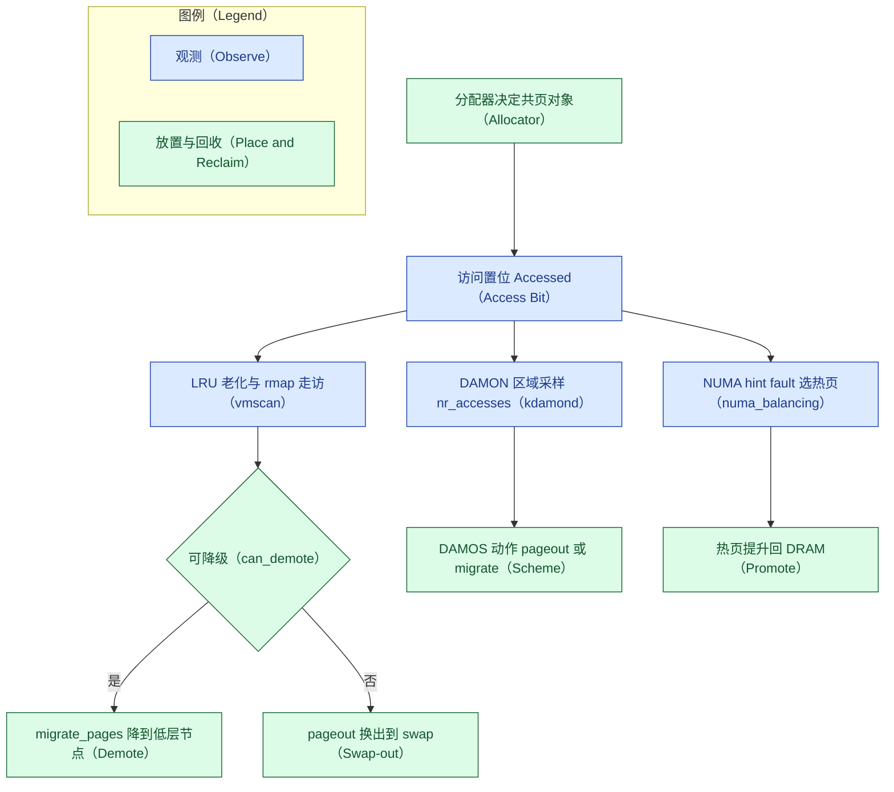

# 逆向消化摘要 · 内存分层开源栈（reverse-digest）

> 按 [reverse-learning-map](../../reverse-learning-map.md) 方法（按逆向学习价值排序而非 star、
> 每仓库只回答一个逆向问题、以"观测/布局/放置/回收目标"四分法归位、最后把论文名词贴回内核函数、
> 贴不上的即论文增量），对用户给定课程（作为**线索**）执行 reverse 技能（开源形态=源码/机制研读）。证据分三级并逐处标注：**源码核验**（对 torvalds/linux
> 源码树与具体提交核验，v6.14 为主，锚点如显式内存层提交 `992bf775` [27]；[16] 的内核文档站仅作
> 入口）、**文档核验**（一手抓取官方文档：QEMU/damo [23][24]、cgroup-v2.rst 按版本对照 [26]）、
> **阅读式**（稳定上游知识，未在本环境编译运行——运行式验证并入
> [benchmark-plan](benchmark-plan.md)）。引用编号沿用 [report.md](report.md)。

## 章节大纲

- P0：一页内存怎么被搬走（Linux / QEMU / ndctl）
- P1：观测与放置（damo / numactl / pcm·likwid / memkind）
- P2：冷热混页的源头（tcmalloc / jemalloc）
- P3：只看时序（gem5 / ramulator2）
- 收束一：仓库四分法；收束二：论文名词贴回函数（含论文增量）；收束三：计数器与按 VM 观测面
- 对本案例（v4）的反哺
- 存疑与参考资料

## P0 · 一页内存怎么被搬走

### 1. torvalds/linux —— 放置与回收（源码核验）

三个逆向问题的答案，都在同一条链上：

- **谁判定页的冷与热？** 三套并行机制：① `mm/damon/` 的 kdamond 按区域采样访问频次
  `nr_accesses`（paddr/vaddr 两种 ops）；② `mm/vmscan.c` 的 LRU 老化（kswapd/直接回收经 rmap 检查
  Accessed 位）——这两套判**冷**；③ `numa_balancing=2` 的 hint fault 选**热**页（提升候选，
  `mm/migrate.c`）——这套在热侧，与前两套方向相反、并行工作。
- **谁决定留 DRAM 还是降慢层？** 回收路径 `shrink_folio_list → demote_folio_list`，由
  `can_demote()` 把关（存在更低内存层 + `demotion_enabled`，层由 `mm/memory-tiers.c` 组织）；
  另一条是 DAMOS 方案（配额/目标门控下执行 `pageout` 或 `migrate_hot/cold`）。
- **降级是整页迁移还是换出？** **两个不同出口**：降级 = `migrate_pages()` 把页迁到低层 NUMA 节点
  （页保持映射、字节可寻址）；换出 = `pageout` 解除映射写入 swap（再访问触发主缺页）。同一次回收
  扫描里按 `can_demote()` 分岔。
- **大页怎么办？**（阅读式）`migrate_pages()` 以 folio 为单位整体迁移大 folio，目标侧分配失败
  （-ENOMEM）才走 split 重试路径（`mm/migrate.c`）；hugetlb 页不入 LRU、不进 `shrink_folio_list`，
  故既不被回收换出也不被降级——1 GiB hugetlb 完全不参与分层。这是报告差距表"双方都牺牲大页"
  一行 Linux 侧的机制位置。
- **策略绑定的反面教材？**（阅读式）`mpol_misplaced()`（`mm/mempolicy.c`）对 bind 策略命中的页
  判为"未错置"，NUMA balancing 的提升因此永不触发——即报告"勿把 guest RAM bind 到慢层节点"
  的函数级位置。

**对照**：MDK 的"回收目标"——上游优化的是水位/压力（最接近的钩子是 DAMOS 目标
`some_mem_psi_us`），不是"SLO 下长期省内存"，这正是 MDK 的增量；MAC——kswapd 扫的是
`struct folio` 页描述符与 Xarray，元数据驻留位置决定回收速度；RamRyder——"页仍是 OS 迁移单位"
即 `migrate_pages()` 的粒度，mm 里**没有 channel 这一级**。

### 2. qemu/qemu —— 拓扑（文档核验 [23]）

- **guest 看到什么？** 配置 `cxl=on` + `cxl-fmw.X.targets/size` 后，QEMU 仿真 CXL host bridge
  （`pxb-cxl`）、root port（`cxl-rp`）、Type-3 设备（`cxl-type3`，`volatile-memdev`/
  `persistent-memdev`）与交换机；**固定内存窗口（CFMW）以 ACPI CEDT 的 CFMWS 结构呈现给系统软件**
  ——即 guest 看到的是带 CXL 拓扑的多段地址，不是一段扁平内存。
- **边界**：QEMU **不仿真一致性协议**、聚焦 CXL 2.0+、单主机静态配置——给的是**功能拓扑，不是
  DDR/CXL 时序**；该文档未载内存热插/热度（热插走通用 ACPI 内存热插/virtio-mem 路径，属阅读式
  判断）。
- **热迁移读什么？**（阅读式）QEMU 迁移在 `migration/ram.c` 逐页读源端 guest RAM——已被 host 换出
  的页在读取时触发 swap-in，这是报告"NVMe 通路迁移=换入风暴"判断的机制来源。
- **对照**：RamRyder 的 channel/chunk/热插可在"节点级"仿真、无 channel 级；MAC 的双 NUMA 仿真
  思路同源。

### 3. pmem/ndctl（cxl/daxctl）—— 拓扑到可用内存（分级：见句内标注）

- **一个 CXL 设备如何变成可绑定内存？** `cxl` 建 region → 出 device-dax（`/dev/daxX.Y`）→
  `daxctl reconfigure-device --mode=system-ram` 经 kmem 驱动把它 online 成一个**内存 NUMA 节点**
  （建议 `auto_online_blocks=online_movable`）——这条链与 online 建议为**阅读式**。**源码核验**的
  是边界：daxctl **只作用于 device-dax**（PMem/CXL），块设备（NVMe）永远走不进这条路。
- **对照**：RamRyder 把 channel 收成独立 DAX device 的运维侧正是这条链的变体。

## P1 · 观测与放置

### 4. damonitor/damo —— 观测（文档核验 [24] + 源码核验 [16]）

- **粒度/开销/热判断在哪？** 都在**内核**（kdamond 的采样/聚合区间与区域数决定开销上界）；damo
  是用户态**配置与呈现**：`start`/`record`（落 `damon.data`）/`report access|heatmap|wss`。
- **观测如何变动作？** 一条命令即接上 DAMOS：如 `--damos_action pageout` 把"≥4K 且 ≥60 秒未访问
  的区域"换出 [24]——这就是"观测喂给回收/迁移"的最短通路。
- **对照**：NEMO 的 match-update-notify 是**内存控制器内**流水线，damo/DAMON 是**软件采样**——
  NEMO 的增量在于覆盖率与即时性；MDK 的"先轨迹后曲线"对应 `damo record` 产物。

### 5. numactl/numactl —— 放置（源码核验）

- **绑的是什么？** `mbind`/`set_mempolicy`/`migrate_pages` 系统调用，绑定与迁移的对象是
  **NUMA 节点（容量域）**；内核在缺页/分配时按策略选 node。**没有 channel 这一级**；上游最接近
  带宽感知的是加权交织（`MPOL_WEIGHTED_INTERLEAVE`，6.9，权重在 sysfs）[6][16]。
- **对照**：RamRyder 的 sNode/cNode 是把"先选节点、再在通道间交织"做成两级——numactl 只有第一级。

### 6. intel/pcm（likwid）—— 带宽计数（阅读式）

- **能对齐到进程/VM 吗？** uncore/IMC 计数器给**每通道/每控制器**带宽，属整机/socket 级；进程级
  归因通常做不到（RDT/MBM 只能近似到 core/RMID）。
- **对照**：RamRyder 每秒读计数器再热插 channel；其"独占 channel"设计正是绕开归因难题的办法。

### 7. memkind/memkind —— 分配时分层（阅读式）

- **分层发生在何时？** kind 在**分配时**映射到 NUMA/DAX，静态分堆；运行中不按访问迁移。
- **对照**：OBASE 之前的世界。论文的出发点正是"热度会变，静态 kind 不够"。

## P2 · 冷热混页的源头

### 8. google/tcmalloc（jemalloc）—— 布局（阅读式）

- **一次分配决定什么？** 按 **size class** 把同尺寸对象塞进同一 span/extent——决定的不只是地址，
  而是**这个对象以后与谁共用一个 OS 页**（co-residency）；未来热度完全不在考虑之列。
- **结论**：hotness fragmentation（冷热对象混页）在**进内核之前**就已铸成；页级回收看到的"热页"
  可能 90%+ 字节是冷的。这里没有 Guide、没有 HOT/COLD 堆——OBASE 的增量正是把这一层重构掉。

## P3 · 只看时序（不用于验证策略）

- **gem5/gem5**（阅读式）：改 DRAM vs 远端延迟、跑会缺页的小负载，看"元数据/访问变慢 → 尾延迟"
  （MAC 的现象层）；控制器内流水线（NEMO 类）默认不存在。
- **CMU-SAFARI/ramulator2**（阅读式）：只看 channel 数与请求排队对带宽的影响（RamRyder 的
  "带宽大致随 channel 扩展"）；无 VM、无页迁移。

## 收束一 · 仓库四分法

| 仓库 | 改变的是 | 一句话答案 |
|---|---|---|
| linux（mm）| **放置 + 回收** | 冷/热判定三套并行；降级=迁移、换出=swap，`can_demote()` 分岔 |
| damo/DAMON | **观测** | 热判断与开销在内核，工具只配置呈现；观测一键接 DAMOS 动作 |
| numactl | 放置 | 只有 node 级，无 channel 级 |
| pcm/likwid | 观测（带宽）| 通道/控制器级，难归因到进程 |
| memkind | 布局（静态）| 分配时分堆，不随热度迁移 |
| tcmalloc/jemalloc | **布局** | size class 决定共页关系，冷热混页在进内核前形成 |
| qemu + ndctl | 拓扑 | CFMW 经 ACPI CEDT 呈现；device-dax → kmem → NUMA 节点 |
| gem5/ramulator2 | 时序 | 只供延迟/带宽感受，无策略验证效力 |

## 收束二 · 论文名词贴回函数（含论文增量）

| 论文名词 | 上游对应 | 论文相对上游的增量 |
|---|---|---|
| channel（RamRyder）| **无对应**（mm 无 channel 级；最近的是交织权重 sysfs）| 把通道做成分配单位 + 弹性热插 |
| hot-set / 热度（NEMO/MDK）| DAMON 区域 `nr_accesses`；LRU 老化 | MC 内流水线观测（覆盖率/即时性）|
| page descriptor 扫描（MAC）| `struct folio` + Xarray，kswapd 扫描路径 | 近内存加速器 offload 元数据操作 |
| promotion rate（MDK）| `pgpromote_success`（TPP 路径）/ DAMOS stats | 把它设为**回收目标**（SLO 代理）而非副产品 |
| 冷热混页（OBASE）| 分配器 size class 的 co-residency | Guide 间接 + HOT/COLD 堆重排对象 |
| 降级/提升 | `demote_folio_list`/`migrate_pages`；hint-fault 提升 | —（上游已有，论文在其上建策略）|

**贴不上的部分即论文增量**——这一列直接回填了 [report.md](report.md) §二的"机制底座（论文增量）"
引块。

## 收束三 · 计数器与按 VM 观测面（文档核验 [26]）

分层的每条动作路径各有计数器，**host 全局（`/proc/vmstat`）与按 VM（cgroup v2 `memory.stat`）
的可得性并不对称**，且随内核版本变化。本表按 v6.14（PVE 9.0 代）与 master 的 `cgroup-v2.rst`
一手对照 [26]：

| 计数器 | 动作路径 | host 全局 | 按 VM（`qemu.slice/<vmid>.scope/memory.stat`）|
|---|---|---|---|
| `pswpin/pswpout` | swap 换入/换出 | 有 | **v6.14 无**；master 已加（npn 条目）——按 VM 需更新内核，期间用 `memory.swap.current` 增量 + PSI 近似 |
| `zswpin/zswpout/zswpwb` | zswap 进出/回写 | 有 | **v6.14 已有** |
| `pgdemote_kswapd/direct/khugepaged` | 回收路径降级（TPP）| 有 | **v6.14 已有**——按 VM 采降级在 6.14 即可行 |
| `pgpromote_success` | hint-fault 提升（TPP）| 有 | v6.14 无 |
| `pgmigrate_success/fail` | `migrate_pages()`（含 DAMON 迁移）| 有 | 无（v6.14 与 master 均无）|
| DAMOS `stats` | 每 scheme 的动作统计 | sysfs 按 scheme | 仅当"每 VM 一条 scheme + memcg 过滤"编排时才等价于按 VM |

**含义**：v6.14 上按 VM 能直接采的是 **zswap 计数与降级（`pgdemote_*`）**；swap 换入/换出按 VM 要
等更新内核（或近似）；提升与 DAMON 迁移只有全局计数，按 VM 归因须靠 DAMOS per-scheme `stats`
或单 VM 隔离实验设计（benchmark-plan 的 config D2 正是后者）。

## 对本案例（v4）的反哺

- **再次确认 ADR-0001/0003**：上游"引擎"完整（观测/降级/换出/提升四件套齐），缺的是产品化整合
  ——本消化把这条结论落到函数级。
- **MVP 观测面可直接借 damo/DAMON 的分工**：内核出数据、产品层做配置与呈现（damo 即现成参照，
  甚至可复用其 `report heatmap/wss` 作 GUI 数据源）。
- **RamRyder 的教训写实了**："带宽与容量是两种数据"（pcm vs damo 各看一半）——加权交织只许出现
  在带宽场景（v4 已按此纠正）。
- **OBASE/MAC 属远期**：一个动分配器、一个动硬件，均超出 Proxmox 产品层可控范围，维持"远期/搁置"
  评级的依据由概念级升为机制级。

## 存疑与需确认

- 本消化为**静态研读（未运行）**——只读源码与文档、未在本环境编译运行各仓库（"阅读式"一词
  保留为三级证据分级中的专名，不再指代全文）；运行式验证（damo 抓真实负载、QEMU 起 CXL 拓扑、
  pcm 读通道带宽）已并入 [benchmark-plan](benchmark-plan.md) 的执行前置。
- QEMU CXL 文档未载热插/热度支持细节 [23]；P1 工具的实际开销未实测。
- 2026 论文原型仓库（MAC/NEMO/OBASE/MDK/RamRyder 及 Memtis/HeMem/Pond）**不写死地址**——命名与
  归属以作者主页/会议 artifact 为准（沿用"用户输入=线索须核验"原则）。**更新（v4.5）**：五篇 OSDI '26
  题名与作者已由主 agent 抓 USENIX 官方议程一手确认（NEMO="Finding NEMO: Nimble and Expressive Memory
  Observability"、OBASE="Object-Based Address-Space Engineering to Improve Memory Tiering"，arXiv
  2603.00378），此前"命名未确认"结论作废；OBASE 摘要 verbatim 印证收束二对"分配器 size-class 致
  hotness fragmentation"的贴回。
- **暂缓清单（有理由的不读）**：pmem/pmdk——持久内存**编程库**，与本案例的易失扩容/页回收不是
  同一条路径，按课程排序 P0–P2 走完再看；TPP 独立仓库——其思路（降级/提升/显式内存层）多数已入
  主线 `mm/`，本消化直接读主线（P0 第 1 节），无须独立仓库。

## 参考资料（增量）

沿用 [report.md](report.md) 的 [1]–[22]；本文件新增：

[23] QEMU 官方文档 — CXL 仿真（docs/system/devices/cxl.rst，本轮一手抓取）. https://www.qemu.org/docs/master/system/devices/cxl.html
[24] damonitor/damo — README（本轮一手抓取）. https://github.com/damonitor/damo
[25] 消化对象仓库：torvalds/linux · qemu/qemu · pmem/ndctl · damonitor/damo · numactl/numactl · intel/pcm · RRZE-HPC/likwid · memkind/memkind · google/tcmalloc · jemalloc/jemalloc · gem5/gem5 · CMU-SAFARI/ramulator2（均为 GitHub 公开仓库）.
[26] Linux `Documentation/admin-guide/cgroup-v2.rst`，v6.14 与 master 对照（本轮经 GitHub API 一手抓取核对 memory.stat 条目）. https://github.com/torvalds/linux/blob/v6.14/Documentation/admin-guide/cgroup-v2.rst
[27] Linux commit `992bf775` — mm/demotion: add support for explicit memory tiers（作者 Aneesh Kumar K.V, IBM；2022-08 作，入 v6.1；本轮经 GitHub API 一手核验作者与日期）. https://github.com/torvalds/linux/commit/992bf77591cb
