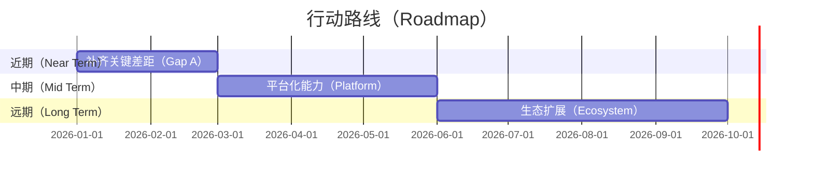
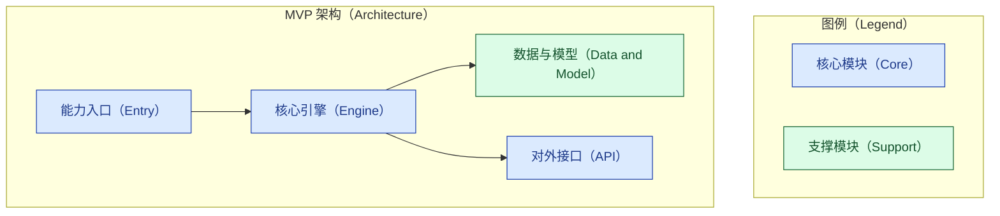
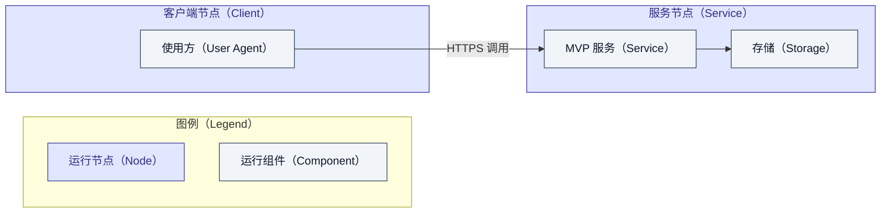

# 对标分析报告 · 章节骨架模板

本文件是 `competitive-analysis` SOP 产出的**报告骨架模板**。生成案例时，复制本骨架到
`docs/harness-sop/examples/`，逐节替换占位内容。所有图表须符合
[`../authoring/mermaid-style-guide.md`](../authoring/mermaid-style-guide.md)，全文须符合
[`../authoring/report-style-guide.md`](../authoring/report-style-guide.md)（大纲先行、结论
置后、表格对比、`[n]` 引注、防幻觉）。

> 使用提示：方括号 `【】` 内为待替换占位；示例图表可直接改写；查不到的事实一律写"无法确定"，
> 严禁杜撰。
> 引用自闭环：每处 `[n]` 引注与跨文档链接（含指向 reverse-digest、benchmark-plan、价值模型等）都须
> in-place 写出被引内容的关键事实/数字/结论，读者不跳转即可完整理解，跳转仅供核验与深挖；不为
> 控制篇幅而省略就地阐述。

---

## 【报告标题：XXX 方向 · YYY 对标 ZZZ 分析报告】

### 章节大纲

先在此列出本报告的章节推进路径（研究背景 → 学术热点 → 差距分析 → 行动路线 → MVP 架构 →
价值兑现 → 结论），点明各节之间的递进关系。

## 零、目标、意图与价值假设（价值锚点）

用一张价值假设卡钉住全程锚点：后续每一节的判断、差距、行动、FAB 与控标点都要能追溯回它。

| 要素 | 内容 |
|---|---|
| 业务目标与意图 | 【这次对标要支撑的具体决策】 |
| 受益者 | 【谁获得价值】 |
| 价值主张 | 【创造什么价值】 |
| 度量口径 | 【用什么指标判断价值是否兑现，含目标值】 |

## 一、研究背景与范围界定

阐明为何做这次对标：XXX 方向的确切边界与评价维度、YYY 与 ZZZ 的版本与形态、目标客户及其
痛点、以及（如适用）招投标或采购背景。给出本报告采用的评价维度清单，作为后续差距分析的基准。

> 须给出 **why-now（时机窗口）** 与**具名竞争对手**（不止对标 ZZZ，还有抢同一需求的同类替代品）。

## 二、XXX 方向的学术研究热点

综述该方向近年的研究热点与技术趋势，每个判断均以可核验来源支撑并 `[n]` 引注。突出与本次
对标相关的方向，为差距分析与 MVP 设计提供学术锚点。避免空泛预测。

> 上游视角：若对标双方共享上游（如 Linux 内核提供内存/IO/调度能力），须把该上游的历史·现状·
> 演进·预测作为一等分析源单列，并指明哪一方继承了它。
> 机制准确性与代次核对：不得混淆机制（如 swap 与内存分层引擎）；对比前核对版本/特性可用性，避免拿
> 不具备该能力的版本作比。
> 机制底座（逆向消化）：存在共享开源上游时，按 [reverse-learning-map.md](reverse-learning-map.md)
> 对相关开源栈做逆向学习，产出案例级 `reverse-digest.md`（术语贴回函数 + 论文增量表，证据分级标注），
> 本节及第三节的机制性判断以它为底座引用。

## 三、YYY 对标 ZZZ 的差距分析

围绕第一节的评价维度逐维对比，用表格承载，并在表后展开解读每条差距的成因与影响。

| 评价维度 | YYY 现状 | ZZZ 现状 | 差距与影响 | 与学术热点/客户痛点的关联 |
|---|---|---|---|---|
| 【维度一】 | 【…】 | 【…】 | 【…】 | 【…】 |
| 【维度二】 | 【…】 | 【…】 | 【…】 | 【…】 |

## 四、行动 Roadmap

把差距转化为分期行动。先用四维打分（价值/投入/风险/证据强度）为候选项定优先级，主指标是
**价值密度 = 价值 / 投入**，风险下调、证据不足者搁置（方法见
[value-realization-model.md](value-realization-model.md) 的价值筛选一节）。

| 候选行动项 | 对应差距 | 价值 1-5 | 投入 1-5 | 风险 1-5 | 证据强度 1-5 | 价值密度 | 结论 |
|---|---|---|---|---|---|---|---|
| 【项一】 | 【差距】 | 【…】 | 【…】 | 【…】 | 【…】 | 【价值/投入】 | 【MVP 候选/分期/搁置】 |

据此把行动项落到分期排期，下图为占位，替换为实际内容。

## 五、最优价值 MVP 架构设计

MVP 取自第四节打分中**价值密度最高、风险可接受、证据扎实**的最小切片——它不是功能最全的
版本，而是最快兑现一次可验证价值的版本。说明选择理由，并用架构图与部署图呈现设计。下列为
占位图，替换为实际模块。

架构图刻画模块层次与依赖：

部署图刻画组件、节点及运行时关系：

## 六、MVP 价值兑现

### 产品 FAB 与价值链

价值兑现是一条可追溯的价值链：特性 → 优势 → 客户利益 → 客户 KPI → 控标差异化；每一环都要能
溯回具体差距与真实证据。用一张表串起整条链：

| 特性（Feature） | 优势（Advantage） | 客户利益/业务结果（Benefit） | 对应客户 KPI 或任务 | 追溯（差距与证据） | 控标差异化点 |
|---|---|---|---|---|---|
| 【特性一】 | 【相较 ZZZ 的优势】 | 【客户可感知的业务结果】 | 【客户 KPI 或待办任务】 | 【对应差距 + `[n]` 证据】 | 【可写进招标的差异化】 |
| 【特性二】 | 【…】 | 【…】 | 【…】 | 【…】 | 【…】 |

### 客户语言的价值

把技术特性翻译成客户能听懂的业务结果，围绕效率、成本、风险、合规、收入等维度展开，避免技术
黑话。每条价值主张尽量给出可核验的量化口径或来源；无据则不夸大。

### 价值度量与验证计划

为价值假设配上可测指标与目标值，并说明 MVP 上线后如何验证价值是否兑现。**无实测环境时，目标值
用可核验的公开材料做估算并标注来源与推导（基线不限自测）；禁止填入无据数字，也不必留空。真正需
本地验证的部分见下面的"对比测试设计"。**

| 价值假设 | 先导指标（Leading） | 滞后指标（Lagging） | 目标值 | 验证时点 |
|---|---|---|---|---|
| 【假设一】 | 【早期行为信号，如启用率】 | 【业务结果，如中标率/成本】 | 【量化目标】 | 【时点】 |

验证闭环：MVP 上线后按上表采集先导与滞后指标，对照目标值判断价值是否兑现；未达标则回到价值
假设或方案进行修正（方法见 [value-realization-model.md](value-realization-model.md) 的价值
度量与验证闭环一节）。

### 对比测试设计（意图与预估）

对真正需要本地验证的价值假设，给出对比测试设计而非留空：**意图**、**对照配置矩阵**（含基线，
基线可取自文献）、**负载**、**指标**、**方法**，以及每条假设的**预估结果**（据公开锚点推断的预测
区间，标注为预估非实测）。

| 配置 | 说明 | 作用 |
|---|---|---|
| A 基线 | 【当前或无新特性】 | 基线（可取自文献） |
| B 主验证 | 【引入 MVP 能力】 | 主对照 |
| C 敏感性 | 【关键参数变体】 | 参数敏感性 |

预估结果：【据锚点给出各配置相对基线的预测区间，逐条标注为预估】。

### 控标经典案例

列出可作为招投标差异化技术门槛的能力点。**只填写真实、可核验的案例**；查不到即写"无法确定"，
严禁杜撰客户名、项目、金额或结果。

| 差异化能力点 | 可核验案例与来源 | 可用于招标的技术门槛表述 |
|---|---|---|
| 【能力点一】 | 【真实来源，或"无法确定"】 | 【中性、合规的技术要求表述】 |

> 即便真实案例"无法确定"，也须给出**招标差异化条款语言**（标注为建议、须结合真实招标校准）——条款
> 语言非事实断言，是必须的控标产出，不得以"无法确定"回避。另附**异议应答表**（买家常见异议 → 应答），
> 为一线预置弹药。

## 七、如何超越（超越论点 + 业务规划 + 技术规划）

不止于差距分析，须明确回答"YYY 如何在 XXX 超越 ZZZ"：
- **超越论点**：2–4 条 ZZZ 结构上难以跟随的战线（换战场而非硬追），并说明为何 ZZZ 跟不上。
- **why-now**：时机窗口（市场/成本/技术三股力量）与**具名竞争对手**（同类替代品）。
- **业务规划**：具名买家段 + JTBD + 主价值杠杆 + GTM 次序 + 定价 + 设计伙伴 + 护城河。
- **技术规划**：MVP → 中期 → 远期的技术主线与关键集成点，与 roadmap 及 MVP 架构一致。

## 八、结论

在层层论证之后，收束到本次对标的核心结论：最值得投入的方向、MVP 的价值假设、以及落地建议。
结论只在此处给出。

## 参考资料

> 来源分级：**用户提供的是线索（hints），须经独立检索核验/发散后再用**——能核验的正常引注；不能
> 核验的明说"无法确定"，**不得原样当"未核验材料"去支撑结论**。其余独立核验来源正常引注。

[1] 【来源名称】. 【完整链接】
[2] 【来源名称】. 【完整链接】

## 存疑与需确认

列出价值阐述存疑、落地条件待确认之处，遵循带着问题去核实的原则，暂不下结论（对应 grilling 的
纪律；用户在场时可转为实时访谈澄清）。

- 【存疑点或待确认的落地条件一】
- 【…】
