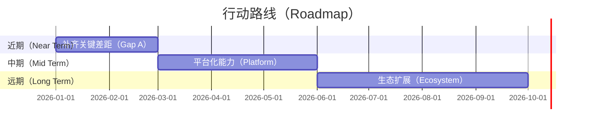
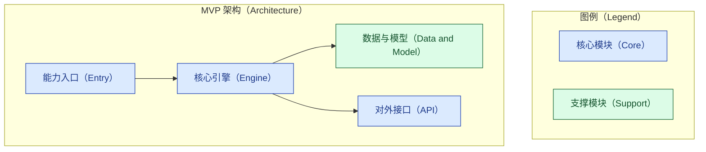
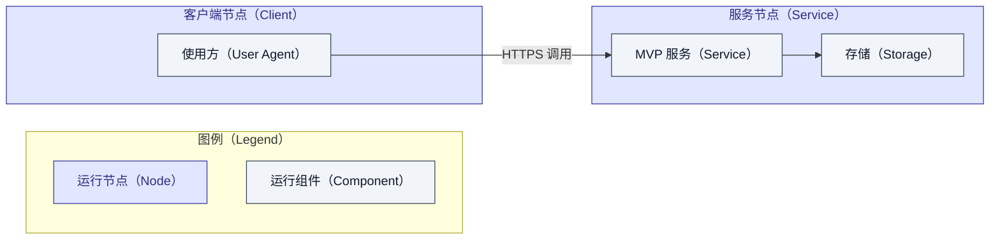

# 对标分析报告 · 章节骨架模板

本文件是 `competitive-analysis` SOP 产出的**报告骨架模板**。生成案例时，复制本骨架到
`docs/harness-sop/examples/`，逐节替换占位内容。所有图表须符合
[`../authoring/mermaid-style-guide.md`](../authoring/mermaid-style-guide.md)，全文须符合
[`../authoring/report-style-guide.md`](../authoring/report-style-guide.md)（大纲先行、结论
置后、表格对比、`[n]` 引注、防幻觉）。

> 使用提示：方括号 `【】` 内为待替换占位；示例图表可直接改写；查不到的事实一律写"无法确定"，
> 严禁杜撰。

---

## 【报告标题：XXX 方向 · YYY 对标 ZZZ 分析报告】

### 章节大纲

先在此列出本报告的章节推进路径（研究背景 → 学术热点 → 差距分析 → 行动路线 → MVP 架构 →
价值兑现 → 结论），点明各节之间的递进关系。

## 零、目标、意图与价值假设（价值锚点）

用一张价值假设卡钉住全程锚点：后续每一节的判断、差距、行动、FAB 与控标点都要能追溯回它。

| 要素 | 内容 |
|---|---|
| 业务目标与意图 | 【这次对标要支撑的具体决策】 |
| 受益者 | 【谁获得价值】 |
| 价值主张 | 【创造什么价值】 |
| 度量口径 | 【用什么指标判断价值是否兑现，含目标值】 |

## 一、研究背景与范围界定

阐明为何做这次对标：XXX 方向的确切边界与评价维度、YYY 与 ZZZ 的版本与形态、目标客户及其
痛点、以及（如适用）招投标或采购背景。给出本报告采用的评价维度清单，作为后续差距分析的基准。

## 二、XXX 方向的学术研究热点

综述该方向近年的研究热点与技术趋势，每个判断均以可核验来源支撑并 `[n]` 引注。突出与本次
对标相关的方向，为差距分析与 MVP 设计提供学术锚点。避免空泛预测。

## 三、YYY 对标 ZZZ 的差距分析

围绕第一节的评价维度逐维对比，用表格承载，并在表后展开解读每条差距的成因与影响。

| 评价维度 | YYY 现状 | ZZZ 现状 | 差距与影响 | 与学术热点/客户痛点的关联 |
|---|---|---|---|---|
| 【维度一】 | 【…】 | 【…】 | 【…】 | 【…】 |
| 【维度二】 | 【…】 | 【…】 | 【…】 | 【…】 |

## 四、行动 Roadmap

把差距转化为分期行动。先用四维打分（价值/投入/风险/证据强度）为候选项定优先级，主指标是
**价值密度 = 价值 / 投入**，风险下调、证据不足者搁置（方法见
[value-realization-model.md](value-realization-model.md) 的价值筛选一节）。

| 候选行动项 | 对应差距 | 价值 1-5 | 投入 1-5 | 风险 1-5 | 证据强度 1-5 | 价值密度 | 结论 |
|---|---|---|---|---|---|---|---|
| 【项一】 | 【差距】 | 【…】 | 【…】 | 【…】 | 【…】 | 【价值/投入】 | 【MVP 候选/分期/搁置】 |

据此把行动项落到分期排期，下图为占位，替换为实际内容。

## 五、最优价值 MVP 架构设计

MVP 取自第四节打分中**价值密度最高、风险可接受、证据扎实**的最小切片——它不是功能最全的
版本，而是最快兑现一次可验证价值的版本。说明选择理由，并用架构图与部署图呈现设计。下列为
占位图，替换为实际模块。

架构图刻画模块层次与依赖：

部署图刻画组件、节点及运行时关系：

## 六、MVP 价值兑现

### 产品 FAB

| 特性（Feature） | 优势（Advantage） | 客户利益（Benefit） |
|---|---|---|
| 【特性一】 | 【相较 ZZZ 的优势】 | 【对客户的可感知利益】 |
| 【特性二】 | 【…】 | 【…】 |

### 客户语言的价值

把技术特性翻译成客户能听懂的业务结果，围绕效率、成本、风险、合规、收入等维度展开，避免技术
黑话。每条价值主张尽量给出可核验的量化口径或来源；无据则不夸大。

### 控标经典案例

列出可作为招投标差异化技术门槛的能力点。**只填写真实、可核验的案例**；查不到即写"无法确定"，
严禁杜撰客户名、项目、金额或结果。

| 差异化能力点 | 可核验案例与来源 | 可用于招标的技术门槛表述 |
|---|---|---|
| 【能力点一】 | 【真实来源，或"无法确定"】 | 【中性、合规的技术要求表述】 |

## 七、结论

在层层论证之后，收束到本次对标的核心结论：最值得投入的方向、MVP 的价值假设、以及落地建议。
结论只在此处给出。

## 参考资料

[1] 【来源名称】. 【完整链接】
[2] 【来源名称】. 【完整链接】
