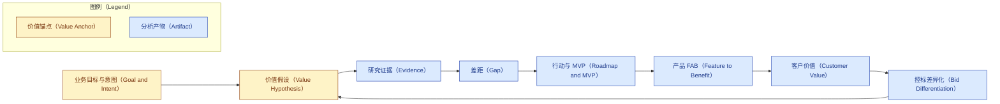

# 价值兑现模型（SOP 的组织内核）

本文件是竞品对标分析 SOP 的方法论内核，回答一个根本问题：**这套分析凭什么创造价值，又如何
确保价值真正兑现。** SOP 的每个阶段、每张表、每张图都由本模型统摄。

## 章节大纲

- 为什么以价值兑现为主线
- 目标、意图、价值假设三层锚点
- 价值追溯链：向后溯源、向前达价值
- 价值主线如何重塑七个阶段
- 结论

## 为什么以价值兑现为主线

一份对标分析的价值，不在于它罗列了多少差距、画了多少图，而在于它**改变了某个能释放价值的
决策**。如果分析做得再漂亮，却没有人据以调整投入、赢下项目或改进产品，那它创造的价值为零。
所以本 SOP 不以"产出章节"为目标，而以"价值兑现"为主线：从一开始就钉住"要兑现什么价值"，并让
后续每一步都对这个价值负责。

## 目标、意图、价值假设三层锚点

在动手分析前，先把三层锚点说清楚，它们是全程的判断基准。

| 锚点 | 含义 | 反例（要避免） |
|---|---|---|
| 目标（Goal） | 这次对标要支撑的业务结果 | "全面了解竞品"这类没有落点的目标 |
| 意图（Intent） | 分析要支撑的那个具体决策 | 不知道结论要拿去做什么决定 |
| 价值假设（Value Hypothesis） | 为谁、创造什么价值、用什么指标度量 | 价值主张空泛、无可度量口径 |

三者合成一张**价值假设卡**，是阶段零的产物，也是后续所有内容的追溯终点。

## 价值追溯链

价值主线通过一条**追溯链**贯穿全程：任何一个分析产物，向后都能溯源到目标与真实证据，向前都
能抵达可被客户感知的价值。凡追溯不成立或流于空泛者，一律淘汰。

链尾的"控标差异化"回指"价值假设"，形成闭环：一个能写进招标的差异化能力，正是价值假设被市场
认可的最硬证据。

## 价值主线如何重塑七个阶段

价值主线不是新增一个环节，而是给每个阶段都装上一个"价值问题"，只有回答了它，该阶段才算过关。

| 阶段 | 它必须回答的价值问题 |
|---|---|
| 零 · 目标与价值假设 | 我们要兑现什么价值、为谁、用什么指标衡量？ |
| 一 · 范围界定 | 在哪个战场比、按哪些维度判断价值高低？ |
| 二 · 学术与情报调研 | 有哪些真实证据支撑价值判断，而非臆测？ |
| 三 · 差距分析 | 哪些差距是真正卡住价值兑现的关键，而非无关紧要？ |
| 四 · 行动路线 | 以什么顺序投入，能最快、最稳地兑现价值？ |
| 五 · MVP 架构 | 哪一个最小切片，单位投入能撬动的价值最高？ |
| 六 · 价值兑现 | 价值如何转成客户能感知、愿买单、可控标的形态？ |
| 七 · 成文 | 结论是否足以支撑最初那个决策？ |

## 结论

把价值兑现设为主线，等于给整套分析装了一根脊柱：它逼迫每个判断都对"目标—证据—价值"负责，
让报告从"信息的堆叠"变成"决策的杠杆"。后续几节（价值筛选、价值度量与验证、质量门）都是在这
根脊柱上继续加固，确保分析出来的价值不仅"看起来有"，而且"能落地、可检验"。
