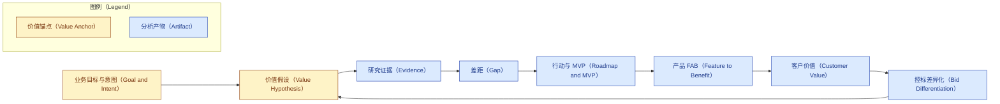
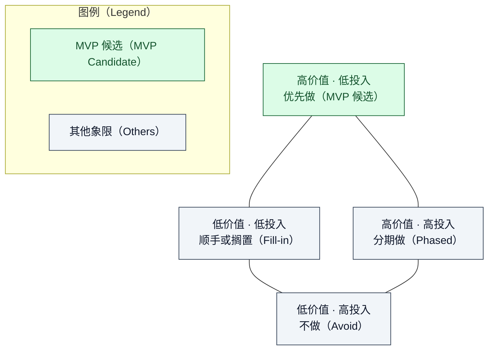
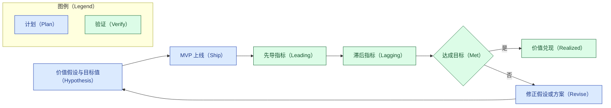

# 价值兑现模型（SOP 的组织内核）

本文件是竞品对标分析 SOP 的方法论内核，回答一个根本问题：**这套分析凭什么创造价值，又如何
确保价值真正兑现。** SOP 的每个阶段、每张表、每张图都由本模型统摄。

## 章节大纲

- 为什么以价值兑现为主线
- 目标、意图、价值假设三层锚点
- 价值追溯链：向后溯源、向前达价值
- 价值主线如何重塑七个阶段
- 结论

## 为什么以价值兑现为主线

一份对标分析的价值，不在于它罗列了多少差距、画了多少图，而在于它**改变了某个能释放价值的
决策**。如果分析做得再漂亮，却没有人据以调整投入、赢下项目或改进产品，那它创造的价值为零。
所以本 SOP 不以"产出章节"为目标，而以"价值兑现"为主线：从一开始就钉住"要兑现什么价值"，并让
后续每一步都对这个价值负责。

## 目标、意图、价值假设三层锚点

在动手分析前，先把三层锚点说清楚，它们是全程的判断基准。

| 锚点 | 含义 | 反例（要避免） |
|---|---|---|
| 目标（Goal） | 这次对标要支撑的业务结果 | "全面了解竞品"这类没有落点的目标 |
| 意图（Intent） | 分析要支撑的那个具体决策 | 不知道结论要拿去做什么决定 |
| 价值假设（Value Hypothesis） | 为谁、创造什么价值、用什么指标度量 | 价值主张空泛、无可度量口径 |

三者合成一张**价值假设卡**，是阶段零的产物，也是后续所有内容的追溯终点。

## 价值追溯链

价值主线通过一条**追溯链**贯穿全程：任何一个分析产物，向后都能溯源到目标与真实证据，向前都
能抵达可被客户感知的价值。凡追溯不成立或流于空泛者，一律淘汰。

链尾的"控标差异化"回指"价值假设"，形成闭环：一个能写进招标的差异化能力，正是价值假设被市场
认可的最硬证据。

## 价值主线如何重塑七个阶段

价值主线不是新增一个环节，而是给每个阶段都装上一个"价值问题"，只有回答了它，该阶段才算过关。

| 阶段 | 它必须回答的价值问题 |
|---|---|
| 零 · 目标与价值假设 | 我们要兑现什么价值、为谁、用什么指标衡量？ |
| 一 · 范围界定 | 在哪个战场比、按哪些维度判断价值高低？ |
| 二 · 学术与情报调研 | 有哪些真实证据支撑价值判断，而非臆测？ |
| 三 · 差距分析 | 哪些差距是真正卡住价值兑现的关键，而非无关紧要？ |
| 四 · 行动路线 | 以什么顺序投入，能最快、最稳地兑现价值？ |
| 五 · MVP 架构 | 哪一个最小切片，单位投入能撬动的价值最高？ |
| 六 · 价值兑现 | 价值如何转成客户能感知、愿买单、可控标的形态？ |
| 七 · 成文 | 结论是否足以支撑最初那个决策？ |

## 价值筛选：从候选到最优价值 MVP

"最优价值"不是拍脑袋选一个，而是有据可依地找出**单位投入撬动价值最高、且风险可控、证据扎实**
的最小切片。为此给每个候选能力项打四维分：

| 维度 | 含义 | 说明 |
|---|---|---|
| 价值 | 对价值假设与关键差距的推动力 | 越高越好 |
| 投入 | 构建成本与周期 | 越高越贵，作价值密度的分母 |
| 风险 | 技术与市场不确定性 | 越高越险，用于下调优先级 |
| 证据强度 | 价值判断的可核验程度 | 低于门槛者先搁置，不进 MVP |

排序主指标是**价值密度 = 价值 / 投入**，再用风险下调、用证据强度设门槛。据此把候选项落到价值-
投入矩阵，四个象限对应四种行动策略：

"最优价值 MVP"取自左上象限——高价值、低投入、风险可接受、证据扎实的最小切片。它不是功能最全
的版本，而是**最快兑现一次可验证价值**的版本。这样选出来的 MVP，天然带着"为什么是它"的量化
理由，而不是一句"我们觉得这个重要"。

## 价值度量与验证闭环

价值假设若不可度量，就无法判断是否兑现，也就谈不上价值。因此每条价值假设都要配上**可测指标与
目标值**，并区分两类指标：

- **先导指标（Leading）**：早期、可快速观察的行为信号，如启用率、采纳率、任务完成时间，用来
  尽早判断方向对不对。
- **滞后指标（Lagging）**：最终的业务结果，如中标率、成本下降、收入增长、留存，用来确认价值
  是否真正落地。

MVP 上线后，按下图闭环采集指标、对照目标：兑现则固化，未达标则回到假设或方案修正——让"计划的
价值"最终被"实测的价值"检验。

FAB → 客户利益 → 控标差异化，本质上就是这条价值链的对外表达：特性带来优势，优势转成客户能
感知的业务结果，结果沉淀为招标里的差异化门槛。把它写成一张贯通的表（见报告骨架第六节），每一
环都溯回差距与证据，价值兑现才不是口号。

### 无实测环境时的做法

没有自测环境不等于价值不可度量。此时分两手：一是用**可核验的公开或第三方材料做事实推断**，给出
带来源与推导的**估算**（明确标注为估算，绝不冒充实测），基线也可取自厂商与文献数据——**基线不限
于自测**；二是把真正需要本地验证的部分写成**对比测试设计**：给出意图、对照配置矩阵（含基线）、
指标、方法，以及每条假设的**预估结果**（据公开锚点推断的预测区间，标注为预估）。这样既不留空拍
脑袋，也不把估算伪装成实测。

## 质量门与防空泛（价值成色）

价值主线要真发挥作用，就必须有门槛拦住空泛：每个阶段设**完成标准（DoD）**，不达标不进入下一
阶段；凡不可追溯、无证据、凭感觉的内容一律打回。

| 阶段 | 完成标准（DoD） | 不通过的典型信号 |
|---|---|---|
| 零 | 价值假设卡四要素齐全，度量口径可量化 | 目标空泛、无目标值 |
| 一 | 评价维度清单明确、可判高低 | 维度含糊、无法比较 |
| 二 | 每条判断有真实来源与 `[n]` 引注 | "据说""业界普遍"等无源表述 |
| 三 | 每条差距有证据，且说明为何卡住价值 | 只罗列差异，不说重要性 |
| 四 | 候选项有四维打分与价值密度 | 凭感觉排序 |
| 五 | MVP 是打分选出的最小切片，含架构与部署图 | 贪大求全、无选择理由 |
| 六 | 价值链贯通、指标可测、控标案例真实 | FAB 泛泛、案例杜撰 |
| 七 | 大纲先行、结论置后、图表合规、防幻觉自检通过 | 开篇给结论、图表违规 |

交付前再用一张记分卡给报告的"价值成色"打分，每项按 0/1/2 计，低于达标线就回炉：

| 记分项 | 达标含义 |
|---|---|
| 价值锚定 | 每条主张都能溯回价值假设卡 |
| 证据强度 | 事实均有可核验来源与引注 |
| 价值密度 | MVP 选择有量化依据，非拍脑袋 |
| 可度量性 | 价值假设配了先导/滞后指标与目标值 |
| 客户语言 | 价值用客户听得懂的话表达 |
| 防幻觉 | 无虚构，敏感项标"无法确定" |
| 规范符合 | 结构、图表、引用符合写作标准 |

**经多路 reviewer 对拍加固的必过门**（源自首个真实案例的评审教训）：

- **具名买家**：≥3 个具名买家段，各有 JTBD 与主价值杠杆；禁止单一笼统"客户"。
- **买家货币**：至少一个价值以买家 P&L 口径表达（$/VM、许可账单差额、每 GB TCO 等），非仅工程增量。
- **可证伪 MVP**：MVP 配一句可证伪假设 + kill-gate（阈值可待基线，但门必须在）。
- **控标产出**：即便真实案例"无法确定"，也须给出**招标差异化条款语言**（标注为建议）——条款语言非
  事实断言、不构成幻觉，不得以"无法确定"回避该产出。
- **机制准确性与代次核对**：不得混淆机制（如把 swap 当内存分层引擎）；对比前核对版本/特性可用性，
  避免拿不具备该能力的版本作比。
- **机制底座（逆向消化）**：当对标双方共享开源上游（内核、开源引擎等）时，须按
  [reverse-learning-map.md](reverse-learning-map.md) 执行逆向学习正式子步骤（按逆向学习价值排序、
  每仓库一问、观测/布局/放置/回收四分法、名词贴回函数），产出案例级 `reverse-digest.md` 作为机制
  底座；机制性主张须能**贴回具体函数/一手源**并按"源码核验 / 一手文档核验 / 阅读式"分级标注。
  首个真实案例证明：没有这层底座，"修正"本身会引入新的机制错误。
- **超越答案**：结论须回答"YYY 如何超越 ZZZ"，并配 why-now、具名竞争对手、业务规划与技术规划、
  投资建议（投多少/次序/kill-gate/不投的代价）。
- **评分自洽**：评分用带锚点 rubric + 显式公式（含风险与证据），且所选 MVP 必须是该公式下的最优，
  不得与打分自相矛盾。
- **全资产参与**：本仓库已集成的资产（`storm-research`、grilling 套件、`domain-modeling`、
  `report-authoring`、无授权检索、`vendor/reverse-skill`、`scholar-slides` 等）都要在每次对标中
  参与——主线用得上就用，用不上也要进"对拍"或校验环节；**闲置资产视为质量隐患**。资产参与映射见
  `competitive-analysis/SKILL.md`。
- **用户输入即线索（hints，非结论）**：用户提供的材料是**线索**，须经独立 research **核验并发散**后
  再用——能核验则正常引注；不能核验则明说"无法确定"，**不得原样当"未核验材料"去支撑结论**。（本案例
  据此把 OSDI '26 从"未核验"升级为已核验的 RamRyder/MAC/MDK + 命名存疑的 NEMO/OBASE。）

对高价值/高风险的对标，建议在成文前用**多 reviewer 对拍**（技术深度、产品价值、证据严谨、架构可行
等角度并行对抗式评审），据其发现迭代——首个真实案例正是靠这一步查出了机制性事实错误。

**元教训（源自该案例）**：① 机制性主张必须对**一手源**（内核/官方源码与文档，而非博客）核验；
② 一次"修正"本身可能引入新错误（案例的 v3 把 v2 改错了），故高价值结论要**再核验**；③ 对拍子代理
**用与主 agent 一致的高配置**——配置越强，越能对源码取证、推翻错误论点（该案例第二轮 Fable 5 对拍
即推翻了 v3 的一条核心论点）。

这套门槛与记分卡，是价值主线从"理念"变成"可执行、可检验"的最后一环。

## 结论

把价值兑现设为主线，等于给整套分析装了一根脊柱：它逼迫每个判断都对"目标—证据—价值"负责，
让报告从"信息的堆叠"变成"决策的杠杆"。后续几节（价值筛选、价值度量与验证、质量门）都是在这
根脊柱上继续加固，确保分析出来的价值不仅"看起来有"，而且"能落地、可检验"。
